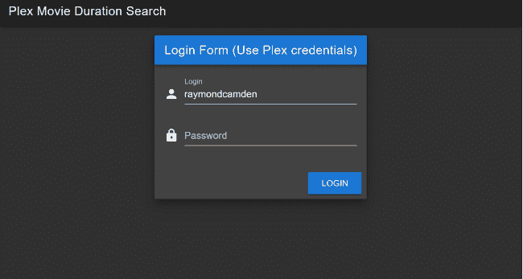
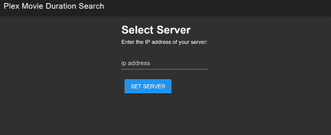
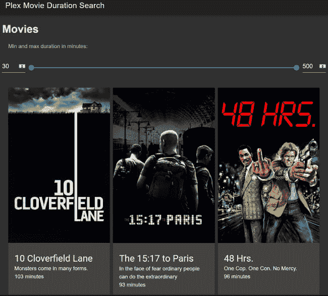
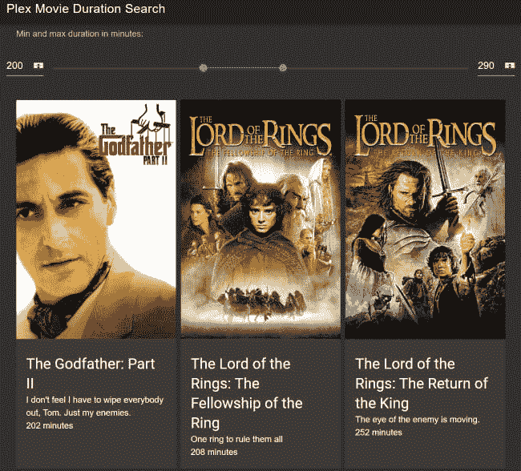

# 使用 Vue.js 构建丛服务器持续时间搜索

> 原文：<https://dev.to/raymondcamden/building-a-plex-server-duration-search-with-vue-js-1jci>

几天前一个好朋友问了我一个关于 [Plex](https://www.plex.tv/) 的问题。如果你从未听说过它，Plex 是一个*令人敬畏的*媒体服务器，它为媒体(视频、音乐文件、图片等)创建了一个易于使用的用户界面。).它非常受欢迎，你可以通过网络、移动设备和智能电视使用它。它相对容易使用，你可以与朋友分享你的(当然是合法获得的)内容。我的朋友提到，如果 Plex 有办法找到特定长度的电影，那将会很酷。在这种情况下，晚餐是在一个小时左右，这将是一个很好的选择。Plex 允许您按时间长度排序，但您不能过滤到特定长度(或长度范围)。

因此，我当然接受了这个简单的请求，花了大量的时间来构建一个演示，这个演示虽然过于复杂，但是构建起来很有趣。这也让我有机会使用一个“合适的”Vue.js 应用程序。如果你读过这篇博客，你会注意到我用 Vue.js 构建的东西 99%都比较简单，只有一个脚本标签和一些基本代码。我很少玩完整的 Vue.js 应用程序，我真的很想有机会。我还想更多地使用 [CodeSandbox](https://codesandbox.io/) ，这对这个项目*非常有效。当我完成后，我点击了一个按钮，大约两分钟后我的网站就发布到了 [Netlify](https://www.netlify.com/) 上。*

让我从展示最终结果开始。我不打算分享网址，但你可以在这里查看知识库:[https://github.com/cfjedimaster/plex-movie-duration-search/](https://github.com/cfjedimaster/plex-movie-duration-search/)

该应用程序从一个简单的登录表单开始:

[](https://res.cloudinary.com/practicaldev/image/fetch/s--g__F18m6--/c_limit%2Cf_auto%2Cfl_progressive%2Cq_auto%2Cw_880/https://static.raymondcamden.cimg/2019/05/plex1.png)

成功登录后，输入您的服务器地址。

[](https://res.cloudinary.com/practicaldev/image/fetch/s--cPu5CI1n--/c_limit%2Cf_auto%2Cfl_progressive%2Cq_auto%2Cw_880/https://static.raymondcamden.cimg/2019/05/plex2.png)

此时，应用程序将访问您的服务器，加载关于所有电影的信息，并在顶部显示一个 UI 控件，以允许过滤一系列电影。

[](https://res.cloudinary.com/practicaldev/image/fetch/s--rfviW2Np--/c_limit%2Cf_auto%2Cfl_progressive%2Cq_auto%2Cw_880/https://static.raymondcamden.cimg/2019/05/plex3.png)

因为电影海报很大，所以这不是很明显，但这是服务器上所有可用电影的滚动列表。如果过滤，列表会自动更新。

[](https://res.cloudinary.com/practicaldev/image/fetch/s--Wi2vFBzB--/c_limit%2Cf_auto%2Cfl_progressive%2Cq_auto%2Cw_880/https://static.raymondcamden.cimg/2019/05/plex4.png)

好吧，让我们来谈谈我是如何建造它的。

### 丛【API】

这有点有趣。丛确实有一个 API 记录在这里:[丛媒体服务器 URL 命令](https://support.plex.tv/articles/201638786-plex-media-server-url-commands/)。注意他们称之为“URL 命令”而不是 API。它从记录如何获得认证令牌开始。这是一个简单的对主 Plex 服务器的 POST hit，它返回大量用户数据，您唯一需要关心的是`authentication_token`。

之后，剩下的 API 调用将针对您自己的服务器。API 调用允许获取您的库、列出库内容以及获取某个项目的细节。您也可以请求 Plex 扫描和刷新库。

但是等等，还有更多。你可以找到一个 [wiki 页面](https://github.com/Arcanemagus/plex-api/wiki),记录了你可以做的更多 api“东西”,包括请求 JSON 数据，这些似乎从来没有被 Plex 的人正式记录过。对我来说，我所关心的是获得 JSON，但是您也可以查看那个链接以获得更多信息。

我的需求最终归结为两个需求:

*   注册
*   获取所有库，并通过与电影相关的库进行过滤。
*   对于每个电影库，请求所有电影。

老实说，这并不太难。让我们看看我为 Plex 调用构建的 API 包装器。请注意，Plex 不支持 CORS。我本可以为它构建一个无服务器代理，但是决定只使用 http://cors-anywhere.herokuapp.com/的 T2。这是*而不是*我会在生产中推荐的东西，但它对演示有效。在下面的代码中，您会注意到两个方法命中以包装器为前缀的 URL。

```
const plex = {
  async login(username, password) {
    console.log("try to login with " + username + " " + password);
    let form = new FormData();
    form.append("user[login]", username);
    form.append("user[password]", password);
    return fetch("https://plex.tv/users/sign_in.json", {
      method: "post",
      headers: {
        "X-Plex-Client-Identifier": "PlexWrapper",
        "X-Plex-Product": "PlxWrapper",
        "X-Plex-Version": 1
      },
      body: form
    })
      .then(res => res.json())
      .then(res => {
        console.log(res);
        return res;
      });
  },

  async getMovies(user, server) {
    let movies = [];
    console.log(
      "try to get movies for " + server + " " + user.authentication_token
    );
    return new Promise(async (resolve, reject) => {
      let response = await fetch(
        `https://cors-anywhere.herokuapp.com/http://${server}:32400/library/sections?X-Plex-Token=${user.authentication_token}`,
        {
          headers: {
            Accept: "application/json",
            "x-requested-with": "javascript"
          }
        }
      );

      let librariesRaw = await response.json();
      let libraries = librariesRaw.MediaContainer.Directory;
      //console.log(libraries);
      let movieLibs = libraries.filter(l => {
        return l.type === "movie";
      });

      //iterate over all movieLibs
      movieLibs.forEach(async m => {
        let movieRequest = `https://cors-anywhere.herokuapp.com/http://${server}:32400/library/sections/${m.key}/all?X-Plex-Token=${user.authentication_token}`;

        let response = await fetch(movieRequest, {
          headers: {
            Accept: "application/json",
            "x-requested-with": "javascript"
            }
          }
        );

        let movieRaw = await response.json();
        movieRaw.MediaContainer.Metadata.forEach(m => {
          m.poster = `http://${server}:32400${m.thumb}?X-Plex-Token=${user.authentication_token}`;
          m.duration = m.Media[0].duration;
        });
        movies.push(...movieRaw.MediaContainer.Metadata)

      });
      resolve(movies);
    });
  }
};

export default plex; 
```

Enter fullscreen mode Exit fullscreen mode

这个`login`调用并不复杂，只是一个 post，但是请注意他们对标题的要求很严格。他们好像不在乎你传什么，但你那里一定传了什么。

对于`getMovies`，我先问一下所有的库。我通过`type`等于`movie`来过滤它们。一旦有了这些，我就可以向每个库请求资产，并将它们全部复制到一个数组中。注意，在这个循环中，我设置了两个值来简化我的 Vue 代码的其余部分，`poster`和`duration`。正如我所说，这只是简化的捷径。

我仍然在通过`async`和`await`来“猜测”我的方式，但是我的上帝，我爱他们。

### vue . js 应用程序

上面我已经分享过截图了，但是 Vue 应用是如何分解成各个部分的呢？我有:

*   登录屏幕
*   “设置服务器”屏幕
*   和“显示过滤电影”屏幕。

让我们逐一解决这些问题。请注意，我正在为我的 UI 层使用 [Vuetify](https://vuetifyjs.com/en/) 。我喜欢它，但有时“布局”部分让我困惑。UI 小部件大部分都很容易理解，但是网格/布局系统仍然让我有些困惑。反正登录屏幕:

```
<template>
  <div>
    <v-flex>
      <v-card class="elevation-12">
        <v-toolbar dark color="primary">
          <v-toolbar-title>Login Form (Use Plex credentials)</v-toolbar-title>
        </v-toolbar>
        <v-card-text>
          <v-form>
            <v-text-field
              prepend-icon="person"
              name="login"
              label="Login"
              type="text"
              v-model="username"
            ></v-text-field>
            <v-text-field
              prepend-icon="lock"
              name="password"
              label="Password"
              id="password"
              type="password"
              v-model="password"
            ></v-text-field>
          </v-form>
        </v-card-text>
        <v-card-actions>
          <v-spacer></v-spacer>
          <v-btn color="primary" @click="login">Login</v-btn>
        </v-card-actions>
      </v-card>

      <v-alert :value="loginError" type="error">Invalid login credentials.</v-alert>
    </v-flex>
  </div>
</template>

<script>
import plex from "../api/plex";

export default {
  name: "Login",
  data() {
    return {
      username: "",
      password: "",
      loginError: false
    };
  },
  methods: {
    async login() {
      this.loginError = false;
      let result = await plex.login(this.username, this.password);
      if (result.error) {
        this.loginError = true;
      } else {
        // store the user
        this.$store.commit("setUser", result.user);
        // now move on
        this.$router.replace("/selectserver");
      }
    }
  }
};
</script> 
```

Enter fullscreen mode Exit fullscreen mode

该布局由一个登录表单和一个出错时显示的警告对话框组成。唯一的方法`login`就是这样做的。注意，我使用一个非常简单的 Vuex 存储来记忆值。现在让我们转到设置服务器屏幕:

```
<template>
  <div>
    <h1>Select Server</h1>
    <p>
      Enter the IP address of your server:
    </p>
    <v-text-field v-model="server"
            label="ip address"
            required
    ></v-text-field>
    <v-btn color="info" @click="setServer">Set Server</v-btn>

    <v-alert :value="serverError" type="error">
      Please specify a server.
    </v-alert>

  </div>
</template>

<script>
export default {
  name: "SelectServer",
  data() {
    return {
      server: "",
      serverError: false
    };
  },
  methods: {
    setServer() {
      this.serverError = false;
      if (this.server === "") {
        this.serverError = true;
      } else {
        this.$store.commit("setServer", this.server);
        this.$router.replace("/main");
      }
    }
  }
};
</script> 
```

Enter fullscreen mode Exit fullscreen mode

这实际上是上一个屏幕的重复，只是这次我只要求一个提示，即服务器。对此没有任何验证，只是提交给商店。最后，这里是电影展示。

```
<template>
  <div>
    <h1>Movies</h1>

    <v-subheader>Min and max duration in minutes:</v-subheader>
    <v-layout row>
      <v-flex shrink style="width: 60px">
        <v-text-field v-model="duration[0]" class="mt-0" hide-details single-line type="number"></v-text-field>
      </v-flex>

      <v-flex class="px-3">
        <v-range-slider v-model="duration" :max="500" :min="30" :step="10"></v-range-slider>
      </v-flex>

      <v-flex shrink style="width: 60px">
        <v-text-field v-model="duration[1]" class="mt-0" hide-details single-line type="number"></v-text-field>
      </v-flex>
    </v-layout>

    <v-container grid-list-md>
      <v-layout row wrap>
        <v-flex xs4 d-flex v-for="movie in filteredMovies" :key="movie.key">
          <v-card>
            <v-img :src="movie.poster"/>
            <v-card-title primary-title>
              <div>
                <h3 class="headline mb-0"></h3>
                <div></div>
                <div></div>
              </div>
            </v-card-title>
          </v-card>
        </v-flex>
      </v-layout>
    </v-container>
  </div>
</template>

<script>
import plex from "../api/plex";

export default {
  name: "Main",
  data() {
    return {
      duration: [30, 500],
      movies: []
    };
  },
  computed: {
    filteredMovies() {
      return this.movies.filter(m => {
        let minS = this.duration[0] * 60 * 1000;
        let maxS = this.duration[1] * 60 * 1000;
        return m.duration > minS && m.duration < maxS;
      });
    }
  },
  async mounted() {
    let user = this.$store.state.user;
    let server = this.$store.state.server;
    this.movies = await plex.getMovies(user, server);
  }
};
</script>

<style scoped>
img {
  max-width: 250px;
  max-height: 250px;
}
</style> 
```

Enter fullscreen mode Exit fullscreen mode

好吧，我想我得到电影的部分足够简单，但是请注意`filteredMovies`，这是我处理限制电影的方式。我这样做是基于`duration`值，这是一个数组，这可能看起来很奇怪，但这就是 Vuetify“双手”范围控件需要工作的方式。(注意，“双手”是我自己的术语，很可能是错的。)

差不多就是这样。正如我所说的，这大部分只是为了在 CodeSandbox 上玩得更多一点，并获得更多关于“完整”Vue 应用程序的经验。别忘了我有一个 GitHub [repo](https://github.com/cfjedimaster/plex-movie-duration-search/) 可用，如果你也想在 CodeSandbox 上看到它，请查看下面的内容:

[https://codesandbox.io/embed/744k1l0j9j](https://codesandbox.io/embed/744k1l0j9j)