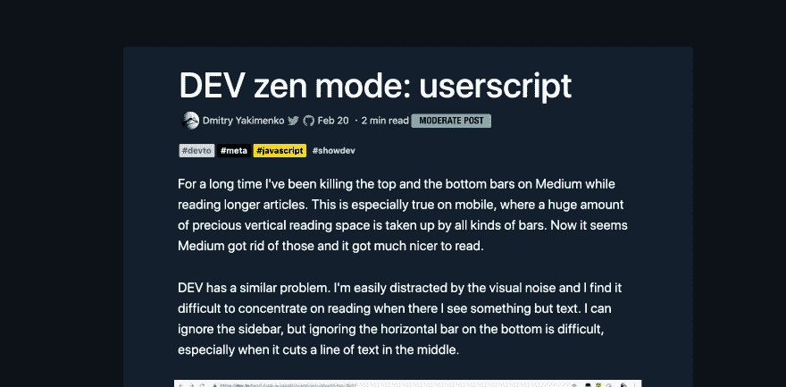

# 变更日志:禅模式

> 原文：<https://dev.to/devteam/changelog-zen-mode-40g2>

我喜欢不久前的这篇文章:

 [## 开发禅模式:用户脚本

### Dmitry Yakimenko Feb 20 ' 192min read

#devto #meta #javascript #showdev](/detunized/dev-zen-mode-userscript-12bd)

所以这个周末，当我在做其他事情的时候，我把它作为一个原生特性实现了。这是一个通过按键隐藏页面元素的功能。它将设计最小化，这样你就可以专注于阅读。然后再按一次键就可以恢复导航。

那篇文章的实现使用了`shift + z`来完成这个任务。我简单地选择了`0`按钮，它位于 num pad 上箭头键的右边。不过，我可以看到其他关键配置的论据。所以我们可以看到这在野外是如何工作的，并得到反馈。

在接下来的几周里，我们将着眼于总体上理清设计，但这只是一个简单的添加，总会以某种方式占有一席之地。

在缓存清空之前，这个特性还不能在所有文章上使用，我已经注意到了在使用“切换”时的一个错误，在这里事情有点不同步。所以我想回去用不同的方式实现它。

另外,“处理一些其他事情”是对网站编辑的更新:

 [## Changelog:升级的编辑器

### 开发团队的 Ben Hal pern 1919 年 5 月 13 日 1 分钟阅读

#meta #changelog #webdev #preact](/devteam/changelog-upgraded-editor-45mk)

编码快乐！