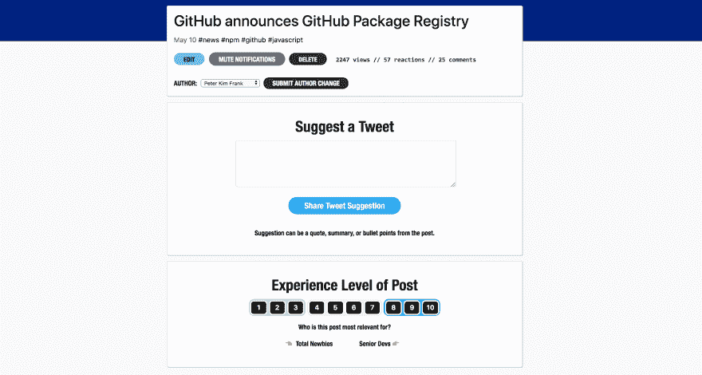

# Changelog:为作者提供 Tweet 建议和其他工具

> 原文：<https://dev.to/devteam/changelog-tweet-suggestions-and-other-tools-for-authors-9k6>

DEV 作者现在有了新的方法来管理和分享他们的帖子。从[仪表板](https://dev.to/dashboard)和个人帖子页面，您会看到一个新的管理按钮。

点击该按钮后，您将看到如下所示的页面:

随着时间的推移，我们可能会在此页面上添加一些功能，但是让我们来讨论一下您可以立即使用的页面上的几个项目:

### 建议推文

主要的新功能是能够**建议一条推文**。这是一个为您的帖子提议一条推文的机会，这条推文将通过我们的一个 Twitter 帐户发布。除了我们的主要 [@ThePracticalDev](https://twitter.com/@ThePracticalDev) 账户，我们还有越来越多的特定主题账户，如 [@TheBeginnerDev](https://twitter.com/TheBeginnerDev) 、 [@the_ruby_dev](https://twitter.com/the_ruby_dev) 等。你可以点击查看 DEV 相关 Twitter 账户的完整列表[。](https://dev.to/page/twitter)

我们不能分享每一条被提议的推文，我们保留对建议文本进行调整的权利，但这已经被证明是作者的一个伟大功能。几周前，我们悄悄地推出了这项功能，它一直工作得很好。

### 经历等级

作为一个作者，你现在有能力分配你的文章的“经验水平”。这个特性在 Ben 最初的 Changelog 帖子中有更全面的描述，但是现在除了社区 mod 之外，作者也可以使用这个选项:

 [## 新的实验特性:帖子的“目标经验等级”

### 开发团队的 Ben Halpern 月 28 日 192 分钟阅读

#meta #changelog](/devteam/new-experimental-feature-target-experience-level-for-posts-2g3j)

填写帖子的经验水平将有助于为 feed 算法提供一个*柔和的*指示器，让你的目标受众在他们的 feed 中遇到文章的可能性稍微高一点。

### 静音通知

如果你足够幸运，有一个开发人员的帖子非常受欢迎，你可能会有过禁用该帖子通知的想法。从技术上来说，这个特性在仪表板上已经存在一段时间了，但是我们认为它存在于这个页面上更有意义。

当我有一个[#讨论](https://dev.to/t/discuss)帖子得到大量回复时，我倾向于使用这个选项。

* * *

就是这样！如果您有任何问题或反馈，请留下评论，给我们发送电子邮件，或打开 GitHub 问题✌️