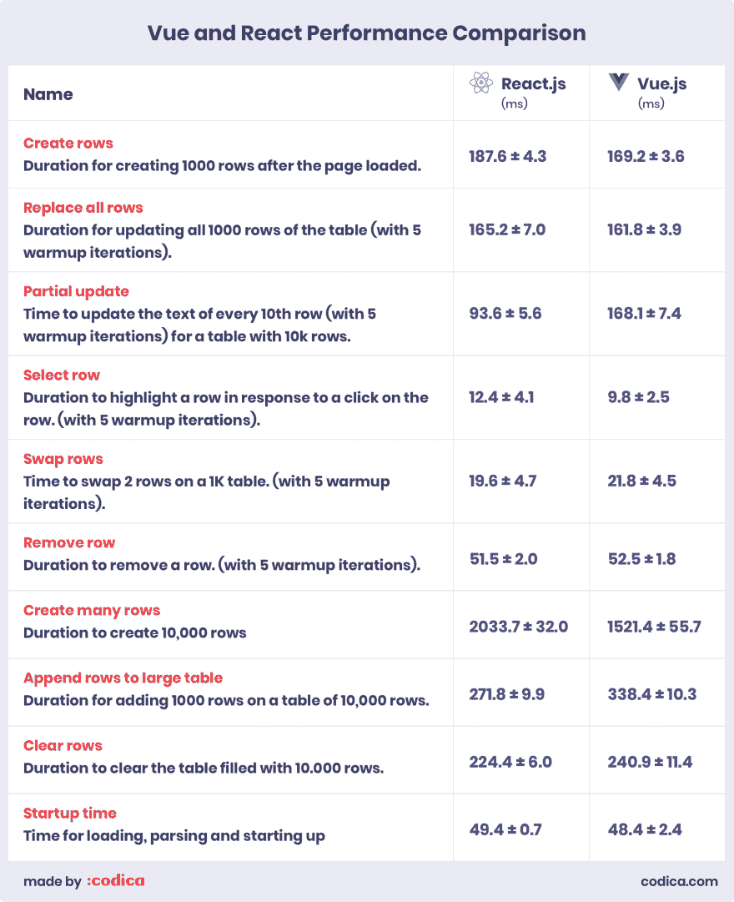
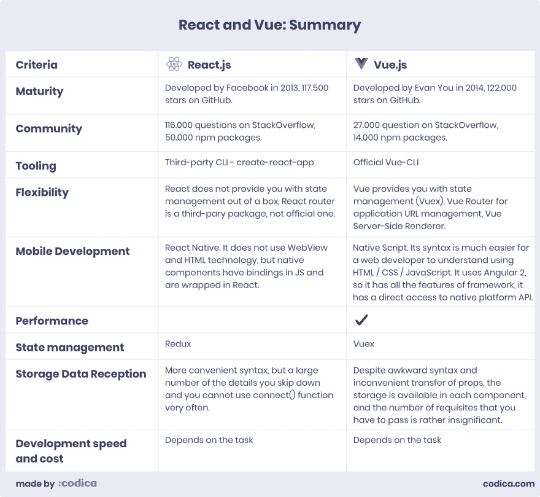
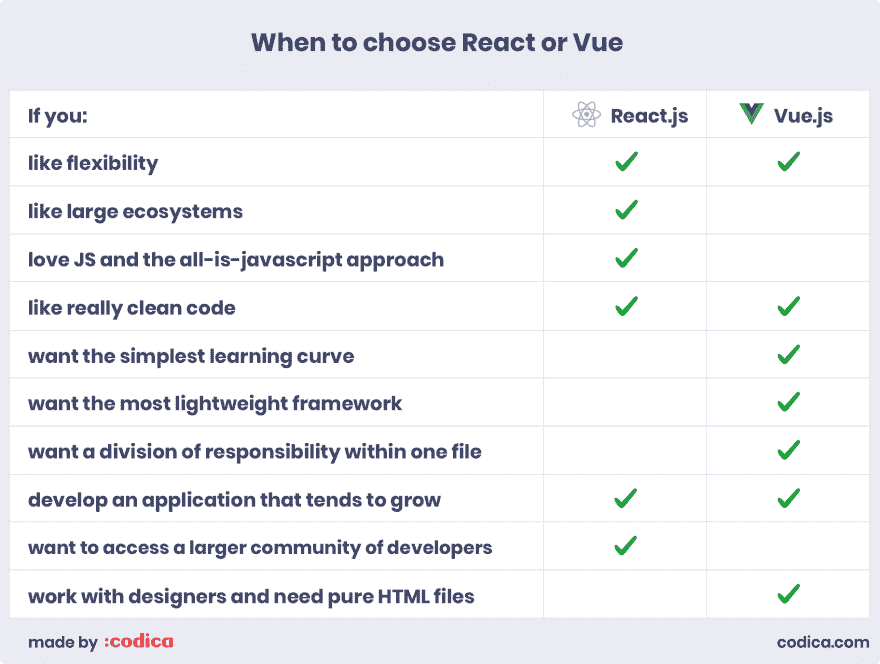

# vue vs React:2019 年为你的项目选择最好的工具。第三部分

> 原文：<https://dev.to/codicacom/vue-vs-react-choosing-the-best-tool-for-your-project-in-2019-part-3-3ppk>

今天，我们想为您提供这篇文章的最后一部分，专门介绍 Vue 与 React。在这里，我们从技术方面对这些工具进行比较，如**性能、状态管理和存储数据接收**。如果你错过了第二部分，这里是[链接](https://dev.to/codicacom/vue-vs-react-choosing-the-best-tool-for-your-project-in-2019-part-2-53b2)为您提供方便。

如果你现在想阅读完整的文章版本，这里是[链接](https://www.codica.com/blog/react-vs-vue-2019/)。

让我们开始吧。

## 表现

为了查看和比较 ReactJS 和 Vue.js 的性能，我们来了一个众所周知的 [js-framework-benchmark](https://github.com/krausest/js-framework-benchmark) 。它帮助我们比较了两种 web 开发工具。

95%置信区间的持续时间(毫秒)。

[](https://res.cloudinary.com/practicaldev/image/fetch/s--EwKB209---/c_limit%2Cf_auto%2Cfl_progressive%2Cq_auto%2Cw_880/https://thepracticaldev.s3.amazonaws.com/i/7cmx1p3worswwrzvl4zo.jpg)

总之，Vue 提供了更高的性能，但与特别慢或特别快的开发工具(如 [Inferno](https://infernojs.org) )相比，这两种开发工具非常接近。

## 状态管理

一般来说，Vue 和 React 在管理应用程序状态方面有相似的方法，但在不变性方面仍有一些差异。这里我们为您提供关键的区别点。

创建 ui 是相当乏味的。问题是状态始终存在——数据最终会改变。因此，它增加了复杂性。当你面对应用程序的增长和可伸缩性的情况时，状态管理帮了你很大的忙。考虑到小的应用程序，这并不重要，所以像 [Vanilla JS](http://vanilla-js.com) 这样的工具就足够了。

您可能想知道状态管理是如何工作的，对吗？确切地说，应用程序组件描述了某一时刻的 UI。当状态改变时，框架重新绘制整个 UI 组件——显示的数据总是最新的。因此，我们可以将这种方法称为“UI 作为一种功能”。

换句话说:状态完全在统一存储内部的对象树中。它提供了调试应用程序的机会，一些功能变得更容易实现。该状态是只读的，只能通过称为 reducers 的操作来更改。创建它们是为了表明操作如何改变状态。

**Redux 和 Vuex**

通常，这两种框架都在某种数据流库中使用。Redux 是 React 最受欢迎的选择， [Vuex](https://vuex.vuejs.org/) 是 Vue。老实说，从 Redux 到 Vuex 的转换基本上没有痛苦，因为这两个库(Redux & Vuex)比 ReactJS 和 Vue.js 本身有更多的共同点。

你已经明白，React 经常和 Redux 成对出现。它用三个基本原则来描述自己:

*   真理的唯一来源
*   状态为只读
*   使用纯函数进行更改

与 Vuex 的主要区别在于 Redux 非常依赖于状态不变性。原因是 Redux 是考虑到 ReactJS 而创建的。但是，建议避免改变用作属性或状态的值，以优化 React 性能。

另一方面，Vuex 不关心状态的不变性。

考虑到 Vue，在渲染过程中会自动跟踪与组件相关联的依赖关系。这意味着当状态改变时，框架确切地知道哪些组件应该被重新显示。

综上所述，状态管理是这两种 web 开发工具的主要区别。与 Redux 不同，Vuex 修改应用程序状态，而不是像 Redux reducers 那样使其不可变并完全替换它。

## 存储数据接收

在处理存储时，我们可以在不同的应用程序部分多次使用相同的数据。这非常重要，因为这样我们就不需要每次访问组件数据时都构建相同的函数。

如果要使用 React 组件内部的存储，需要通过 Redux 中的`connect()`函数来连接。老实说，React/Redux 数据流中最热门的话题之一是决定连接哪些组件。

对于这种情况，React 提供了一个非常有用的模式:将组件分为容器(智能)和无状态(非智能)组件。连接到存储的组件通常称为容器，哑组件通常是返回标记的简单函数。

考虑到 Vue，你不需要考虑一些划分和数据流问题。问题是存储可从任何 Vue 组件获得:

```
const Counter = {
  template: `<div>{{ count }}</div>`,
  computed: {
    count() {
      return this.$store.state.count
    }
  }
} 
```

Enter fullscreen mode Exit fullscreen mode

这是什么意思？实际上，从一个组件传递到另一个组件的细节数量是有限的，并且只有存储在存储库中的数据才需要。这很合理，因为向 Vue 传递道具有一个非常笨拙的语法:

```
<template>
<div>
  <todo-item :todo="todo"></todo-item> </div> </template> <script>
import TodoItem from './TodoItem.vue'
export default {
  components: {
    TodoItem
  },
  data () {
    return {
      todo: {
        text: 'Learn Vue',
        isComplete: false
      }
    }
  }
}
</script> 
```

Enter fullscreen mode Exit fullscreen mode

正如你所看到的，Vue 中的存储在任何组件中都是可用的，尽管在 Vue 中转移道具更不方便，与 ReactJS 相比，你真正需要通过的必需品的数量是微不足道的。

## React vs Vue:比较摘要

**反应**

如果您构建一个复杂的 web 应用程序，比如电子商务平台、市场等，您需要使用 React。

通过社区卷，未来的维护和定制变得更加容易。问题是，你可以看到大量的贡献者和程序员准备构建任何应用程序。

视图

另一方面，如果您想创建轻量级且易于修复的应用程序，Vue 是您的完美选择。老实说，学习曲线较低，允许在短时间内掌握框架。

到目前为止，Vue 社区比 React 小，但它发展迅速，这使得创建与使用 ReactJS 相同的解决方案变得更加容易。随着贡献量的增长，可用的工具和库的数量也在增加。

总结一下所有的利弊，我们来看看 Vue.js 和 React 对比表。

[](https://res.cloudinary.com/practicaldev/image/fetch/s--PXvcNxfZ--/c_limit%2Cf_auto%2Cfl_progressive%2Cq_auto%2Cw_880/https://thepracticaldev.s3.amazonaws.com/i/097ksepu2m6s3msi63bn.jpg)

正如我们所看到的，Vue 和 React 都有强大的工具和功能来帮助我们进行 web 开发。然而，在选择采用什么时，你需要记住表中列出的差异，以便做出正确的选择。

## 什么时候选择 React 或者 Vue？

React 和 Vue 都可以用于任何需求和要求，例如创建 web 应用程序、单页应用程序和用户界面组件。

最后，让我们总结一下所有的信息，以及提到的 web 开发工具的优缺点，看看哪一个将是您的企业更好的选择。

下面是考虑不同因素选择 ReactJS 或 Vue.js 的对比表:

[](https://res.cloudinary.com/practicaldev/image/fetch/s--98cm7j78--/c_limit%2Cf_auto%2Cfl_progressive%2Cq_auto%2Cw_880/https://thepracticaldev.s3.amazonaws.com/i/cwrsnqyx9vohzzoxpnpn.jpg)

无论你选择什么，你都不会错！

敬请关注，点击此处阅读全文版本:Vue vs React:[2019 年为你的项目选择最佳工具](https://www.codica.com/blog/react-vs-vue-2019/)。