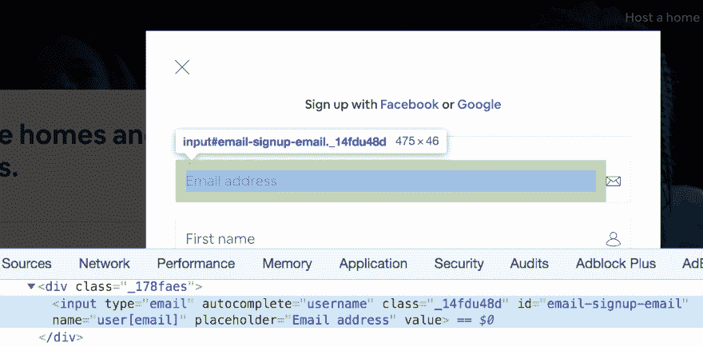
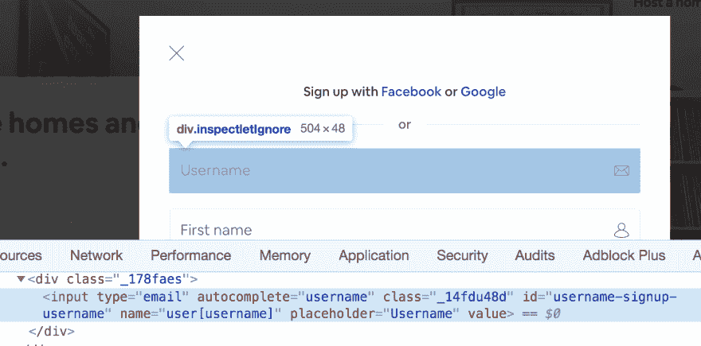
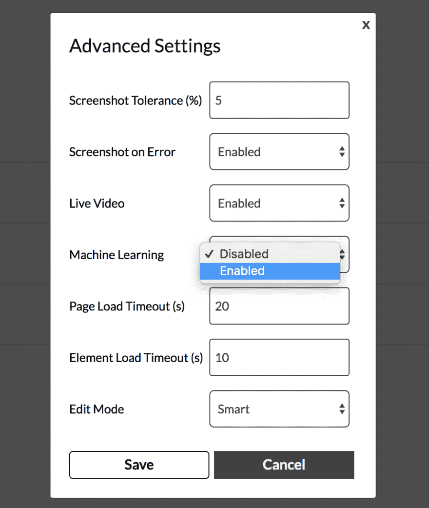
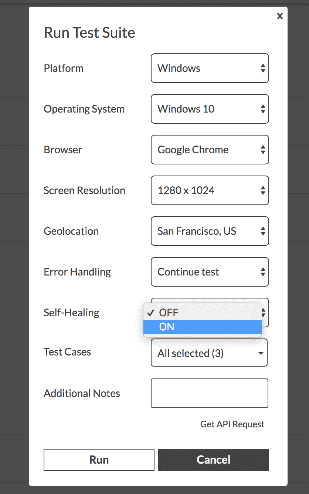

# Endtest 如何使用机器学习使您的测试更加稳定

> 原文：<https://dev.to/endtest_io/how-endtest-is-using-machine-learning-to-make-your-tests-more-stable-52hn>

我们在 Endtest 使用机器学习已经不是什么秘密了。

它不仅仅是我们用来吸引用户的流行语。

在本文中，我们将向您展示它是如何工作的。

Endtest 是一个云平台，任何人都可以创建、管理和运行 Web 和移动应用的自动化测试，而无需编写任何代码。【T2[https://www.youtube.com/embed/4DIVKcs--TA](https://www.youtube.com/embed/4DIVKcs--TA)

我们谈论的是功能测试，它通过用户界面与应用程序进行交互，就像用户通过用户界面进行交互一样。

我们的引擎使用 Python 和 Selenium 与来自 Web 应用程序的元素进行交互，使用 Python 和 Appium 与来自移动应用程序的元素进行交互。

为了找到含有硒和钋的元素，您需要提供该元素的定位器。

让我们看一个简单的例子。

在 [Airbnb](https://airbnb.com) 的注册表单中输入的电子邮件地址:

创建 Selenium 测试时，可以使用以下定位器之一来查找输入:
**ID**= email-sign-email
**Name**= user【email】
**类名**= _ 14 fdu 48d
**XPath**=/*[[@ ID](https://dev.to/id)= " email-sign-email "]
**CSS 选择器**= # email-sign-sign

您可以更进一步，根据唯一标识该元素的任何属性编写自己的自定义 XPaths:

**XPath**=//*[@ type = " Email "]
**XPath**=//*[@ autocomplete = " username "]
**XPath**=//*[@ placeholder = " Email address "]
**XPath**=/*[@ type = " Email " and @ autocomplete = " username "]

当你写这样一个测试时，你只能使用其中一个定位器。

现在，我要你选择你认为最可靠的定位器。

好吧，你选了吗？太好了，下一步我们会用到它。

让我们想象一下，Airbnb 将经历一次改造。

该输入现在看起来像这样:

你选了什么定位器？

你选了 ID，是吗？

可悲的是，你的测试现在会失败，它会给你一个假阴性。

似乎你需要更新它。

从事测试工作的人总是会经历那种维护的痛苦。

更新一个步骤并不耗时，但很少只有一个步骤。

这是我们的平台正在解决的众多问题之一。

只需从高级设置中启用机器学习选项:

当你运行测试时，我们的引擎会记住 50 到 100 种方法来定位你的元素。

它会记住所有的属性，XPaths 和 CSS 选择器。关于邻居和元素在工作流中的角色的详细信息。

当应用程序发生变化时，所有这些信息都将是有用的。

如果这些更改破坏了您的测试，我们的引擎可以轻松地更新您的测试，以匹配最新的更改。

您所要做的就是在运行测试时启用自我修复选项:

当该测试到达不再对应于新的 UI 和工作流的步骤时，它将获取它收集的关于该元素的所有信息，它将在多个线程中抓取页面，它将执行大量的计算和排序，以确定该元素是否仍在该页面上，并确定哪些是新的定位器。

它将更新您的测试，以匹配您应用程序的最新更改。

通过彻底的实验，我们得到了 98%的准确率。

我们的算法实际上可以区分有意的改变和错误。

我们的引擎更新的每一步都将在结果部分详细说明。

在机器学习领域，这被称为**监督学习**。