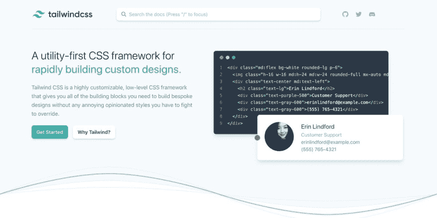

# Tailwindcss v1.0 终于来了！

> 原文：<https://dev.to/alicannklc/tailwindcss-v1-0-finally-18l1>

> 亚当·瓦坦@亚当·瓦坦🚀超级激动的宣布 [@tailwindcss](https://twitter.com/tailwindcss) v1.0 终于出来了！
> 
> 去那个网站转一转🤙🏻
> 
> 【tailwindcss.com】2019 年 5 月 13 日下午 14:29