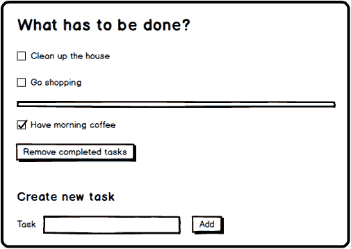

# 用 ORGENIC UI 丰富一个最小的 Javascript ToDo-App

> 原文：<https://dev.to/christianotto/enriching-a-minimal-javascript-todo-app-with-orgenic-ui-ni1>

**一个小的待办事项 app。嗯，没什么新东西，对吧？添加新任务，然后将它们标记为完成或未完成，甚至将它们从列表中完全删除...听起来可行。**

这里有一个小模型，它可能看起来像。

我很确定有很多前端开发人员在用 Javascript 编写一些代码来解决所有这些问题时不会有任何问题。这也是我们所做的。

这里有一个密码笔，看看用了多少。 *(感谢我的同事托拜厄斯做的前期工作)*
[https://codepen.io/COT/embed/EzPvQo?height=600&default-tab=result&embed-version=2](https://codepen.io/COT/embed/EzPvQo?height=600&default-tab=result&embed-version=2)
好吧，这可能暂时行得通，但这里使用的原生 HTML 控件看起来有点枯燥，你明白吗？带有标签的复选框，一些按钮，可能是一个字段集或其他包装所有东西的东西。**是时候调整视觉外观了！**

如果你对 CSS 不太感兴趣，不能独立完成所有这些元素的样式，你可能会想，现在是时候让第三方工具来帮助你了。

当然，很多人会立刻想到 Bootstrap 之类的东西来完成造型任务。虽然这可能行得通，但通常意味着你必须坚持某种预定义的模板结构，这种模板结构很容易增加 HTML 的行数。

那么，为什么不试试 web 组件呢？大家都在谈论的东西和所有整洁的 SPA 框架都已经在使用了。

## ORGENIC UI

好了，是时候介绍一下 **[ORGENIC UI](https://orgenic.org/)** 了，这是一组新的、不断增长的现成 web 组件，支持通过 CSS 自定义属性(也称为 CSS 变量)进行主题化。

虽然您可以通过 npm 非常容易地将 ORGENIC UI 包集成到您的 Angular 项目中，但是您当然也可以(使用 unpkg)将所需的文件包含在一个普通的基于 Javascript/HTML 的项目中。我们已经做到了这一点，并用我们前面提到的 CodePen 的修改版本进行了演示。

这是该应用的一个版本，其特色是有机 UI 组件和一些修改的逻辑。
[https://codepen.io/COT/embed/KLzaxY?height=600&default-tab=result&embed-version=2](https://codepen.io/COT/embed/KLzaxY?height=600&default-tab=result&embed-version=2)
(看一下笔的设置，算出需要收录的 JS 和 CSS。前往 https://docs.orgenic.org[了解目前存在的组件以及如何处理它们。)](https://docs.orgenic.org)

基本上，我们用一个`<og-card>` (ORGENIC 卡)包装我们的主模板部件，它提供了两个放置内容的槽，一个*内容*槽和一个*页脚*槽。本地按钮被替换为`<og-button>`控件(ORGENIC 按钮),它提供了一个自定义的 *clicked* 事件，我们可以监听这个事件。我们利用`<og-form-item>` (ORGENIC input)作为标签和文本输入的包装组件。作为奖励，我们甚至集成了一个小工具栏来演示如何轻松地在软件包附带的两个主题(*亮*和*暗*)之间切换。

你对更新后的结果也满意吗？从根本上改变这个小应用的用户界面只是几分钟的事情，基本上只是通过修改我们的 HTML 一点点。最重要的是，您可以通过覆盖可用的 CSS 自定义属性来轻松更改所提供的布局，但我认为这是值得单独发布的内容，请继续关注。

请访问 ORGENIC，网址为:

*   [https://orgenic.org](https://orgenic.org)
*   [https://github.com/orgenic/orgenic-ui](https://github.com/orgenic/orgenic-ui)
*   [https://twitter.com/orgenicUI](https://twitter.com/orgenicUI)