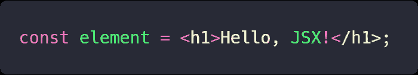
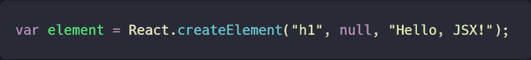
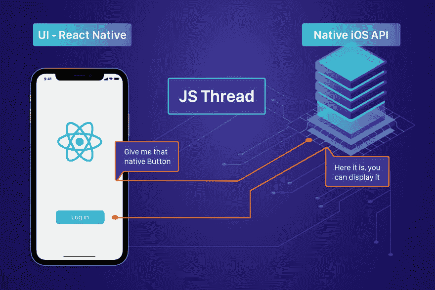
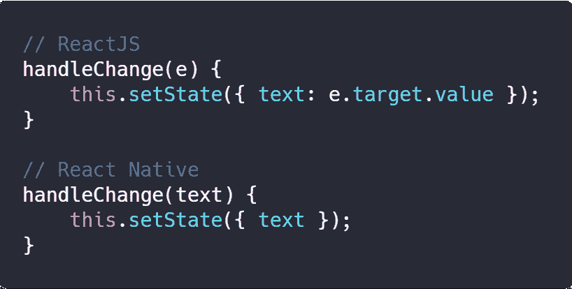
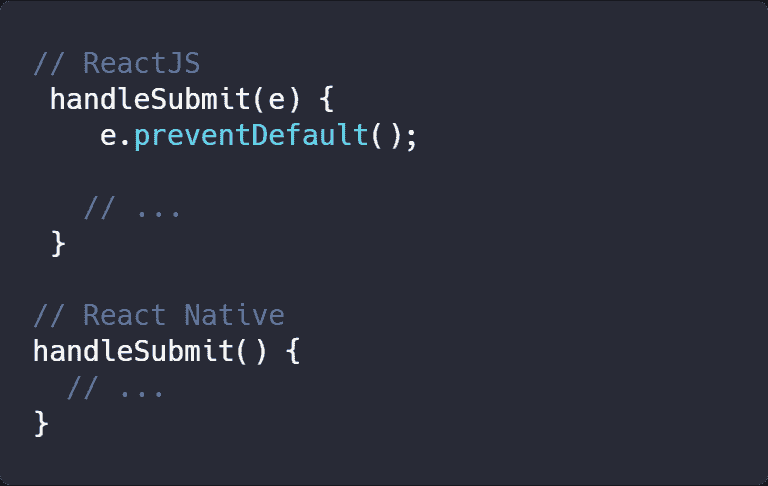
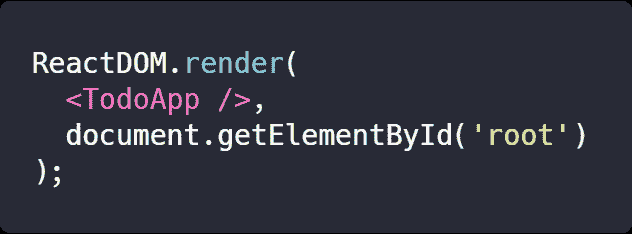
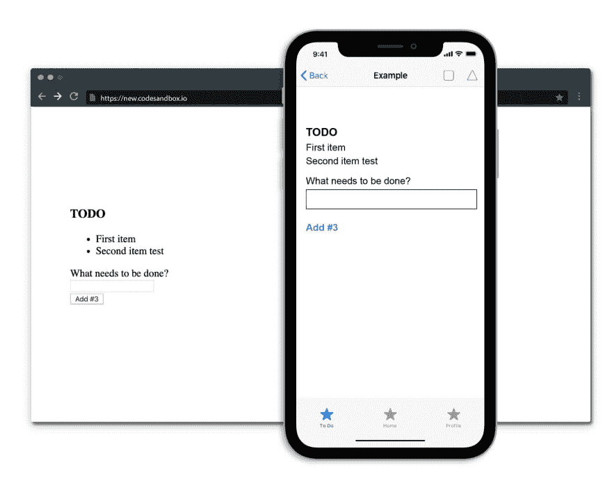

# React Native 简介

> 原文：<https://dev.to/alexandrumic/an-introduction-to-react-native-gje>

在我的职业生涯中，我有信心指导年轻的计算机科学学生(耶！).因此，当我的公司在大约 25 号(T1)开始征集导师时，我答应了。问题是:我们在 React Native 上介绍了一个实习机会，随着简历开始滚动，我意识到人们并不知道 React Native 实际上是什么。

这就是这篇文章的由来。因此，我将与您分享一些关于 React Native 的介绍性说明，在进入这个广阔的世界之前您应该知道的内容，以及-也许是最重要的-React Native 与 React 有何不同。

# 最初的考虑

React 的原生代码是用 JavaScript 编写的，应用程序的最终编译版本将几乎是原生的 iOS 和 Android 代码。通过本文，您将了解我所说的“几乎是本地的”是什么意思。

在开始使用 ReactJS 和 React Native 之前，您应该具备以下基本知识:

*   [HTML](https://developer.mozilla.org/en-US/docs/Web/HTML)
*   [CSS](https://developer.mozilla.org/en-US/docs/Web/CSS)
*   [HTML DOM](https://developer.mozilla.org/en-US/docs/Web/API/Document_Object_Model)
*   [ES6](https://developer.mozilla.org/en-US/docs/Web/JavaScript/New_in_JavaScript/ECMAScript_2015_support_in_Mozilla)
*   [节点。JS](https://developer.mozilla.org/en-US/docs/Glossary/Node.js)
*   [什么是 API](https://en.wikipedia.org/wiki/Application_programming_interface)
*   [HTTP 协议/ Web 请求](https://www.w3schools.com/tags/ref_httpmethods.asp)

因为 React 和 React Native 库都是由同一家公司(脸书)开发的，而且它们非常相似，所以在开始使用 React Native 之前，我想从 React 的基础知识开始。

# ReactJS 是如何工作的？

想象一下:这是周五晚上，你下班回家，很累，想放松一下。你坐在沙发上，拿着一个冷的和你的笔记本电脑。在打开网飞之前，你可以查看你的脸书好友动态。

当你向下滚动你的订阅源时，你注意到你最好的朋友在他们的年度公司活动上的一张有趣的照片。你对照片做出反应，并写下评论。

此时，你正在写评论，你看到有人在同时输入评论，评论随即弹出，反应和喜欢都在增加。你回复其中一个，你可能喜欢另一个，你得到另一个回复等等。

所有这些都不需要刷新页面！这是我们的好朋友——react js 的作品。

那么，React 如何知道向您显示什么，以及如何在幕后完成工作？

# 让我们深入了解一下

React 是一个基于组件的库。这意味着 web 应用程序由不同的组件组成。这些组件最终被编译成 HTML 元素。

这些组件是独立的块，它们链接在一起构建整个 web 应用程序。你可以把它想象成一棵树，其中**有一个根组件，其他每个组件都变成单独的分支**，这些分支又被进一步划分为子分支。

这使应用程序的 UI 保持有序，并允许数据和状态变化在分支之间平稳地流动。另外，组件可以链接在一起，因此一个组件可以引用其他组件。

每个组件都有自己的状态，以及[生命周期方法](https://reactjs.org/docs/state-and-lifecycle.html)。

每次一组数据发生变化，React 都会相应地自动更新组件的状态。

在代码方面，React 对代码使用了 JSX (JavaScript XML)语法——JavaScript 的一种类似 XML/HTML 的扩展。以下是 JSX 的一瞥:

如你所见，JSX 不是普通的 JavaScript 代码，也不是 HTML。

JSX 是一项独立于 React 的技术，在构建 React 应用程序时**完全可选**。然而，当你把 JSX 和反应结合起来时，生活就简单多了。

没有 JSX，代码会变得混乱，因为在 JavaScript 中创建 HTML 需要大量的元素。

大概是这样的:

这是 JSX 语法的编译代码。这是完全有效的 React 代码，但是很难编写和理解。

更多关于 React 如何使用 JSX 的信息，请点击这里。

## 但是 React 怎么理解 JSX 呢？

为了让 React 理解和编译 JSX，它需要一个翻译器。为此，我们有 **Babel** 这是一个 JavaScript 编译器，可以将标记或编程语言翻译成 JavaScript。此外，通过 Babel，您可以使用 ES6 (ECMAScript 2015)的所有功能。

好了，现在您对 React 有了一个大致的概念，让我们回到我们的例子，检查这个库如何知道向用户显示什么 HTML 元素。

React 有一个**虚拟 DOM** 的概念。

假设您在 React 中编写了一个简单的 HTML 网页。这个页面是 *transpiled JavaScript 输出*创建你的 HTML。现在，假设您想要更改/添加/删除该页面中的一个元素，并在不刷新页面的情况下显示更改。

这些更改不会被直接推送到 DOM，而是被推送到一个叫做虚拟 DOM 的地方。

虚拟 DOM 基本上只是 React 制作的真实 DOM 的副本。所以每次你想改变一个元素的时候，React 都会比较虚拟 DOM 和原始 DOM。在这一点上，如果虚拟 DOM 和真实的 HTML DOM 之间存在差异，那么更改将被推送到真实的 DOM，但只针对 DOM 的特定部分。其余保持不变。

这就是为什么反应如此之快。

JavaScript 是一种非常快速的编程语言，几乎可以立即被浏览器解释。web 开发中比较慢的部分是渲染和 CSS 部分。这就是为什么在 JavaScript 代码中保留原始 DOM 的副本并在每次更改时进行比较比替换整个 DOM 更快。

用上面例子中的元素替换这个简单的页面，你可以很容易理解脸书和其他应用程序如何使用 React，知道如何在不刷新整个网页的情况下显示动态数据。

# 什么是 React Native？

现在我们已经解决了 React 的基础问题，我们终于可以进入 React 的本地世界了。

React Native 是一个开源的移动应用框架，由脸书开发。它的首次发布是在 2015 年 3 月 26 日的 React JavaScript 配置大会上。

> React Native 旨在通过为开发人员提供一个与原生移动平台一起使用 React 的工具，为 iOS 和 Android 创建移动应用程序。

# 如何反应原生作品？

React Native 的工作原理与 React 是一样的，但他们不是针对浏览器，而是针对移动应用。

所以，现在你是 React 基础知识的专家了，这应该很简单: **React Native 也操纵某种 DOM，比较它，就这样。**是在换一个手机 app UI 吧？

但是等等...在移动应用程序中没有 HTML DOM 的痕迹。而且我们要做的是手机 app，不是网站。所以我们无法打开移动设备浏览器(咄！).

也就是说，React Native 并不通过虚拟 DOM 操纵 DOM，而是**运行一个后台进程——一个 JavaScript 线程——以便通过序列化、异步和批处理桥与本机平台**通信。

我知道，这里有些花言巧语，但我会让它更简单。

React Native 不使用 HTML，而是通过使用 JavaScript 部分与本机 iOS (C/Swift)和 Android (Java)代码之间的桥梁发送的消息来查看本机视图。

> 这就是为什么我喜欢说最终的 React 原生 app 是一个*几乎*的原生手机 app。JavaScript 和原生 iOS 和 Android 代码之间还有一座桥梁。

为了便于理解，请看下图:

在上面的例子中，比尔——了不起的 React 原生开发者——正在他的 React 原生移动应用中创建一个开始屏幕。它需要在页面上显示 2 个元素:React 徽标和登录按钮。

为此，他使用 JSX 和类似的 React 代码结构在 React Native 中编写代码，但他没有使用 div 和 HTML 元素，而是使用 React Native 视图元素。**当代码被编译时，它会生成一个 JavaScript 线程，在 React 原生渲染方法和实际的 iOS/Android 原生代码之间建立一座“桥梁”。**利用这个桥梁，React Native 可以要求原生代码提供它需要的原生元素。

在这种情况下，React Native 调用本地呈现 API 来接收图像和按钮元素，然后它只在应用程序中显示它们。最终显示的组件是完全本机的 UI 元素。没有必要创建 webview 并在其中呈现 HTML。

**这就是 React Native 如此强大的原因。最终的应用程序看起来和感觉上与任何其他移动应用程序一样。**

除了提供对原生渲染 API 的访问，React Native 还公开了原生平台 API 的 JavaScript 接口，因此您可以访问特定于平台的功能，如手机摄像头、位置等。

在任何其他方面，React Native 都类似于 React😊。

# 反应原生的优点

在使用 React Native 之后，我认为以下是它的一些非常坚实的优势:

*   你可以**更快地编写代码**并发布给 iOS 和 Android，只有与设备相关的微小差异。没有必要为同一个应用程序的 2 个开发团队。
*   由于 React Native 实际上使用原生平台 API 来呈现组件，因此它**从大多数现有的跨平台开发方法**中脱颖而出，例如 Cordova 或 Ionic，它们使用 webviews 来显示应用程序中的 HTML 元素。
*   你不需要太多关于 C/Swift 或 Java 的知识就可以为这两个移动平台开发移动应用
*   能够编写独立于与本机平台通信的主 UI 线程运行的 React 代码。
*   对 Web(前端)开发友好——你可以用本地应用的性能、外观和感觉编写移动应用，同时使用熟悉的工具。

以上只是 React Native 的几个优点，但我想你已经明白了。

# 反应 vs 反应原生。例子

正如我上面提到的，React 和 React Native 在代码编写的角度上非常相似，所以让我用一个实际的例子来说明。

为了便于比较，这里有一个用 React 和 React Native 编写的简单的待办事项应用程序。

注意:不要害怕 JSX 语法，也不要太关注代码。这个想法是要注意 React 和 React 本机代码之间的细微差别，除了一些样式之外。

为了更容易理解，我将把不同之处分开:

在 React 的`handleChange()`函数中，函数的参数是事件对象，通过它，我们可以获得触发该事件的 HTML 元素的值。

另一方面，在 React Native `handleChange()`函数中，我们可以直接发送输入元素的当前值，并在组件状态中设置该值。

* * *

您可以注意到的另一个区别是在`handleSubmit()`函数中。
同样的原则也适用于 React 端——使用事件对象是为了防止触发该事件的元素的默认行为，该元素是`form` HTML 元素。默认情况下，当`onSubmit`事件被触发时，表单自动用表单数据发出请求。

在 React Native 侧，这是不必要的，当按下`Add`按钮时会触发`handleSubmit()`功能。

* * *

接下来是`render()`方法，它负责在屏幕上呈现组件。这里可以看到，React 原生代码使用了来自`“react-native”`包的元素，而不是`divs`、`inputs`、`forms`等 HTML 元素，这些元素都是移动原生 UI 元素。

* * *

最后，在 React 中使用了`ReactDOM.render()`方法，为了将`<TodoApp />`组件注入到`
` HTML 元素中，该方法是**强制的**。

> 别忘了这是 JavaScript，所以页面中的每个 HTML 元素都被注入到那个根 div 中。

这款应用在网络和手机上看起来很相似:

# 总结一下吧

React Native 是一个仍处于早期阶段的框架，它的工作还在进行中，所以它确实有一些局限性。但总的来说，它真的帮助我从 web 开发过渡到移动开发，并且非常适合我正在从事的项目。

我很高兴听到你对 React Native 的体验——无论是好是坏——所以请随意挑起任何争论或寻求任何建议。