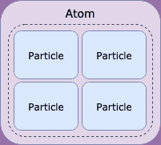
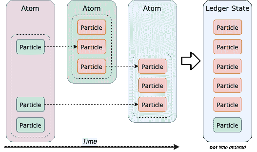
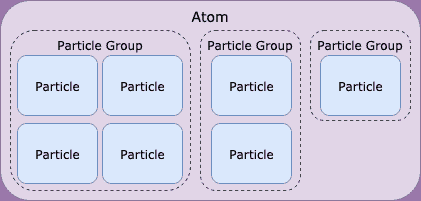
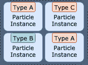
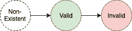
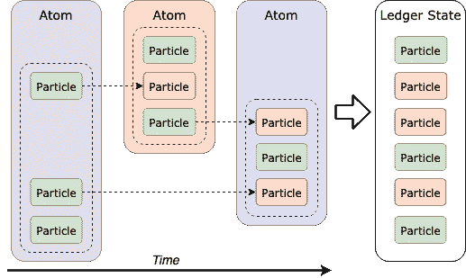
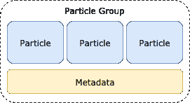
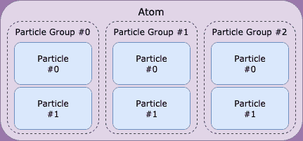
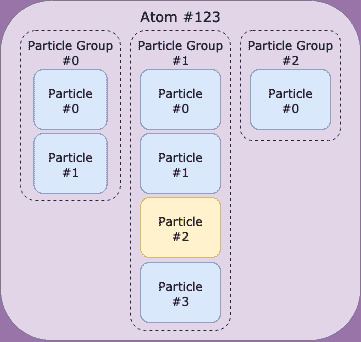
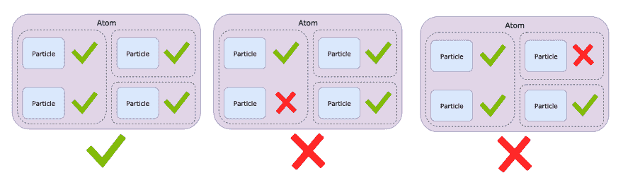

# 知识库更新-原子模型

> 原文：<https://dev.to/radixdlt/knowledgebase-update-atom-model-263i>

# 简介

Tempo(基数一致性算法)提供了一个基本的约束:状态的最终一致性。为了有意义地建立在这个约束之上，我们需要高级的、面向应用的约束和结构。Atom 模型旨在通过支持金融系统(代币的创建、铸造、转移和燃烧)、数据存储和转移(消息传递)等的可扩展实现来支持去中心化的应用。

# 规格

在分布式数据存储中，所有参与者必须就一组控制状态如何改变的规则达成一致。因为不是每个节点都可以存储所有状态，所以必须将一个状态划分为更小的状态片段，这些片段可以在不需要所有其他状态的情况下进行验证。为了实现这一点，状态更改必须是显式的，并且需要支持一种机制，该机制可以作为一个单元接受或拒绝一批状态更改。在 Radix 中，这些状态变化是粒子，这一批原子粒子是一个原子。原子模型描述了它的结构、规则和与节奏的接口。

# 层次结构概述

分类帐的状态是微小状态变化的总和。账本的这些单个状态变化被称为粒子。为了将粒子(即状态变化)提交到分类帐，它们必须被放置在原子内部。

较后原子中的粒子可以更新作为较早原子的一部分存储的粒子(例如，存储某些令牌已经被花费)。因此，分类帐的当前状态由所有最新的粒子(即状态变化)组成，其相对于彼此的排序由速度来确保。

当许多这样的状态变化被同时提交时，很难辨别哪些属于一起。这对于验证(即接受/拒绝更改)和最终用户来说都是很麻烦的(“哪些粒子代表什么？”).为了提供粒子关系的清晰机制，相关粒子被分组到粒子组中。

请注意，任何粒子必须作为粒子组的一部分提交，粒子不能直接进入原子内部。这种显式的分组机制使得开发库、钱包，当然还有 Radix 节点实现变得更加简单，因为管理粒子之间的关系本身就得到支持。

原子、粒子群和粒子是原子模型的核心结构元素。下面几节将对它们进行详细定义。

# 粒子

粒子是驱动原子模型的核心组件，因为它们可以与原子中的其他粒子混合和匹配，以形成任意复杂的动作。有许多不同类型的粒子用于不同的目的，在这里解释[。因此，在讨论粒子时，区分描述粒子类型的粒子类型和描述特定粒子类型实例的粒子实例是很重要的。粒子实例形成分类帐的状态，而粒子类型定义粒子实例的状态保证和规则。](https://docs.radixdlt.com/alpha/learn/architecture/particle-types)

根据粒子类型的允许，不同粒子类型的粒子实例可以在一个原子和一个粒子组中混合。关于一个粒子类型可以允许和不允许其实例的状态，在文章[粒子类型](https://docs.radixdlt.com/alpha/learn/architecture/particle-types)中有进一步的解释。

# 粒子是有限状态机

正如所建立的，粒子实例可以在后面的原子中更新。更新是指将粒子的生命周期状态变为另一种状态，例如从“不存在”变为“有效”，或者从“有效”变为“无效”，或者甚至从“有效”变为“有效”。失效——将粒子实例标记为无效——对于可以以某种方式使用的所有粒子类型(例如令牌)都很有用。

更新粒子不会改变其内容，但会改变其状态。事实上，相等的粒子的内容被用来标识具有相等内容的后面的粒子意味着是更新。“不存在”、“有效”和“无效”是任何粒子实例的三种可能的生命周期状态，粒子类型规定了允许的状态和顺序。也就是说，粒子实例可以呈现的有限数量的生命周期状态由粒子类型描述的生命周期有限状态机控制。记住粒子的生命周期状态，考虑粒子如何随时间更新的示例:

请注意，每个箭头都标记了从一个生命周期状态(在此示例中为绿色，即“有效”)到另一个生命周期状态(在此示例中为红色，即“无效”)的转换。为了清楚起见，从不存在到有效存在的转变被省略了，因为它们是隐含的。

# 粒子群

粒子组是相关粒子的分组，原子中的元数据表示一个应用程序级动作。动作可以是发布涉及多个粒子的转移、付费、发送消息，或者用户或开发者希望分组的任何逻辑动作。

# 元数据

与原子类似，粒子组包含基于字符串的元数据键值存储。这种元数据没有任何形式的验证或约束(除了原子的大小限制)，可以自由使用。请注意，因为所有粒子组都包含元数据，并且它不会以任何方式影响原子模型的其他方面，所以将省略它，除非在本文的剩余部分中明确讨论。

# 粒子和粒子组索引

为了唯一地识别原子中的粒子组，按照它们被添加到原子中的顺序对它们进行索引。为了唯一标识粒子组中的粒子，粒子按照添加到其粒子组的顺序进行索引。请注意，这两个指数都是从零开始的。

使用粒子所在的粒子组的索引，以及该粒子在该组中的索引，可以很容易地在遵循 [JSON 指针标准](https://tools.ietf.org/html/rfc6901)的原子中引用粒子，如下所示:

> < atomId >/组/< groupIndex >/粒子/ < particleIndex >

请注意,“atomId”是使用原子的散列计算的。进一步解释见[形式定义](https://docs.radixdlt.com/alpha/learn/architecture/atom-model#formal-definition)。例如，粒子标识符

> 123/组/1/粒子/2

指索引为 1 的粒子组中索引为 2 的粒子，如下所示:

当一个原子被节点拒绝时，这有助于调试，因为它可以以人类可读的方式指向特定的粒子。

# 原子内的依赖关系

通常希望提交一个由多个相互依赖的变更组成的原子状态变更。原子中的粒子组可以依赖于它之前的粒子组的输出，按索引排序。

# 原子

原子是账本上状态变化的原子容器。当一个原子被提交给网络时，要么它的所有粒子(即状态变化)都被接受和存储，要么都不被接受和存储。

除了粒子形式的状态变化(分组到粒子组中)，原子还包含元数据、签名和时间证明。签名对于确保原子中提交的状态更改的合法性至关重要，而时间证明对于达成分类帐公共状态的共识至关重要。注意，时间证明不是由客户端附加的，而是由节点附加的。由于签名和时态证明与原子模型没有直接关系，因此在本文的剩余部分将省略它们。

# 元数据

Atoms 还包含基于字符串的元数据键值存储。这种元数据不会以任何方式被验证或约束(除了原子的大小限制，参见[形式定义](https://docs.radixdlt.com/alpha/learn/architecture/atom-model#formal-definition))，并且可以自由使用。请注意，因为所有原子都包含元数据，并且它不会以任何方式影响原子模型的其他方面，所以本文的其余部分将省略元数据。

# 原子性

原子的原子性对于构造复杂的动作是有用的，在这些复杂的动作中，所有的状态变化要么被接受，要么被拒绝。

只有当一个原子的粒子都不被排斥时，它才被接受，不管它们在原子中的位置如何。

# 正式定义

# 正式结构

原子模型的正式结构定义是一个高层次的概述。就本定义而言，[项目]+应表示项目必须至少包含一次，[项目]*应表示项目可以包含任意次，项目应表示项目必须恰好包含一次。

# 通用元数据

通用元数据是关于基于字符串的键值存储中的项目(例如原子或粒子组)的任意数据。字符串是 UTF-8，它们的键和值是任意的。唯一的限制是尺寸，这是由整个原子尺寸限制间接施加的。通用元数据被定义为

> 键=
> 值=
> 元数据=
> [键=值]*

# 粒子

粒子的结构在[粒子文件](https://docs.radixdlt.com/alpha/learn/architecture/particle-types)中定义。由于粒子没有任何必需的结构，所以没有共同的基础结构。

# 粒子群

粒子组包含带有常规元数据的非空索引粒子列表。粒子群的结构是

形式粒子群结构

> 粒子组=
> 通用元数据
> [粒子]+

# Atom

原子包含带有原子元数据的粒子组的非空索引列表。Atom 元数据类似于一般元数据，只是它具有必须存在的特殊值，并且具有值约束:

| 必需的元数据键 | 目的 | 价值约束 |
| --- | --- | --- |
| 时间戳 | 提交原子时的时间戳 | 正整数 |
| 一定是在宇宙被创造之后 |  |  |

原子的结构被定义为

> Atom =
> 原子元数据
> [粒子组]+

# 原子大小的限制

紧凑序列化原子可以拥有的最大字节数是 65536。

# 形式图式

正式模式是一个 JSON 模式，对象的 JSON 序列化版本必须遵循它。

# 粒子

粒子的模式在粒子文档中定义。由于粒子不共享任何所需的结构，因此没有公共的基础模式。

# 粒子群

粒子组的正式 JSON 模式可从这里获得。

# Atom

这里提供了 Atom 的正式 JSON 模式。

# 实现

Atom 模型目前是在 Radix 核心的开发分支(Radix 节点的主要实现)和 Radix 客户端库上用 Java 实现的。

# 基数核心(Java)

Radix 核心实现目前只对 Radix 核心开发人员开放。

# 客户端库

| 语言 | 状态 | 图书馆 |
| --- | --- | --- |
| [Java](https://docs.radixdlt.com/alpha/develop/java-client-library-guide) | 有空的 | radixdlt-Java |
| [JavaScript](https://docs.radixdlt.com/alpha/develop/javascript-client-library-guide) | 有空的 | radixdlt-js |
| [锅炉](https://docs.radixdlt.com/alpha/develop/kotlin-client-library-guide) | 有空的 | radixdlt-kot Lin |
| 迅速发生的 | 发展中 | radixdlt-swift |

# 加入 Radix 社区

[电报](https://t.me/radix_dlt)普通聊天
[不和](https://discord.gg/7Q7HSZZ)开发者聊天
[Reddit](https://reddit.com/r/radix) 普通讨论
[论坛](https://forum.radixdlt.com/)技术讨论
[推特](https://twitter.com/radixdlt)发布公告
[电子邮件](https://radixdlt.typeform.com/to/nyKvMV)简讯每周更新
邮件[hello@radixdlt.com](//hello@radixdlt.com)普通查询