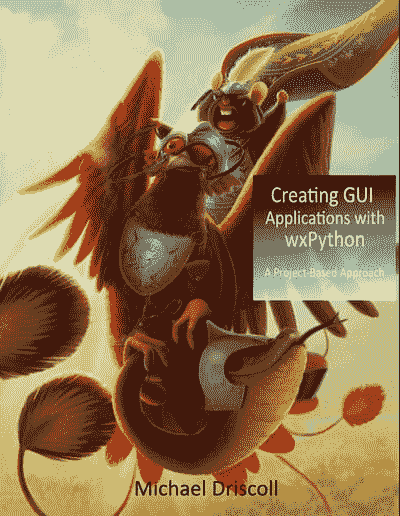
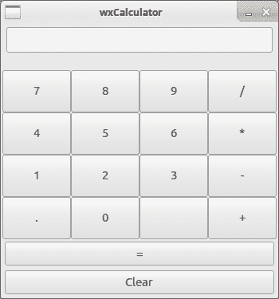

# 用 wxPython 创建 GUI 应用程序

> 原文：<https://dev.to/learnbyexample/creating-gui-applications-with-wxpython-book-review-4ogo>

*照片信用:T1】特拉特茅斯 on [像素](https://www.pexels.com/)t5]*

多年来，我一直想创建好看、有用的 GUI 应用程序。我已经放弃了大部分时间，因为编程对我来说太难了，GUI 至少需要一些设计技能。一年多来，我只艰难地通过一个 Android 应用程序，因为这是一个学生时代的梦想游戏，我辞职后有很多空闲时间。然而，最终，我得到了一个由 1000 多行程序组成的意大利面条般的烂摊子，并对 Java 和面向对象编程产生了强烈的厌恶。一部分原因是我没有尝试正规的学习方式，只是从一个最接近我想做的游戏的教程开始。

几年后，我在这里，再次尝试使用 GUI。我有几个中小规模的应用程序要实现，希望我会避免以前的错误，特别是功能蠕变。当我看到 Mike Driscoll 的这条推文时，我接受了这个提议。

> 迈克·德里斯科尔@德里斯科尔如果有人有兴趣在他们的博客/网站上评论我的任何一本书，请告诉我。我很乐意送你一本免费的书！2019 年 3 月 22 日下午 14:56624

我得到了一本免费的书，作为交换，我复习了用 wxPython 创建 GUI 应用程序的[。这本书目前发售到 5 月 15 日。不得不复习是定期阅读这本书的额外动力，到目前为止，我对这样做很满意。](https://www.blog.pythonlibrary.org/2019/05/08/creating-gui-applications-with-wxpython-now-available/)

在这本书之前我没听说过 [wxPython](https://wxpython.org) 。说到 Python 中的 GUI，我知道默认带有标准库的`tkinter`、 [Kivy](https://kivy.org) 、 [Pygame](https://www.pygame.org) 和 [PyQt5](https://pypi.org/project/PyQt5/) 。这本书从介绍`wxPython`开始，然后深入到基于项目的方法。到目前为止，我已经完成了一半的章节，涵盖了四个项目概念:

*   图像浏览器
*   数据库查看器和编辑器
*   计算器
*   档案管理员

其余章节涵盖以下主题:

*   MP3 标签编辑器
*   使用美国宇航局 API 的图像应用
*   PDF 合并/拆分器
*   文件搜索
*   FTP 应用程序
*   XML 编辑器
*   分发您的应用程序

还有几个附录章节。

正如在本书的介绍中提到的，在开始阅读本书之前，你肯定需要熟悉 Python 类。书中使用的代码也可以从 [GitHub repo](https://github.com/driscollis/applications_with_wxpython) 获得，但是我强烈推荐手动键入它们。

项目性质也意味着在第三章之后，你可能会跳过你不感兴趣的章节。例如，我没有太关注数据库章节，因为我没有太多的数据库经验。每个项目都是逐步描述和展示的。这些项目可以在不同的阶段运行——在这些阶段使用 GUI 有助于将代码映射到输出，以及试验不同的设置。

总而言之，对于那些想开始用 Python 编写 GUI 应用程序的人，我强烈推荐这本书。请务必联系作者，让他知道您的反馈或您是否有任何澄清。快乐学习:)