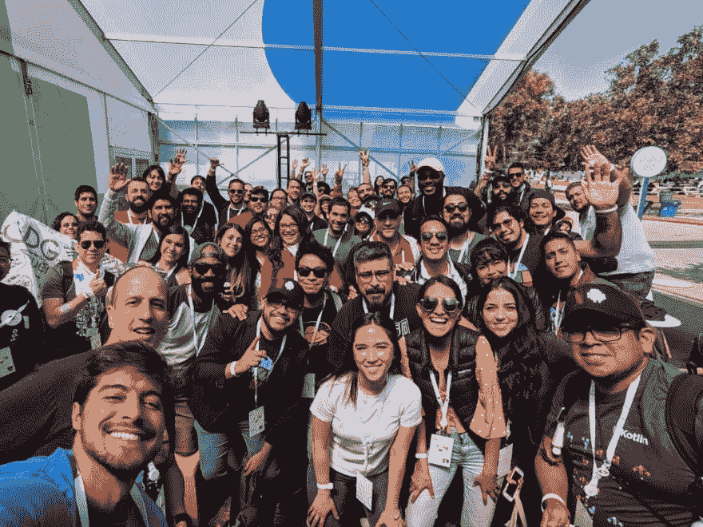

# ∞2019 年谷歌 I/O 离开了我们？

> [https://dev . to/devpicon/which 我们离开-el-google-i-o-2019-3k8i](https://dev.to/devpicon/que-nos-dejo-el-google-i-o-2019-3k8i)

#### Para un Android 开发者

这无疑是一个有趣的版本，在我看来，今年还有许多工作要做；尤其是如果你是 Android 开发者。

<figure> 

<figcaption>谷歌 I/O 2019</figcaption>

</figure>

上与拉美乐队合影

我第四次有机会参加了正在进行中的 Google I/O，该网站在聚会环境中介绍了 Google 开发的各种技术的最新发展。

此次活动包括与会场一起在各种空间举办的会议，以及可以与正在开发各种技术的工程师交谈的专题空间:中国 Android 、**、浮动+AR** 、**中国 Android 汽车此外，还有*【app reviews】*和*的办公时间。***

 *活动会话已在 Google developers 频道上提供。

接下来，我将对我有机会参加的会议作一点评论。

[https://www.youtube.com/embed/videoseries](https://www.youtube.com/embed/videoseries)

#### 谷歌主题演讲

我必须强调的要点如下:

*   今天，谷歌正通过使用模型和人工智能，与早期癌症检测药物携手合作。
*   **双面项目**继续推进，现在不仅可以让我们的助理与现实生活中的人互动预约、忙时接听电话等，还可以自动与网络互动，执行占用我们时间的操作。
*   无障碍环境方面正在取得进展，现在可以使用实时记录誊本进行通信。
*   **委婉语项目**([【http://g . co/委婉语】](http://g.co/euphonia)是一个为有语言障碍的人使用训练有素的模式的项目。

[https://www.youtube.com/embed/OAdegPmkK-o](https://www.youtube.com/embed/OAdegPmkK-o)

*   展示了 Google Translator 等工具的使用情况及其在低成本、低性能设备新兴市场的使用能力。压缩所有这些机型的能力令人难以置信，因此使用这些机型时不需要太多存储空间。

[https://www.youtube.com/embed/videoseries](https://www.youtube.com/embed/videoseries)

#### 开发者主题演讲

在 Google Keynote 上看到之后，我们看到了 developer keynote，它涉及到 Google 工具的更多技术方面。这次的*【要点】*由谷歌云现任首席执行官托马斯·栗安主持开幕。虽然该主题介绍了几种技术，但我将重点介绍为 **Android** 制作的广告。

*   Android 变得比以前更强了*【kot Lin-first】*，因此组成 Jetpack 的图书馆的许多更新都将以该语言为重点。
*   在 Jetpack 中添加了一个名为[**【camera】**](https://developer.android.com/training/camerax)的新 API，该 API 旨在以向后兼容的方式实现摄像机部署的标准化，市场上设备的比例高达 90%。
*   另外，名为**【jetpack 复合】** (开发中)的图书馆正在进行工作，这将使面向 UI 的反应性发展成为可能。
*   **Android Studio** 后面的团队进行了*【功能冻结】*并着手处理最重要的错误，从其基础上完善所有工具，[这些增强功能将作为 3.5](https://android-developers.googleblog.com/2019/05/android-studio-35-beta.html) 版本的一部分提供。
*   将有一个名为“**in-app updates”**的新功能，使您可以执行应用程序更新，而无需等待来自 Play Store 的更新。

#### 我看到的其他会议

下面，我将把我曾出席过的会议清单留给各位:

[https://www.youtube.com/embed/videoseries](https://www.youtube.com/embed/videoseries)

虽然这是一个介绍性的演讲，但它给我们带来了 Android 的最新发展。

[https://www.youtube.com/embed/videoseries](https://www.youtube.com/embed/videoseries)

这个塑料向我们解释了科特林在背后是如何工作的。

[https://www.youtube.com/embed/videoseries](https://www.youtube.com/embed/videoseries)

本教程将向您介绍新的 camera API 的工作原理。

[https://www.youtube.com/embed/videoseries](https://www.youtube.com/embed/videoseries)

我喜欢他们给我的这种对话，他们给了[【florina munenescu】](https://medium.com/u/d5885adb1ddf)和[【yigit boyar】](https://medium.com/u/55a38e86cfa7)，他们根据一个人想给他们的方法一起探索各种建筑模式。最后一课是我们会告诉你使用哪一种，一切都取决于你的应用程序；但是，这是一个值得推荐的谈话，看看为什么他们会向你展示选择和走上建立体系结构的道路所涉及的各个方面。我对这种说法的看法是，经常看到社会讨论一个人应该使用的架构，他们想表明自己在这方面的立场。

[https://www.youtube.com/embed/videoseries](https://www.youtube.com/embed/videoseries)

这次演习首先回顾了《古兰经》的各项原则，然后又进一步，最后向我们展示了各种组成部分如何取用古兰经，并将其纳入其中，以改进其运作。

[https://www.youtube.com/embed/videoseries](https://www.youtube.com/embed/videoseries)

与参与 Android 开发的每个团队的负责人进行经典对话。

[https://www.youtube.com/embed/videoseries](https://www.youtube.com/embed/videoseries)

如果我们想深入了解 Android 的工作方式，这次演讲非常出色。帮助我们更好地了解 Android 虚拟机的工作方式。

到目前为止，我参加了一系列的整容手术，我还有几件事要做，我希望在今后几天里能看到。继续复习，继续学习。

BTW 渴望得到一个 3a 像素和一个戴着 OS 的 Smartwatch，但这将是一个更好的机会。

* * **