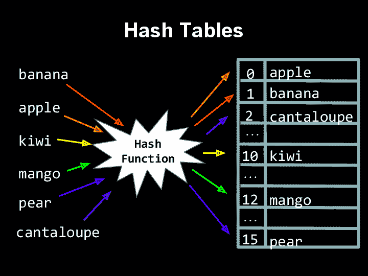

# 哈希表介绍(幕后的 JS 对象)

> 原文：<https://dev.to/loganwohlers/intro-to-hash-tables-js-objects-under-the-hood-26oa>

在数据结构和算法的世界里，散列表非常普遍。作为一个主要从事 JavaScript 工作的人——我真的没有接触过它们——因为像许多其他东西一样——JavaScript 把它们抽象了出来(剧透:它们是对象)。然而，出于学习 DSA 材料的兴趣，本周末我花了一些时间研究它们，并希望分享我所学到的知识，以帮助揭开这种常见数据结构的神秘面纱——并更好地了解一个对象如何存储其数据，然后当您给它一个键时，如何去检索一个值。

为了理解哈希表的内部工作原理，让我们来看一个假想的问题，检查数组是否包含值。

我们有一个[1，3，4]的数组。我们如何检查这个数组是否包含数字 5？最简单的解决方案是遍历数组——检查每个值，看它是否等于 5——最终返回 false，因为上面的数组没有 5。这很好，但是这个解决方案是在 O(n)时间内完成的——也就是说，解决这个问题所需的时间取决于数组的大小。如果我们有一个长度为 10k 的数组，我们想检查它是否包含一个特定的值，这将非常耗时——在最坏的情况下，我们必须检查所有 10k 的索引才能回答这个问题。考虑到这一点，我们如何在 O(1)或常数时间内解决这个问题。我们如何能立即得到我们的数组是否包含一个特定值的答案——不管它有多长？

让我们采用另一种方法——我们可以使用一个布尔数组来表示该索引的值是否包含在我们的原始值集中(即索引 1 为真意味着包含数字 1)——这看起来类似于:

```
Values:     1     3  4
 Index:  0  1  2  3  4
   Arr:[ F, T, F, T, T ] 
```

这样我们可以在 O(1)时间内检查值是否包含一个值——因为我们需要做的就是访问那个索引并检查 T/F。

现在我们有了一个超级简单的示例设置，一个问题就变得很清楚了——如果值包含一个很大的数字(例如 100)会怎么样？在索引 100 处指示 T 之前，我们必须用 90+以上的值或 F 填充数组。显然这是完全低效的——所以为了解决这个问题，我们需要找到一种方法，使数组的长度能够更好地对应于它所代表的值的实际数量。一个常见的例子是，我们如何处理我们的值以适应一个更小的数组，就是取它们的模 10，并使用它作为存储 T/F 的索引。

我们的新值集包含:1、3、4、77 和 100
77%10=7 和 100%10=0，因此这些索引现在将包含 T

```
Values: 100    1     3  4        77        
   Arr:[ T, T, F, T, T, F, F, F, T, F, F ] 
```

既然我们已经看到了这一点——让我们的数组变得复杂一点，并在其中存储键/值对，以更好地反映给定索引中包含的任何内容的实际值——仅仅看到 0/7 是 T 并不能很好地反映它们所代表的底层值是 100 和 77。

因为这是一个对象是如何实现的，我们不能只使用一个对象，而是使用另一个数组，其中第一个索引是键，第二个是值

我们的新系列包含:1、3、4、77 和 100

```
 Arr:[ 
    [100,T], 
    [1, T], 
    F, 
    [3, T], 
    [4, T], 
    F, 
    F, 
    F, 
    [77, T], 
    F, 
    F ] 
```

现在让我们加上一个 17，这样我们可以看到另一个问题:碰撞。在我们当前的系统中，我们基于它的模 10 来决定存储在哪里——所以现在我们有两个冲突的值，都希望存储在索引 7 处(7 和 77)。我们可以在索引 7 中添加另一个键/值对数组，而不是覆盖 77。像这样在一个位置存储多个值被称为独立链接——这只是处理冲突的许多方法之一。

```
Value at index 7
    [77, T] ------> [ [77,T], [17,T] ] 
```

这很酷--但是非常方便的是我们的值是数字--如果我们想用字符串做这样的事情会发生什么？接下来是实际的散列过程——获取一个值并将其转换为某种表示该值的数字代码。在现实中，散列是通过一些非常复杂的数学来完成的，你可以自己研究，但最终它只是将一些东西转换成数字代码的过程。

[](https://res.cloudinary.com/practicaldev/image/fetch/s--c_3IL0PS--/c_limit%2Cf_auto%2Cfl_progressive%2Cq_auto%2Cw_880/https://study.cs50.net/slideshows/1WyRdHGA7wYMYg078wXpv9qAjrELJBokRFRKGnVbnI7Q/img/0.png)

现在让我们假设我们的值包含字符串“狗”和“猫”,狗的值是 5，猫的值是 3。假散列函数的一个例子是使用字符串中每个字符的组合 ASCII 值来确定它的散列码。我觉得很懒，所以我们将假设“狗”和“猫”的组合 ASCII 值分别为 31 和 23。

酷——现在我们只需创建另一个数组，并将值存储在适当的索引处。我们将再次使用%10 来保持我们的数组长度只有~ 10——但是现在我们将使用实际的哈希代码来决定在哪里放置我们的动物字符串——Dog 将转到索引 1，Cat 将转到索引 3

```
 Arr:[ 
    F, 
    ['Dog', 5], 
    F, 
    ['Cat', 3], 
    F, 
    F, 
    F, 
    F, 
    F, 
    F, 
    F ] 
```

这里最重要的是，通过一个实际的散列函数，我们可以将任何类型的数据转换成数字代码，然后使用该代码将它放入数组中。然后，我们可以使用适当的索引在 0(1)时间内访问数据(尽管由于单独的链接，如果有多个值堆积在一个位置可能会花费更多时间)，这比传统的循环要高效得多。

最后一个要考虑的概念是所谓的负载系数(用 what 表示)。如果我们要存储 1000 个字符串，会发生什么？我们已经知道，我们希望控制数组的长度——但最终会发生的是，由于单独的链接，我们将在每个索引中结束一堆值——如果我们允许这种情况发生，那么我们将会减慢哈希表的速度，这就违背了整个要点。负载系数旨在保持这种平衡，其计算方法如下:

加载因子=(键/值对的数量)/(数组的长度)

当使用独立链接时，我们总是希望加载因子为 1 或更低(即数组的长度总是大于或等于它存储的对的数量)。利用这个概念，只要这个平衡是我们的比例，我们就可以调整数组的大小。

...就这样——对哈希表内部工作原理的超级简要概述。从所有这些中得到的启示是，我们可以通过散列我们的数据并把它放入一个特定的索引中，而不是仅仅把东西存储在一个数组/列表中并一遍又一遍地循环。当我们可以快速找到我们的数据时，这一点额外的工作就有了回报。

将所有这些归结为一句话——哈希表只是一个键/值对的数组，它使用复杂的数学来确定在哪里/如何存储数据，以便以后可以快速访问。

像编码世界中的许多东西一样——它基本上只是一个数组——但希望这篇文章有助于揭开哈希表是什么以及为什么使用它的神秘面纱。

感谢阅读，并请留下任何问题/评论！

谢谢-

洛根