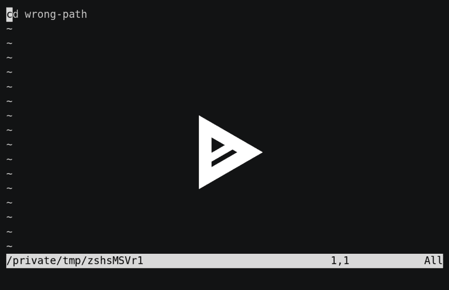

# 使用“fc”可以轻松修复 Shell 命令中的错误

> 原文：<https://dev.to/mayeu/fix-mistakes-in-shell-commands-easily-with-fc-bcg>

有时，在 shell 中修复输入错误的命令会非常麻烦。如果你能在你最喜欢的编辑器中修改你刚刚输入的命令，会怎么样？这正是`fc`命令的意义所在，它是所有 Unix 系统的标准(包括 GNU/Linux & macOS)。让我们看看它是如何工作。

来自维基百科:

> fc 是 Unix 上的一个标准程序，它列出、编辑和重新执行先前输入到交互式 shell 中的命令。

使用`fc`看起来像这样:

1.  您键入了无效/错误的命令
2.  你输入`fc`
3.  最后输入的命令(在`fc`之前)在编辑器中打开
4.  您修复命令，保存并退出
5.  当您退出编辑器时，将执行编辑后的命令

下面是一个交互式示例，我使用了错误的路径，并通过 fc 进行了修复(单击图片查看实际效果):

[](https://asciinema.org/a/245863)

当然，这个例子有点做作，因为您应该使用自动完成来导航文件夹，而不是完全键入您的路径。

检查我的历史，我发现了这个大命令(它检查家酿的 ZSH 路径是否是`/etc/shells`文件的一部分，如果不是，添加它):

```
export zshpath="$(brew --prefix)/bin/zsh"; \
grep -q "^${zshpath}" /ec/shells || \
sudo -E sh -c "echo '$zshpath' \>\> /etc/shells" 
```

不是很明显，但是中间有个错误:`/ec/shells`而不是`/etc/shells`。随着`fc`的修复，这真的很容易修复，因为我将可以访问我的整个编辑器，而不仅仅是我的外壳运动和快捷方式。

但这还不是全部`fc`还可以使用一个参数来修复 shell 历史中的任意命令，而不仅仅是最后一个命令。

使用`fc -l`列出您的历史记录

```
$ fc -l
6213 rm -rf test
6214 brew install asciinema
6215 vim ~/bin/mac-bootstrap
6216 exit
6221 ls
6222 mkdir right-path
6228 asciinema rec
6229 cd wrong-path
6230 fc
6231 cd right-path
6232 pwd 
```

然后你可以用`fc <history number>`来固定一个具体的命令:

```
$ fc 6214 # Will open “brew install asciinema” in your editor 
```

这个工具没有更多的内容，但是如果你想查看其他的参数，你可以在这里找到完整的文档。

*本帖原载于我的网站: [mayeu.me](https://mayeu.me/post/fix-typo-in-shell-commands-easily-with-fc/) 。*