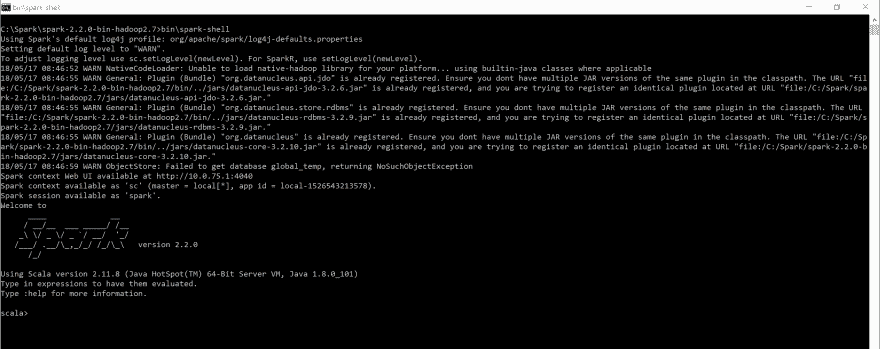
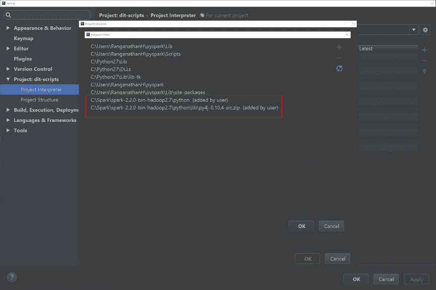

# Windows 和 PyCharm 上的 PySpark 入门

> 原文：<https://dev.to/harshadranganathan/getting-started-with-pyspark-on-windows-and-pycharm-26l3>

## 先决条件

Java 和 Python 都安装在您的系统中。

## Windows 上的 Spark 入门

[通过选择 Spark 版本(例如 2.2.0)和包类型(例如为 Apache Hadoop 2.7 和更高版本预构建)下载 Apache Spark](http://spark.apache.org/downloads.html) 。

将 Spark tar 文件解压缩到一个目录中，例如 C:\ Spark \ Spark-2 . 2 . 0-bin-Hadoop 2.7

GIT 克隆 [winutils](https://github.com/steveloughran/winutils) 到您的系统，例如克隆到目录 C:\winutils

在下面添加系统环境变量，其中`HADOOP_HOME`被设置为 winutils hadoop 二进制位置(取决于之前选择的预构建版本),而`SPARK_HOME`被设置为我们在步骤 2 中提取的 Spark 位置。

```
HADOOP_HOME=C:\winutils\hadoop-2.7.1
SPARK_HOME=C:\Spark\spark-2.2.0-bin-hadoop2.7 
```

在 c 盘上创建一个新文件夹`tmp/hive`。

通过在命令提示符
下运行下面的命令，使用`winutils.exe`为文件夹`tmp/hive`提供权限

```
C:\winutils\hadoop-2.7.1\bin\winutils.exe chmod 777 C:\tmp\hive 
```

现在通过在命令提示符
下运行`SPARK_HOME`目录下的`spark-shell`来验证设置

```
C:\Spark\spark-2.2.0-bin-hadoop2.7>bin\spark-shell 
```

[](https://rharshad.com/assets/img/2018/05/spark-shell.png)

## PyCharm 配置

按照以下步骤配置 python 解释器以支持 pyspark

1.  创建一个新的虚拟环境(文件->设置->项目解释器->在设置选项中选择`Create Virtual Environment`)
2.  在`Project Interpreter`对话框中，选择设置选项中的`More`，然后选择新的虚拟环境。现在选择`Show paths for the selected interpreter`选项。
3.  将`Spark Python`和`Spark Py4j`的路径添加到这个虚拟环境中，如下图所示。

[](https://rharshad.com/assets/img/2018/05/pycharm-interpreter-paths.png)

在对话框`Run\Debug Configurations`中为`Python`创建一个新的运行配置。

在`Python interpreter`选项中，选择我们在第一步中创建的解释器。此外，在环境变量选项中，确保勾选了`Include parent environment variables`。

现在可以将 pyspark 脚本添加到项目中，并使用这个运行配置在 spark 上下文中执行它。