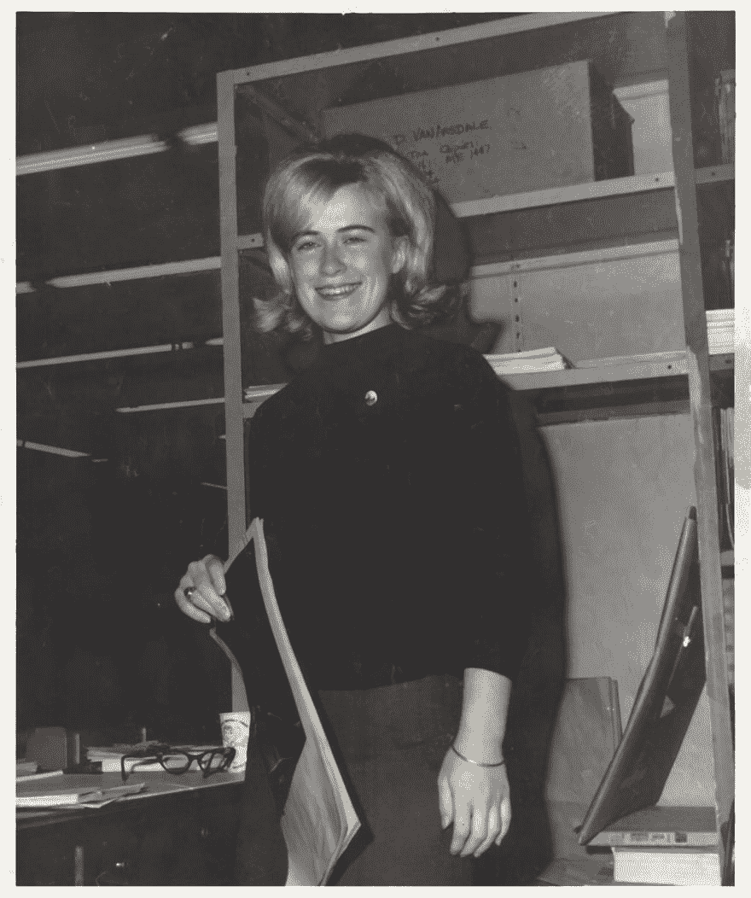
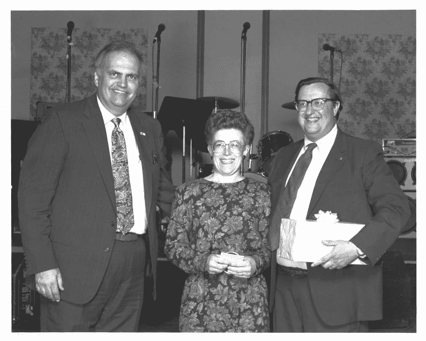

# 和一个搞技术的妈妈一起长大

> 原文：<https://dev.to/steveblue/growing-up-with-a-mom-in-tech-5dhn>

是时候从编码中抽出一点时间来谈论一些真正重要的事情了# womenintech。

我母亲是一名技术文案，在美国国家航空航天局(NASA)的阿波罗和航天飞机任务中工作。这是她在 70 年代工作的照片。

大约二十年前，她在返校攻读学士学位的途中去世。这篇文章是对她的纪念，也是对其他默默无闻的# womenintech 的纪念，她的故事可能永远不会被人知道。

我是美国宇航局的婴儿。我这么说是因为我的父母都在美国宇航局工作，他们在那里相遇并相爱。

我的父母都曾在美国国家航空航天局(NASA)工作过，我从小就认为科技行业有很多女性。我还记得很小的时候，在马里兰州格林贝尔特的戈达德太空飞行中心参加家庭活动，那里有很多女性参加。我的教母为国家航空航天局工作。我从另一个女人那里买了我的第一辆车，她用它作为每天上下班的交通工具。在听说了# womenintech 在 70 年代和 80 年代面临的一些挑战后，我很早就意识到，即使在美国国家航空航天局，做一名女性也是一场艰难的斗争。

直到最近，NASA 那些默默无闻的女性计算机科学家和数学家才获得了某种恶名。在太空竞赛期间，甚至在历史记载中，韦纳·冯·布劳恩因其对土星 5 号火箭的贡献而备受关注。但是我们很少听说安妮·伊斯利，一个被称为“人类计算机”的非洲裔美国妇女，或者玛格丽特·希菲尔德·汉密尔顿，她为阿波罗 11 号任务的成功做出了贡献。她还创造了“软件工程”这个术语。当好莱坞介入并讲述《隐藏的人物》中凯瑟琳·约翰逊、多萝西·沃恩和玛丽·杰克逊的故事时，导演和编剧最终只会在刻画有色人种女性时弄乱细节并犯下重大错误。

然后是我妈妈。在我出生于 70 年代之前，比阿特丽斯·兰克福德是一位抚养我姐姐的单身母亲。我甚至无法想象她有时会面临怎样的挣扎。在她的一生中，男人对她不好。她是我见过的最慷慨、最有同情心的人之一，因为忙于让别人开心，她经常忘记犒劳自己。她生活中不变的事情之一就是工作。她在马里兰州哥伦比亚的 Bendix 公司担任技术文案，该公司是她职业生涯早期与美国国家航空航天局签订的合同。据我姐姐说，在阿波罗任务中，她编辑并校对了显示在任务控制中心的幻灯片。我在 80 年代长大，我记得她为航天飞机任务编写技术手册。下面是我记忆中的她在 80 年代中期因在本迪克斯服务 10 年而获奖后的照片。

父母在科技行业工作，你会认为他们会给我压力，让我走他们的路。考虑到我的父亲，他的父亲和他的父亲都是工程师，我进入工程领域应该是意料之中的事情。相反，在我很小的时候，我的母亲看到我对艺术有浓厚的兴趣，并培养了我艺术的一面。当我大约 8 岁的时候，我的父母把我带进了一个社区大学的绘画班，里面都是成年人。我是唯一上这门课的孩子。我很小的时候，她参加了一个儿童读书俱乐部，给我读书。她确保即使我们没有直系亲属可以依靠，当她忙于工作时，我周围都是好人，都是坚强的女人。她是一个小男孩所能要求的最好的妈妈。

女人经常带来的特质之一是男人常常缺乏的同理心。在计算机科学或 web 开发中，共情并没有被谈论太多，但它是一种非常需要的特质。对我们作为工程师开发的产品的最终用户缺乏同理心会导致令人沮丧的用户体验或糟糕的产品设计。

当我成年后，我去了伦斯勒学院(RPI)，乔治·洛(NASA 的行政人员之一)曾经在那里上过大学，后来担任该学院的院长。我母亲对那个决定非常满意。当我第一年来到 RPI 时，我发现一年级的女生太少了，剩下的男生足够填满整个宿舍。我碰巧是那些不能住在男女混合宿舍的男人中的一员。我后来发现，在我大一的班级里，男女比例是 1:7，这在科技界是很典型的。

我不打算开始公开为什么小学女生开始对 STEM 相关领域失去兴趣，但我确实相信，自从我母亲工作以来，事情并没有改变太多。在大公司，我亲眼目睹了性别歧视。无论是当男人开玩笑地说“把愚蠢的简单任务交给女人”时站起来，还是当经理们没有提升应该获得比男人更高职位的女性时的心照不宣的行为，还是因为性别而导致的不平等薪酬，我们在工作场所的女性平等方面还有很长的路要走。

我想给正在阅读这篇文章的人一个信息。只要记住你雇佣的那个女人是某人的母亲，或者有一天会成为某人的母亲。你会给自己的母亲比同等职位的男人少的工资吗？你会只给你妈妈“愚蠢简单”的任务吗？我不这么认为。发现在 2019 年更有可能找到一名女性，尤其是少数民族女性，担任看门人而不是软件工程师的职位，这让我非常难过。当我们可以要求母亲设计载人火星的火箭时，为什么还要要求她们打扫浴室？

结果显示，2019 年，女性掌管了美国宇航局 4 个科学部门中的 3 个。你工作的地方有很多女性担任行政职务吗？尽管如此，还是有希望看到一个更加光明的未来，在这个未来，女性和男性最终可以在技术上处于平等的地位。我相信私营部门可以从 NASA 那里学到一些东西。

尽管我在青少年时期对视频制作和摄影有着浓厚的兴趣，但我长大后成为了第四代工程师。我希望看到一个未来，一个女人可以自豪地说她是一个多代工程师。你呢？

祝所有做母亲的# womenintech 母亲节快乐！

今年 6 月，我将在俄勒冈州波特兰市的 ACT-W National 做一个 5 分钟的简短演讲，主题是“与从事科技行业的母亲一起成长”。

ACT-W，推进技术女性的职业发展，是一项引人入胜的活动，有才华的女性和支持者可以通过与真正最适合她们的公司联系来培养技能，发展她们的社区，并加快她们的职业道路。

参加 2019 年 6 月 28 日至 29 日在俄勒冈州波特兰举行的会议，向那些将其职业生涯提升到新水平的专家学习，并向您展示如何做到这一点。

确认的发言人包括:

主题演讲:Megan Bigelow，PDX 女性科技公司创始人兼首席执行官主题演讲:Lisa Agona，SVP 和 Ensono 首席营销官
分组会议主题包括:全性别世界的包容性，无服务器技术，发展成功的软技能，从头开始建立安全计划等等。
工作坊的主题包括:Linux 内核贡献，Ship It:像产品经理一样思考，更有力的交流，面向对象的用户体验设计等等！

报名参加活动:[http://act-w.org/](http://act-w.org/)