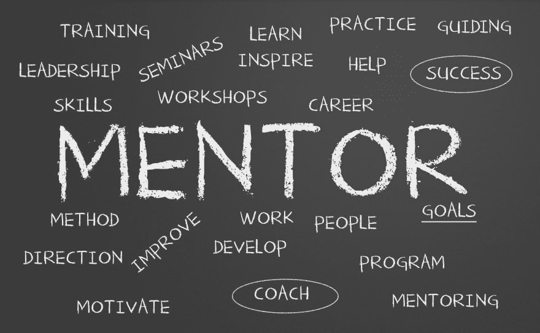

# 指导是克服冒名顶替综合症的一种方式

> 原文：<https://dev.to/nelo_mf/mentoring-as-a-way-of-overcoming-the-impostor-syndrome-298h>

## 丑陋的真相

对自己的成就和能力有自我怀疑，害怕被揭露为“骗子”。如今，大多数人认为冒名顶替综合征是一种心理模式，它扰乱了我们实现目标和梦想的能力。

虽然我们大多数人都知道它是什么，但我们实际上并不知道每一种情况的解决方案，当然，也没有神奇的药物可以让你的大脑停止妨碍你，所以逃避这些想法可能比你希望的要稍微棘手一些。

这是我的第一篇网络文章，我想分享我如何控制自己的自我的经验，并希望鼓励你为自己的个人奋斗找到并尝试一个解决方案。希望你喜欢:)

所以…让我来给你解释一下。我叫 Manuel，今年 25 岁，在过去的一年半时间里，我一直在一家名为 Syloper 的阿根廷初创公司担任后端开发人员。每天，我把在办公室度过的 8 个小时分成两部分，一部分用于我们的主要产品(暂且称之为产品 A)，另一部分用于处理一些外部客户。由于工作流程永无止境，我开始认为我做得不够，我在一周内做的所有工作都没有任何影响——下周我仍然会像上周一样忙——所以我开发了上面提到的 I.S。

不知何故，我保持了整个节目的运行，直到一个新的开发人员被雇用。不是取代我，而是和我一起工作。棘手的是，他的情况和我刚进公司时相似，他需要一些指导。因此，在一个大胆的举动中，我的经理们决定将他分配到产品 A，让他和我一起工作，减轻我的工作量，同时让他在一个真实的项目中获得实践经验。

## ……然后事情就一拍即合了。

我的新合作伙伴不仅需要了解他正在开发的产品，还需要了解我们使用的工具(在这种情况下，PHP 7 和 CakePHP 3 框架)，我的任务是帮助他，向他展示现有的代码库，基本上是在他需要任何东西的时候出现。

我的观点是什么？**指导需要公正的自我评估**。为了把知识传授给其他人，你必须*把你的事实搞清楚*，把你知道的事情组织起来，这样你就可以在交流时为你指导的人提供一个坚实的基础。

为了进一步阅读，请看看 Kaleb M 的精彩帖子，它解释了更多关于这种被称为*邓宁克鲁格效应*的现象。

 [## 通过理解邓宁·克鲁格效应对抗冒名顶替综合征

### kaleb 4 月 29 日 1915 分钟读取

#career #webdev #beginners](/avatarkaleb/battling-imposter-syndrome-by-understanding-the-dunning-kruger-effect-904)

## 这对我有什么帮助？

到目前为止，一切都很顺利，我现在对自己作为开发人员的能力更有信心了，我可以锻炼一些软技能，这在我们的工作中总是受欢迎的。这里的底线是，如果你正在与 I.S .做斗争，你应该试着对你现在的实际情况做一个公正的自我评估:指导一个同事，为你第一次尝试的插件或工具写一些简单的文档...或者去你最喜欢的开发社区写你的第一篇文章，我已经有一点点自豪感了:)

这篇帖子就到这里，万一你坚持到最后了，非常感谢！请在评论区告诉我你的想法。