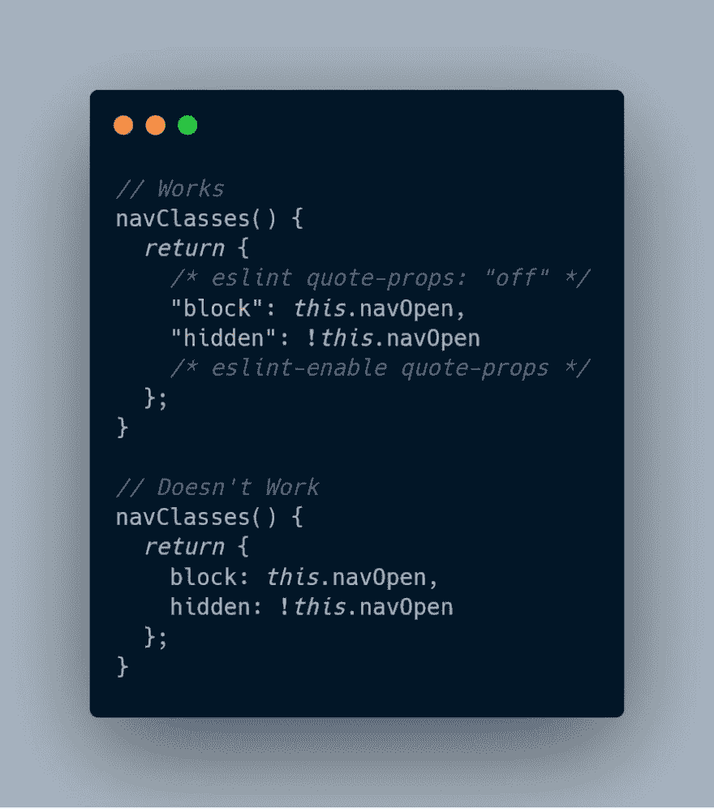

# 找到正确的 Purgecss 提取器

> 原文：<https://dev.to/drewtownchi/finding-the-right-purgecss-extractor-54cc>

当我写关于用 Purgecss 设置 Tailwind 的教程时，我遇到了一个问题，我的 Vue.js 计算样式被 Purgecss 清除了。我非常开心，并向顺风的创造者 [@adamwathan](https://twitter.com/adamwathan) 脱帽致敬，感谢他给我指出了正确的方向。

> 德鲁镇@ Drew Town _ chi知道为什么计算的属性需要用引号括起来才能不被清除吗？ [@adamwathan](https://twitter.com/adamwathan) ？我希望在这里不用引号。2019 年 5 月 10 日上午 00:24[](https://twitter.com/intent/tweet?in_reply_to=1126644092325322753)[](https://twitter.com/intent/retweet?tweet_id=1126644092325322753)[](https://twitter.com/intent/like?tweet_id=1126644092325322753)

当考虑顺风`/[A-Za-z0-9-_:/]+/`的“默认”提取器时，`hidden:`被认为是一个有效的类名是绝对有意义的。不幸的是，如果`hidden:`是我们隐藏的类名出现的唯一地方，那么我们真正想要的类名`hidden`将不再在我们的 CSS 文件中。

通过使用正则表达式和我的 Vue 文件，我可以调整正则表达式，在正则表达式的开头和结尾都使用`\b`元字符。

```
/\b[A-Za-z0-9-_:/]+\b/g 
```

Enter fullscreen mode Exit fullscreen mode

这对我来说非常有效，因为我不使用任何特殊字符来开始或结束我的 CSS 类，我也没有看到任何 Tailwind 这样做的情况。所以现在在我的计算属性中，正则表达式只找到了`hidden`，而没有找到`hidden:`。

```
 computed: {
    navClasses() {
      return {
        block: this.navOpen,
        hidden: !this.navOpen
      };
    }
  } 
```

Enter fullscreen mode Exit fullscreen mode