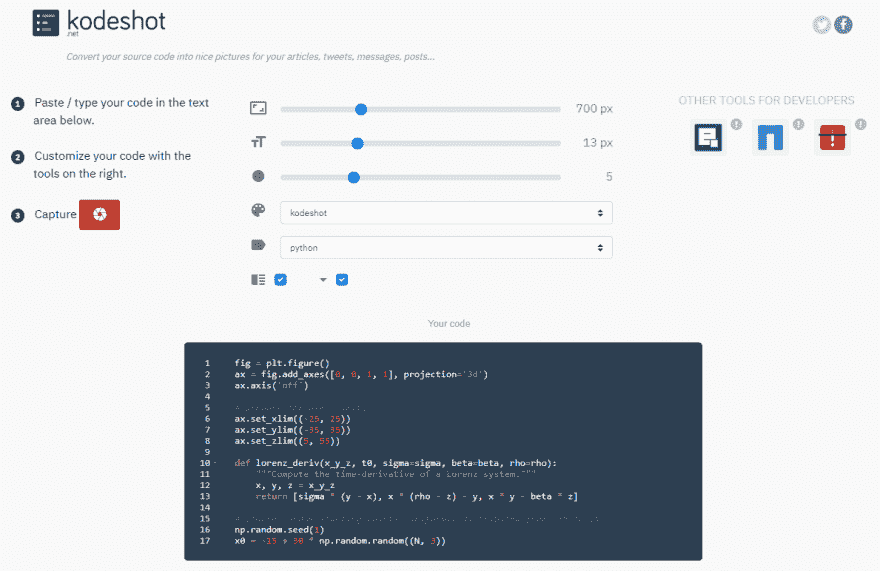
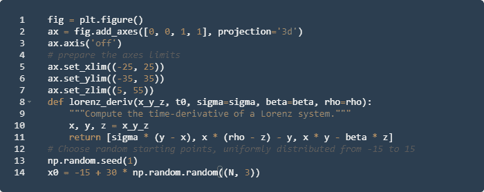
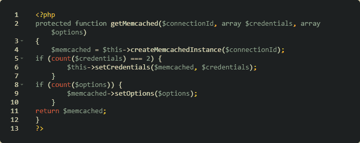

# 如何在中型文章中添加漂亮的源代码

> 原文：<https://dev.to/laurentabbal/how-to-add-beautiful-source-code-in-medium-articles-1723>

一种在中型文章中显示整洁漂亮的源代码并突出语法的简单方法。有了 [Kodeshot](https://www.kodeshot.net) ，只需三个简单的步骤，你就可以包含一个引人注目的源代码展示。

## 1。中等限制

Medium 可以显示内联和多行代码块。但是它们都不支持语法高亮显示。

示例:

```
fig = plt.figure()
ax = fig.add_axes([0, 0, 1, 1], projection='3d')
ax.axis('off')
# prepare the axes limits
ax.set_xlim((-25, 25))
ax.set_ylim((-35, 35))
ax.set_zlim((5, 55))
def lorenz_deriv(x_y_z, t0, sigma=sigma, beta=beta, rho=rho):
    """Compute the time-derivative of a Lorenz system."""
    x, y, z = x_y_z
    return [sigma * (y - x), x * (rho - z) - y, x * y - beta * z]
# Choose random starting points, uniformly distributed from -15 to 15
np.random.seed(1)
x0 = -15 + 30 * np.random.random((N, 3)) 
```

这很方便，但读起来不太舒服。

## 2。解决方案:kodeshot.net

[](https://res.cloudinary.com/practicaldev/image/fetch/s--roP-BzXY--/c_limit%2Cf_auto%2Cfl_progressive%2Cq_auto%2Cw_880/https://thepracticaldev.s3.amazonaws.com/i/pkp23lnz3h23i2rmd9u5.png)

在[Kodeshot.net](https://www.kodeshot.net)上:

*   在文本区域复制您的源代码，定制您的代码并捕获
*   保存图像
*   拖放文章中的图片

结果:
[](https://res.cloudinary.com/practicaldev/image/fetch/s--dOH4ZAHs--/c_limit%2Cf_auto%2Cfl_progressive%2Cq_auto%2Cw_880/https://thepracticaldev.s3.amazonaws.com/i/kdeydgdlevfcozbbkage.png)

<figcaption>[1] Source code at the bottom of this page</figcaption>

再比如:
[](https://res.cloudinary.com/practicaldev/image/fetch/s--zcO9_QWE--/c_limit%2Cf_auto%2Cfl_progressive%2Cq_auto%2Cw_880/https://thepracticaldev.s3.amazonaws.com/i/liog4owzm9qnatn62su4.png)

<figcaption>[2] Source code at the bottom of this page</figcaption>

您可以更改字体大小、宽度、样式、边角……
这个解决方案非常简单，比 Medium 提出的解决方案更好，也比文章中嵌入的 GitHub Gist 更好。

并且，如果你希望人们能够复制和粘贴源代码，你可以在图片`[x] Source code at the bottom of this page`下添加，并且在文章的底部，显示你的代码的多行代码块(正如我在本文中所做的)。

* * *

源代码
[1]

```
fig = plt.figure()
ax = fig.add_axes([0, 0, 1, 1], projection='3d')
ax.axis('off')
# prepare the axes limits
ax.set_xlim((-25, 25))
ax.set_ylim((-35, 35))
ax.set_zlim((5, 55))
def lorenz_deriv(x_y_z, t0, sigma=sigma, beta=beta, rho=rho):
    """Compute the time-derivative of a Lorenz system."""
    x, y, z = x_y_z
    return [sigma * (y - x), x * (rho - z) - y, x * y - beta * z]
# Choose random starting points, uniformly distributed from -15 to 15
np.random.seed(1)
x0 = -15 + 30 * np.random.random((N, 3)) 
```

[2]

```
protected function getMemcached($connectionId, array $credentials, array $options)
{
    $memcached = $this->createMemcachedInstance($connectionId);
if (count($credentials) === 2) {
        $this->setCredentials($memcached, $credentials);
    }
if (count($options)) {
        $memcached->setOptions($options);
    }
return $memcached;
} 
```