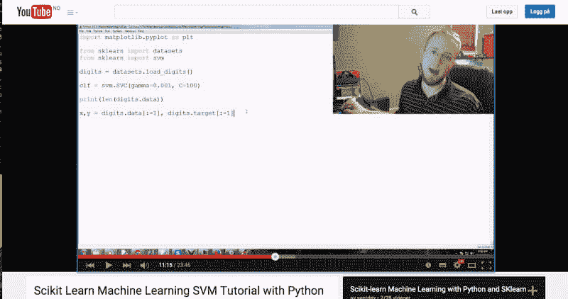
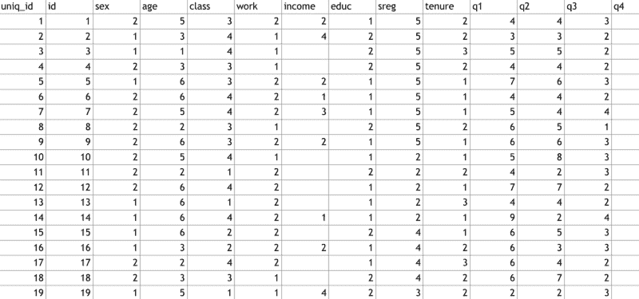
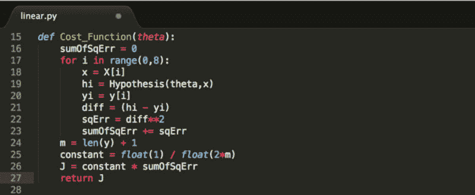
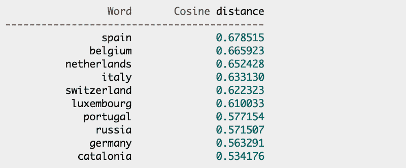
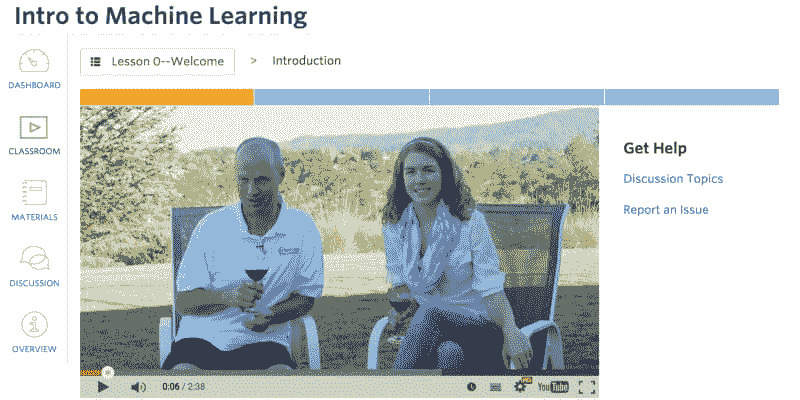

# 一周机器学习

> 原文：<https://dev.to/scrimba/machine-learning-in-a-week-3jh9>

从外部来看，进入机器学习(ml)似乎是一项无法完成的任务。

> 如果你从错误的一端攻击它，它肯定会。

然而，在花了一周的时间学习这个主题的基础知识后，我发现它比我预期的要容易得多。

这篇文章旨在给那些有兴趣进入 ml 的人一个如何开始的路线图，从我在入门周的经历中吸取经验。

### 背景

在我的机器学习周之前，我已经阅读了一段时间关于这个主题的内容，并且已经完成了吴恩达在 Coursera 上的一半课程和其他一些理论课程。所以我对 ml 有一点概念上的理解，尽管我完全不能将我的知识转化成代码。这就是我想要改变的。

我希望能够在周末之前解决 ml 的问题，尽管这意味着跳过许多基础知识，采用自上而下的方法，而不是自下而上的方法。

在就黑客新闻征求了[的建议后，我得出结论，Python 的 Scikit 学习模块是最好的起点。这个模块为您提供了丰富的算法可供选择，将实际的机器学习减少到几行代码。](https://news.ycombinator.com/item?id=9432952)

### 周一:学习一些实用性

我从寻找包含 Scikit Learn 的视频教程开始了这一周。我终于登陆了 [Sentdex 关于如何使用 ml 投资股票的教程](http://pythonprogramming.net/machine-learning-python-sklearn-intro/)，这给了我继续下一步的必要知识。

Sentdex 教程的好处在于，讲师会带您完成收集数据的所有步骤。随着时间的推移，您会意识到获取和清理数据可能比实际的机器学习更耗时。因此，编写脚本从文件中抓取数据或在网上爬行的能力是有抱负的机器学习极客的基本技能。

我后来重新看了几个视频，当我遇到问题时，它们可以帮助我，所以我建议你也这样做。

然而，如果你已经知道如何从网站上抓取数据，本教程可能不是完美的选择，因为很多视频都是围绕数据抓取展开的。在这种情况下， [Udacity 的机器学习介绍](https://www.udacity.com/course/intro-to-machine-learning--ud120)可能是一个更好的起点。

### 星期二:将它应用到实际问题中

星期二，我想看看能否用我所学的知识解决一个实际问题。当我的编码合作团队中的另一名开发人员在英格兰银行的数据可视化竞赛中工作时，我和他一起检查了银行发布的数据集。最有趣的数据是他们的家庭调查。这是银行对几千个家庭进行的年度调查，涉及与金钱有关的问题。

我们决定解决的问题如下:

> 给定一个人的教育水平、年龄和收入，计算机能预测其性别吗？

我摆弄了一下数据集，花了几个小时清理数据，用 [Scikit 学习图](http://scikit-learn.org/stable/tutorial/machine_learning_map/)找到了适合问题的算法。

我们最终的成功率在 63%左右，这一点也不令人印象深刻。但是机器至少比扔硬币猜得好一点，扔硬币的成功率是 50%。

看到结果就像是你动力的燃料，所以我建议你一旦对如何使用 Scikit Learn 有了基本的掌握，就为自己做这件事。

> 当你意识到你可以开始使用 ml 来解决现实生活中的问题时，这是一个关键时刻。

### 星期三:从地面上升起

在玩了各种 Scikit Learn 模块之后，我决定从头开始尝试编写一个线性回归算法。

我想这样做，因为我觉得(现在仍然觉得)我真的不明白引擎盖下发生了什么。

幸运的是，Coursera 课程详细介绍了一些算法是如何工作的，这在这一点上非常有用。更具体地说，它描述了使用梯度下降线性回归的基本概念。

这无疑是最有效的学习技巧，因为它迫使你理解“引擎盖下”正在进行的步骤。我强烈建议你在某些时候这样做。

我计划在进行的过程中重写我自己的更复杂算法的实现，但是我更喜欢在 Scikit Learn 中使用了相应的算法之后再这样做。

### 周四:开始比赛

周四，我开始做 Kaggle 的[入门教程。](https://www.kaggle.com/c/word2vec-nlp-tutorial) Kaggle 是一个机器学习竞赛的平台，你可以提交公司或组织发布的问题解决方案。

我建议你在对机器学习有了一点点理论和实践的理解之后，试试 Kaggle。你需要这个来开始使用 Kaggle。否则，这将是更令人沮丧，而不是奖励。

[单词袋](https://www.kaggle.com/c/word2vec-nlp-tutorial/details/part-1-for-beginners-bag-of-words)教程指导你通过每一个你需要采取的步骤来参加比赛，并给你一个简短而令人兴奋的自然语言处理(NLP)介绍。当我结束教程时，我对 NLP 的兴趣比刚开始时高得多。

### 周五:返校

周五，我继续做 Kaggle 教程，也开始了 [Udacity 的机器学习介绍。](https://www.udacity.com/course/intro-to-machine-learning--ud120)我现在已经完成了一半，并且觉得很享受。

Coursera 课程要简单得多，因为它没有深入算法。但它也更实用，因为它教你 Scikit Learn，这比你在 Coursera 课程中从头开始用 Octave 编写算法要容易得多。

### 前路漫漫

这样做一周不仅很有趣，还帮助我意识到机器学习在社会中的用处。我对它了解得越多，就越明白它可以用于解决哪些领域的问题。

> 如果你对机器学习感兴趣，我强烈建议你在几天或几个晚上出发，一头扎进去。

如果你还没有准备好处理棘手的事情，选择自上而下的方法，尽快解决问题。

祝你好运！

感谢阅读！我叫 Per，我是 [GitSpeak](https://gitspeak.com) 和 [Scrimba](https://scrimba.com?utm_source=dev.to&utm_medium=referral&utm_campaign=machine_learning_in_a_week) 的联合创始人，我喜欢帮助人们学习新技能。如果你想保持联系，请在 [Twitter](https://twitter.com/perborgen) 和 [Instagram](https://www.instagram.com/perborgen/) 上关注我。