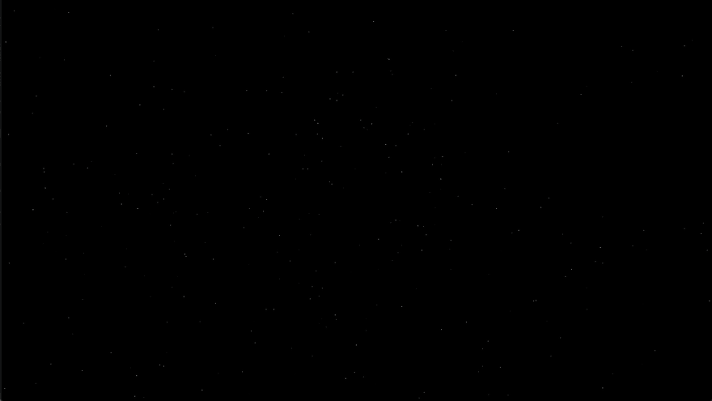

# 与 SDL2 一起走向星空

> 原文：<https://dev.to/shindakun/going-to-the-stars-with-sdl2-and-go-53ff>

# 试图学习 SDL2

## 满天星斗

[](https://res.cloudinary.com/practicaldev/image/fetch/s--iihyvLdG--/c_limit%2Cf_auto%2Cfl_progressive%2Cq_66%2Cw_880/https://thepracticaldev.s3.amazonaws.com/i/045yug7vvbse3n3zb1jl.gif)

##### 现实生活中更好看，老实

欢迎回到另一篇文章。除了普通的 API 或 web 服务器，我还会花一些时间在其他事情上。相反，这一次我们是根据最新一期的 [Wireframe](https://www.raspberrypi.org/blog/create-an-arcade-style-zooming-starfield-effect-wireframe-issue-13/) 中的一篇文章即兴创作的，作者是[丹尼尔·波普](https://twitter.com/lordmauve)。这篇文章介绍了一个类似于 Konami 的 Gyruss 的星域扭曲的基本 Python 实现。

我们不打算做一对一的重新想象，因为我们现在省略了变速部分。如果我们不回到 roguelike 的工作上，也许下周我们会加上这个。

* * *

## 代码演练

如果你将它与 [Python 代码](https://github.com/Wireframe-Magazine/Wireframe-13/blob/master/stars.py)相比较，你会注意到的第一件事是我们有更多的设置要做。一大块代码实际上致力于让 SDL2 准备就绪。之后，只需要更新我们的星域数组并将其写入纹理即可。准备好了吗？好吧，那我们开始吧。

### main.go

和往常一样，我们将从进口开始。我们将使用标准库中的`math`和`time`包。当然，我们将[导入 SDL2](https://github.com/veandco/go-sdl2) 绑定，以便在屏幕上显示一些东西。使用 SDL2 为我们提供了一个发布跨平台应用程序的简单途径。

```
package main

import (
  "math"
  "math/rand"
  "time"

  "github.com/veandco/go-sdl2/sdl"
) 
```

Enter fullscreen mode Exit fullscreen mode

我们正在设置一些常量，窗口大小，我们希望扭曲开始的速度，以及屏幕的中心。哦，还有我们想在曲速显示中使用的星星的数量。

```
const (
  winWidth      = 1280
  winHeight     = 720
  minWarpFactor = 0.1
  numStars      = 300
  centerX       = winWidth / 2
  centerY       = winHeight / 2
) 
```

Enter fullscreen mode Exit fullscreen mode

这个结构将被用来保存一个恒星的当前坐标。我们也会用它来保持速度。我想我们不需要称它为`position`，因为在这种情况下，它并不完全是这样的，`coords`可能会更好，或者只是`xy`，或者别的什么——你明白了。

```
type position struct {
  x float64
  y float64
} 
```

Enter fullscreen mode Exit fullscreen mode

我们的基本结构非常简单，它保存位置、速度和亮度(当前颜色)。我们为亮度保存一个单一的`byte`值，并将其应用到红色、绿色和蓝色通道，以使颜色从黑色变为白色。然后我们建立一个`stars`结构来保存我们的`[]star`。

```
type star struct {
  pos        position
  vel        position
  brightness byte
}

type stars struct {
  stars []star
} 
```

Enter fullscreen mode Exit fullscreen mode

是一个小助手功能，它将帮助我们创建新星离开屏幕中心的初始角度。

```
func randFloat64(min float64, max float64) float64 {
  rand.Seed(time.Now().UTC().UnixNano())
  return min + rand.Float64()*(max-min)
} 
```

Enter fullscreen mode Exit fullscreen mode

就像罐头上说的那样。我们用它来快速清除屏幕绘制之间的像素“映射”。这样我们从一张空白的画布开始，没有任何痕迹。当你跳过清除的时候看起来确实很好，创造了一个很好的轨迹效果，但是我没有做任何清理的工作，所以最终，屏幕会以白色为主。`setPixel()`用来把我们的星星写在正确的位置，用当前的颜色从黑色开始`(0,0,0)`。

```
// clear a slice of pixels.
func clear(pixels []byte) {
  for i := range pixels {
    pixels[i] = 0
  }
}

func setPixel(x, y int, c byte, pixels []byte) {
  index := (y*winWidth + x) * 4

  if index < len(pixels)-4 && index >= 0 {
    pixels[index] = c
    pixels[index+1] = c
    pixels[index+2] = c
  }
} 
```

Enter fullscreen mode Exit fullscreen mode

在这里我们创建一个`newStar()`！代码或多或少与原始文章相同。虽然我没有留下拖尾，因为我没有使用 SDL2s 画线——相反，我们将像素直接绘制到纹理中(稍后您将看到这一点)。

```
func newStar() star {

  // # Pick a direction and speed
  // angle = random.uniform(-math.pi, math.pi)
  angle := randFloat64(float64(-3.14), float64(3.14))

  // speed = 255 * random.uniform(0.3, 1.0) ** 2
  speed := 255 * math.Pow(randFloat64(float64(0.3), float64(1.0)), 2)

  // # Turn the direction into position and velocity vectors
  // dx = math.cos(angle)
  dx := math.Cos(angle)

  // dy = math.sin(angle)
  dy := math.Sin(angle)

  // d = random.uniform(25 + TRAIL_LENGTH, 100)
  d := rand.Intn(100) + 25 //+ traillength

  // pos = centerx + dx * d, centery + dy * d
  pos := position{
    x: centerX + dx*float64(d),
    y: centerY + dy*float64(d),
  }

  // vel = speed * dx, speed * dy
  vel := position{
    x: speed * dx,
    y: speed * dy,
  }

  s := star{
    pos:        pos,
    vel:        vel,
    brightness: 0,
  }

  return s
} 
```

Enter fullscreen mode Exit fullscreen mode

在通过我们的主...循环，我们需要更新星星的位置。我们传入了`elapsedTime`,但是在这个例子中，我们实际上并没有在这个函数中使用它。我们可以在未来做一些更新，以确保一切运行稳定的帧速率，并在这些帧内移动适当的距离。但是，在这个练习中，我们只是顺其自然。我还决定只使用一个简单的增加亮度。这可能有点太快变亮了，但确实有效。

```
func (s *stars) update(elapsedTime float32) {

  // calculate the stars new position
  for i := 0; i < len(s.stars); i++ {
    newPosX := s.stars[i].pos.x + (s.stars[i].vel.x * minWarpFactor) //* dt
    newPosY := s.stars[i].pos.y + (s.stars[i].vel.y * minWarpFactor) //* dt

    // if we're off the screen with the new position reset else update position
    if newPosX > winWidth || newPosY > winHeight || newPosX < 0 || newPosY < 0 {
      s.stars[i] = newStar()
    } else {
      s.stars[i].pos.x = newPosX
      s.stars[i].pos.y = newPosY

      // # Grow brighter
      // s.brightness = min(s.brightness + warp_factor * 200 * dt, s.speed)
      if s.stars[i].brightness < 255 {
        s.stars[i].brightness += 40
      }
    }
  }
} 
```

Enter fullscreen mode Exit fullscreen mode

我们的`draw()`循环遍历星星，并调用`setPixel()`将每个星星“像素”写入我们的切片。

```
func (s *stars) draw(pixels []byte) {
  for i := 0; i < len(s.stars); i++ {
    if int(s.stars[i].pos.x) >= 0 {
      setPixel(int(s.stars[i].pos.x), int(s.stars[i].pos.y), s.stars[i].brightness, pixels)
    }
  }
} 
```

Enter fullscreen mode Exit fullscreen mode

现在我们有了我们的`main()`！我将跳过绝大多数的 SDL2 样板代码。这一切都是为了让 SDL 做好一切准备。代码非常易读，但是如果你有任何问题，请在评论中告诉我。看一看回购中的 [Go/SDL2 例子也是值得的。](https://github.com/veandco/go-sdl2#examples) 

```
func main() {
  err := sdl.Init(sdl.INIT_EVERYTHING)
  if err != nil {
    panic(err)
  }
  defer sdl.Quit()

  sdl.SetHint(sdl.HINT_RENDER_SCALE_QUALITY, "1")

  window, err := sdl.CreateWindow("Stars", sdl.WINDOWPOS_UNDEFINED, sdl.WINDOWPOS_UNDEFINED, int32(winWidth), int32(winHeight), sdl.WINDOW_SHOWN)
  if err != nil {
    panic(err)
  }
  defer window.Destroy()

  renderer, err := sdl.CreateRenderer(window, -1, sdl.RENDERER_ACCELERATED)
  if err != nil {
    panic(err)
  }
  defer renderer.Destroy()

  tex, err := renderer.CreateTexture(sdl.PIXELFORMAT_ABGR8888, sdl.TEXTUREACCESS_STREAMING, int32(winWidth), int32(winHeight))
  if err != nil {
    panic(err)
  }
  defer tex.Destroy() 
```

Enter fullscreen mode Exit fullscreen mode

现在 SDL 一切就绪，我们需要让我们的初始恒星设置准备就绪。首先，我们将设置我们的基础、`elpasedTime`、我们的`pixels`地图和我们的`starField`。`all`将要容纳全套恒星。

```
 var elapsedTime float32
  pixels := make([]byte, winWidth*winHeight*4)
  starField := make([]star, numStars)
  all := &stars{}

  for i := 0; i < len(starField); i++ {
    all.stars = append(all.stars, newStar())
  } 
```

Enter fullscreen mode Exit fullscreen mode

我们使用下面的`for`循环来运行我们的`update()`和`clear()`函数的 2000 次迭代。这使得我们不会弹出一个黑屏，然后只是倾倒我们的一组新的明星。这看起来不太好。2000 年可能有点多，但我不认为这增加了任何重要的启动时间，所以应该没问题。

```
 for i :=; i < 2000; i++ {
    all.update(nil)
    clear(pixels)
  } 
```

Enter fullscreen mode Exit fullscreen mode

这是我们最后的`for`循环。这将设置我们的事件，在我们退出时关闭 SDL。然后是`update()`和`draw()`我们的明星。这有点误导，因为我们实际上并没有将它们绘制到屏幕上，而是绘制到纹理上。使用它作为纹理缓冲，然后我们将纹理绘制到屏幕上，并清除我们的像素集，为下一轮做好准备。最后，我们内置了一点延迟，希望能给我们一个稳定的帧速率。我从来没有超时，所以我不知道它在实践中有多好，但屏幕似乎足够平滑。

```
 for {
    frameStart := time.Now()
    for event := sdl.PollEvent(); event != nil; event = sdl.PollEvent() {
      switch event.(type) {
      case *sdl.QuitEvent:
        return
      }
    }

    all.update(elapsedTime)
    all.draw(pixels)

    tex.Update(nil, pixels, winWidth*4)
    renderer.Copy(tex, nil, nil)
    renderer.Present()
    clear(pixels)
    elapsedTime = float32(time.Since(frameStart).Seconds() * 1000)
    if elapsedTime < 7 {
      sdl.Delay(7 - uint32(elapsedTime))
      elapsedTime = float32(time.Since(frameStart).Seconds() * 1000)
    }
  }
} 
```

Enter fullscreen mode Exit fullscreen mode

## 包装完毕

我们做到了！Go 的另一个不关注业务逻辑的用途！我一直在考虑重新编写一部分类似 roguelike 的代码，使用 SDL2 而不是普通的控制台，这样我就可以加入效果。虽然我想我必须花一些时间学习如何在 SDL 做着色器。谁知道下周我们会在哪里结束，更多的图形类型的东西，或者 roguelikes，或者回到 API...

现在，我真的需要准备更新 ATLG 回购是落后几篇文章！

* * *

你可以在 GitHub 上的 repo 中找到这个和大多数其他试图学习围棋的帖子的代码。

##  [【新达昆】](https://github.com/shindakun) / [ atlg](https://github.com/shindakun/atlg)

### 我在 dev.to 上发布的“尝试学习围棋”帖子的来源报告

<article class="markdown-body entry-content container-lg" itemprop="text">

# 尝试学习围棋

在这里你可以找到我为尝试学习围棋而写的代码，这些代码是我在 [Dev.to](https://dev.to/shindakun) 上写的。

## 帖子索引

| 邮政 | 密码 |
| --- | --- |
| [制作下载器第 01 部分](https://dev.to/shindakun/attempting-to-learn-go---building-a-downloader-part-01-44gl) | - |
| [制作下载器第 02 部分](https://dev.to/shindakun/attempting-to-learn-go---building-a-downloader-part-02-2k7i) | - |
| [制作下载器第 03 部分](https://dev.to/shindakun/attempting-to-learn-go---building-a-downloader-part-03-2214) | - |
| [制作下载器第 4 部分](https://dev.to/shindakun/attempting-to-learn-go---building-a-downloader-part-04-3ln9) | - |
| [建造下载器第 05 部分](https://dev.to/shindakun/attempting-to-learn-go---building-a-downloader-part-05-44o) | - |
| [使用 REST API](https://dev.to/shindakun/attempting-to-learn-go---consuming-a-rest-api-5c7g) | [src](https://raw.githubusercontent.com/shindakun/atlg/master//go-api-01/main.go) |
| [继续休息冒险](https://dev.to/shindakun/attempting-to-learn-go---continuing-rest-adventures-2l4l) | [src](https://raw.githubusercontent.com/shindakun/atlg/master//go-api-02/main.go) |
| [现在发送休息请求](https://dev.to/shindakun/attempting-to-learn-go---now-sending-rest-requests-akp) | [src](https://raw.githubusercontent.com/shindakun/atlg/master//go-api-03/main.go) |
| [REST API 和模板上的位](https://dev.to/shindakun/attempting-to-learn-go---rest-api-and-a-bit-on-templates-4kca) | [src](https://raw.githubusercontent.com/shindakun/atlg/master//go-api-04/main.go) |
| [再次通过 API 发送电子邮件](https://dev.to/shindakun/attempting-to-learn-go---sending-email-via-api-again-2e4e) | [src](https://raw.githubusercontent.com/shindakun/atlg/master//go-api-05/main.go) |
| [让我们模块化吧！](https://dev.to/shindakun/attempting-to-learn-go---lets-get-modular-390i) | [src](https://github.com/shindakun/mailgunner) |
| [让我们再一次模块化！](https://dev.to/shindakun/attempting-to-learn-go---lets-get-modular---again-10cd) | [src](https://github.com/shindakun/mailgunner) |
| [构建开发日志第 1 部分](https://dev.to/shindakun/attempting-to-learn-go---building-dev-log-part-01-1c3m) | [src](https://raw.githubusercontent.com/shindakun/atlg/master//go-devsite-01/main.go) |
| [构建开发日志第 2 部分](https://dev.to/shindakun/attempting-to-learn-go---building-dev-log-part-02-179c) | [src](https://raw.githubusercontent.com/shindakun/atlg/master//go-devsite-02/main.go) |
| [构建开发日志第 3 部分](https://dev.to/shindakun/attempting-to-learn-go---building-dev-log-part-03-7lk) | [src](https://raw.githubusercontent.com/shindakun/atlg/master//go-devsite-03/main.go) |
| [构建开发日志第 4 部分](https://dev.to/shindakun/attempting-to-learn-go---building-dev-log-part-04-2bok) | [src](https://raw.githubusercontent.com/shindakun/atlg/master//go-devsite-04/main.go) |
| [构建开发日志第 5 部分](https://dev.to/shindakun/attempting-to-learn-go---building-dev-log-part-05-4mo1) | [src](https://raw.githubusercontent.com/shindakun/atlg/master//go-devsite-05/main.go) |
| [按扩展名 01 列出文件](https://dev.to/shindakun/attempting-to-learn-go---listing-files-by-extension-1n10) | [src](https://raw.githubusercontent.com/shindakun/atlg/master//go-sort-01/main.go) |
| [按扩展名 02 列出文件](https://dev.to/shindakun/attempting-to-learn-go---sorting-and-moving-files-by-extension-227j) | [src](https://raw.githubusercontent.com/shindakun/atlg/master//go-sort-01/main.go) |
| [开发至 API 01](https://dev.to/shindakun/interacting-with-the-devto-article-api-4g34) | [src](https://raw.githubusercontent.com/shindakun/atlg/master//go-devtoapi-01/main.go) |
| [开发至 API 02](https://dev.to/shindakun/interacting-with-the-devto-article-api---again-sort-of-2o8g) | 参见上面的代码 |
| [发行人](https://dev.to/shindakun/attempting-to-learn-go-issuer-01-5f0k) |

…</article>

[View on GitHub](https://github.com/shindakun/atlg)

* * *

| 喜欢这篇文章吗？ |
| --- |
| 给我买杯咖啡怎么样？ |

* * *