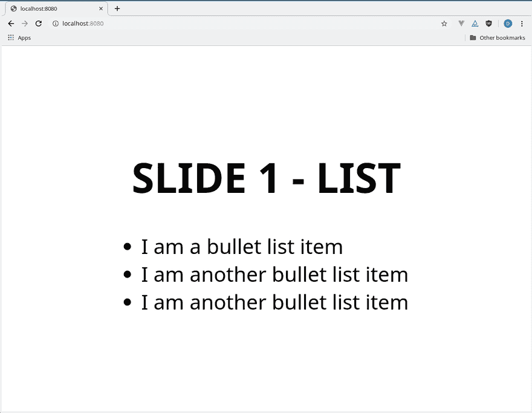

# 学习 MDX 资料:入门

> 原文：<https://dev.to/davefollett/mdx-deck-getting-started-4hn3>

## 🙋什么是 MDX Deck？

[MDX Deck](https://mdx-deck.jxnblk.com/) 由 Brent Jackson ( [@jxnblk](https://twitter.com/jxnblk) )创建，是一款使用 [MDX](https://mdxjs.com/) 创建演示平台网站的工具。 [MDX](https://mdxjs.com/) 提供了在 [Markdown](https://en.wikipedia.org/wiki/Markdown) 内部使用 [React 的](https://reactjs.org/)T10】JSX 的能力。这种结合为构建基于 web 的演示平台创造了强大的体验。以下是功能列表，如 [MDX Deck GitHub 页面](https://github.com/jxnblk/mdx-deck)所列:

*   📝在 markdown 中编写演示文稿
*   ⚛进口并使用 React 组件
*   💅可定制的主题和组件
*   0️⃣零配置 CLI
*   💁Presenter
*   📓演讲者注释

## 🏗️装置

首先确保您已经安装了[节点](https://nodejs.org/en/)，并将以下内容作为`package.json`粘贴到一个新文件中。或者，您可以运行:`npm init`来生成一个`package.json`文件。

```
{  "name":  "demo-mdx-deck",  "version":  "1.0.0",  "description":  "Demo MDX Deck",  "scripts":  {  "test":  "echo \"Error: no test specified\" && exit 1"  },  "author":  "Dave Follett",  "license":  "MIT"  } 
```

接下来，使用以下命令安装 mdx-deck。

```
npm i -D mdx-deck 
```

## 🏃‍♀️入门

要创建一个简单的演示文稿，创建一个名为`deck.mdx`的文件，并将以下内容复制到其中。

```
# SLIDE 1 - LIST

* I am a bullet list item
* I am another bullet list item
* I am another bullet list item

---

# SLIDE 2 - HEADERS

## Header 2
### Header 3
#### Header 4
##### Header 5

---

# SLIDE 3 - TABLE

| Fruit         | Weight   | Cost  |
| ------------- | ---------| ----- |
| Strawberries  | 16oz     | $3.99 |
| Blueberries   | 8oz      | $2.99 |
| Grapes        | 12oz     | $3.75 | 
```

每张幻灯片由`---`隔开。要查看演示的效果，请将以下内容添加到`package.json`的脚本部分。

```
"scripts": {
  "start": "mdx-deck deck.mdx"
} 
```

并运行以下命令来启动开发服务器。

```
npm start 
```

该演示可在`http://localhost:8080/`观看。

[](https://res.cloudinary.com/practicaldev/image/fetch/s--8ghUCmPh--/c_limit%2Cf_auto%2Cfl_progressive%2Cq_66%2Cw_880/https://davefollett.io/2019/05/12/mdx-deck-getting-started/mdx-deck-demo.gif)

## ⌨️键盘快捷键

以下键盘快捷键可用于与演示文稿进行交互。

| 钥匙 | 描述 |
| --- | --- |
| 向左箭头 | 前往上一张幻灯片(或出现时进入) |
| 向右箭头 | 转到下一张幻灯片(或单步出现) |
| 空间 | 转到下一张幻灯片(或单步出现) |
| Alt + P | 切换演示者模式 |
| Alt + O | 切换概览模式 |
| Alt + G | 切换网格模式 |

## 🏁结论

如您所见，您可以很快使用 MDX Deck。MDX Deck 的内容比我在这里展示的要多得多。接下来🔜，我将探索它提供的更多特性，比如导入 react 组件、布局、主题、演讲者注释，以及部署到 [Netlify](http://netlify.com) 。