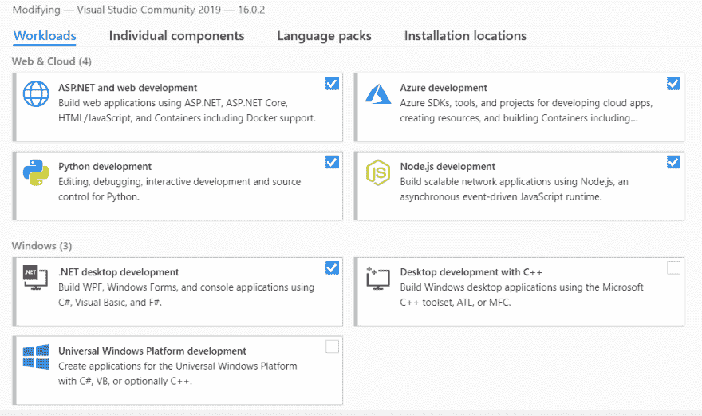
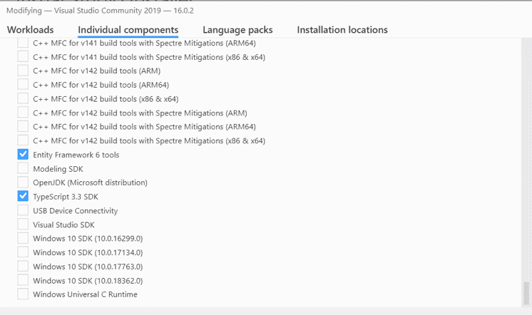

# 如何获得新的 MS 终端

> 原文：<https://dev.to/omiossec/how-to-get-the-new-ms-terminal-le3>

# 如何获得新的 MS 终端

5 月 6 日星期一，在 MS Build conf 上，微软宣布了一款新的 Windows 终端，具有标签、命令行和 PowerShell 之间的切换、表情符号等新功能。

你可以在 Youtube 上观看视频

但是我要到明年冬天才会有空…

如果像我一样，你没有耐心，并且你想玩这个新工具，你有两个选择，在互联网上找到一个构建(风险自担)或者构建解决方案。

让我们试试第二种解决方案。

首先，我们需要什么:

*   Git 客户端
*   努格特
*   可视化工作室
*   Windows 10 (1903 版，如果不是你就能看到所有功能)

如果你没有 Git 和 Nuget，为什么不用一个包管理器来获得它们呢？包管理器在 Linux 上很常见。安装和更新软件很简单。

在 Windows 上，使用最多的包管理器是 [Chocolatey](https://chocolatey.org/) 。

```
Choco install git
Choco install NuGet.CommandLine 
```

Enter fullscreen mode Exit fullscreen mode

现在，最难的部分是安装和配置 Visual Studio。

首先，你不需要购买它，因为构建将与 Visual Studio Community 完美地工作，这是 MS Visual Studio 的全功能免费版本。

之后，下载设置会让你选择你想要的包。看一下模块，但是，为了构建新的 MS 终端，我们需要添加一些包。

注意，如果已经安装了 Visual Studio 2019，也可以通过运行 Visual Studio Installer 来安装这个包。

*   [x]桌面开发 C++
*   [x]通用 Windows 平台开发

[](https://res.cloudinary.com/practicaldev/image/fetch/s--3q2MXLtA--/c_limit%2Cf_auto%2Cfl_progressive%2Cq_auto%2Cw_880/https://thepracticaldev.s3.amazonaws.com/i/bo85dm0h5846ko1i72k4.PNG)

还有一步。您将需要导航到下一个选项卡“单个组件”
您需要添加 Windows SDK 10.0.18362.0

[](https://res.cloudinary.com/practicaldev/image/fetch/s--YG-iFuxo--/c_limit%2Cf_auto%2Cfl_progressive%2Cq_auto%2Cw_880/https://thepracticaldev.s3.amazonaws.com/i/dmgzwtwhzy4x2dgdnst1.PNG)

完成这些设置步骤后，我们现在可以开始构建新的终端了。

打开“VS 2019 工具的开发者命令提示符”，导航到要保存源代码的文件夹。

和类型:

```
git clone https://github.com/microsoft/Terminal.git 
```

Enter fullscreen mode Exit fullscreen mode

它会从 Github 下载代码。但是这还不够，终端项目包含两个子模块，所以我们需要照顾它们

```
cd Terminal

git submodule init

git submodule update 
```

Enter fullscreen mode Exit fullscreen mode

现在是使用 Nuget
的时候了

```
nuget restore OpenConsole.sln 
```

Enter fullscreen mode Exit fullscreen mode

它将下载并安装解决方案文件中列出的项目依赖项。

现在来构建解决方案:

```
msbuild /p:Configuration=Release /p:Platform=x64 /p:PlatformToolset=v142 /p:TargetPlatformVersion=10.0.18362.0 /p:PreferredToolArchitecture=x64 OpenConsole.sln 
```

Enter fullscreen mode Exit fullscreen mode

几分钟(或几分钟)后，你可以享受新的终端。只需进入终端\bin\x64\Release 文件夹并打开 OpenConsole.exe。如果你有合适的 Windows 10 版本，你可以在终端中享受 emoji 和 tab。请记住，这只是一个 alpha 版本，一个预览，你可能会遇到一些错误，当你发现一个问题时，你可以通过发送一个问题来开始贡献。