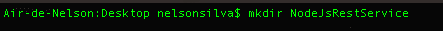
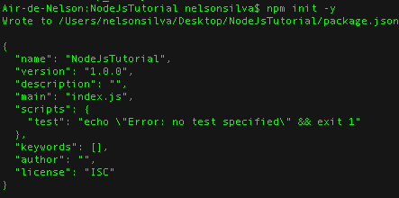
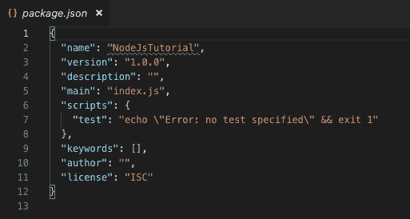
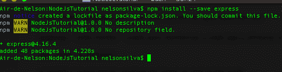
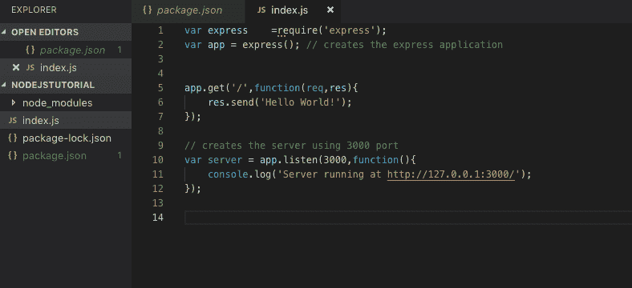
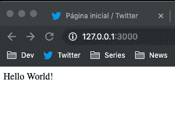
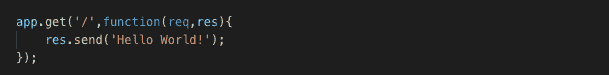

# 我的第一篇博文，你的第一个节点应用

> 原文：<https://dev.to/sir_nsilva/my-first-blog-post-your-first-node-app-5ga0>

这是我的第一篇博文，也是你的第一个 node.js 应用。Node.js 是一个非常受欢迎的后端 javascript 框架，它允许我们在 5 分钟或更短的时间内创建一个简单的服务器或简单的 rest 服务(取决于你快速打字的能力)。

在这篇短文中，我将向您展示如何创建一个简单的 Rest 服务 Api。

前置要求:
[Node.js](https://nodejs.org/en/download/)
部分文字编辑: [Visual Studio 代码](https://code.visualstudio.com/)

所以，让我们开始编码吧。

首先，您需要为您的节点应用程序创建一个目录。

现在，转到刚才创建的目录，执行下一个命令来启动 nodejs 应用程序。

此指令将设置您的项目。参数-Y 表示您同意该流程提出的所有问题。

初始化完成后，package.json 创建完毕，包含以下信息:

到目前为止一切顺利。现在，您已经创建了项目，让我们添加一些特性。您可以执行以下命令来安装 [express](https://expressjs.com/) 。

Express framework 是构建健壮的 node.js 应用程序最流行的框架。

之后，如果你打开你的项目，你会看到一个名为“node_modules”的新文件夹。这是 express framework 的所有依赖项。

注意:当你将你的项目推送到 Github 时，我建议你创建。gitignore”文件。该文件的存在是为了表明某些特定的文件夹/文件是不可推送的。所以，最好的做法是不要依赖 express 框架。为此，请打开。gitignore 并键入“node_module”以便在推送项目时忽略该文件夹。

继续我们的项目，让我们创建 index.js 文件并添加一些神奇的东西。这个文件是应用程序的入口点。

如你所见，在 index.js 文件中我们有一些很酷的东西。

第一行表示我们的项目将依赖于 express 框架。因此，为了访问和使用这个框架，我们需要将它导入到我们的应用程序中。这在 require('module ')中是可能的，其中“module”是一些你可以在 [NPM](https://www.npmjs.com/) 或你自己的库中找到的东西。

第二行，我们创建了一个名为“app”的变量，它将代表 express framework。这意味着，我们需要使用这个应用程序来访问快速框架。

下一段代码创建了我们的服务器，如您所见，服务器正在侦听端口 3000。

因此，如果您打开 web 浏览器并键入“ [http://127.0.0.1:3000/](http://127.0.0.1:3000/) ”，结果将是:

嗯，服务器只是用一句经典的“Hello World”来回应。这是因为，我们用下面的方式编码我们的服务器，我们的入口点:

这段代码创建了我们的端点“/”，每次客户端发送请求
[http://127 . 0 . 0 . 1:3000/](http://127.0.0.1:3000/)都会进入这个端点。

在下一篇文章中，我们将深入探讨 restful 概念以及如何在 node.js + express 框架中工作。