# 时间跟踪:OpenBSD 上的 Kimai1

> 原文：<https://dev.to/nabbisen/time-tracing-kimai-1-on-openbsd-1d7>

## 简介

[Kimai](https://www.kimai.org/) 是开源的时间追踪 app。
有两大版本: [Kimai1](https://github.com/kimai/kimai) ，是 [GPLv3](https://www.gnu.org/licenses/gpl-3.0.en.html) 行货， [Kimai2](https://github.com/kevinpapst/kimai2) ，是 [MIT](https://opensource.org/licenses/MIT) 行货。
我会在这篇文章中展示如何安装 Kimai1。

我尝试安装 Kimai1 和 Kimai2。
为什么还要 Kimai1？
是因为 Kimai2 没有日文翻译！
(另外，我今天提出了关于它的拉请求。啊哈。)

#### 环境

*   OS: [OpenBSD](https://www.openbsd.org/) 6.5
*   数据库: [MariaDB](https://mariadb.org/) 10.0
*   Web 服务器: [httpd](https://man.openbsd.org/httpd.8)
*   CGI: [PHP-FPM](https://php-fpm.org/) 由 [PHP](https://php.net/) 7.2 提供支持
*   时间追踪应用程序:Kimai 1.3.1

## 教程

官方安装手册这里是[这里是](https://www.kimai.org/v1/installation.html)。

#### 要求

首先，你必须具备:

*   [httpd 作为网络服务器](https://dev.to/nabbisen/setting-up-openbsds-httpd-web-server-4p9f)
*   [php-fpm](https://dev.to/nabbisen/php-fpm-on-openbsd-2iof)
*   [MariaDB 作为数据库服务器](https://dev.to/nabbisen/installing-mariadb-server-on-openbsd-5lm)

另外，[推荐 HTTPS](https://dev.to/nabbisen/lets-encrypt-certbot-for-openbsds-httpd-3ofd)。

#### 数据库服务器

创建数据库和用户:

```
CREATE DATABASE <database> CHARACTER SET = 'utf8mb4';
GRANT ALL PRIVILEGES ON <database>.* TO <dbuser> IDENTIFIED BY '<dbpass>'; 
```

#### 应用服务器

获取包:

```
$  ftp https://github.com/kimai/kimai/releases/download/1.3.1/kimai_1.3.1.zip
  $  unzip kimai_1.3.1.zip -d kimai1 
```

然后修改权限:

```
$  cd kimai1
  #  chown -R :www .
#  chmod -R g+r .
#  chmod -R g+rw {temporary,temporary/logfile.txt,includes} 
```

#### Web 服务器

添加配置:

```
server "<fqdn>" {
        listen on $ext_addr port 80
        block return 301 "https://$SERVER_NAME$REQUEST_URI"
}
server "<fqdn>" {
        listen on $ext_addr tls port 443
        tls {
                certificate     "/etc/letsencrypt/live/<fqdn>/fullchain.pem"
                key             "/etc/letsencrypt/live/<fqdn>/privkey.pem"
        }

        root "/<...>/kimai1"
        directory index index.php

        location "/*.php" { 
                fastcgi socket "/run/php-fpm.sock"
        } 
        location "/*.php[/?]*" {
                fastcgi socket "/run/php-fpm.sock"
        }
} 
```

然后重启网络服务器:

```
#  rcctl restart httpd 
```

现在我们可以用浏览器运行 web 安装程序了。
我们到`https://<fqdn>`吧。

#### 网页安装程序

遵循指南:

[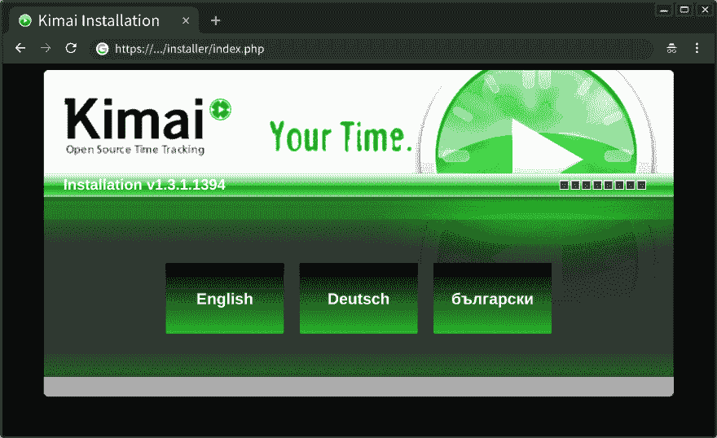](https://res.cloudinary.com/practicaldev/image/fetch/s--KDyrgg11--/c_limit%2Cf_auto%2Cfl_progressive%2Cq_auto%2Cw_880/https://thepracticaldev.s3.amazonaws.com/i/hjesnkfw0epasddmk6eu.png)
[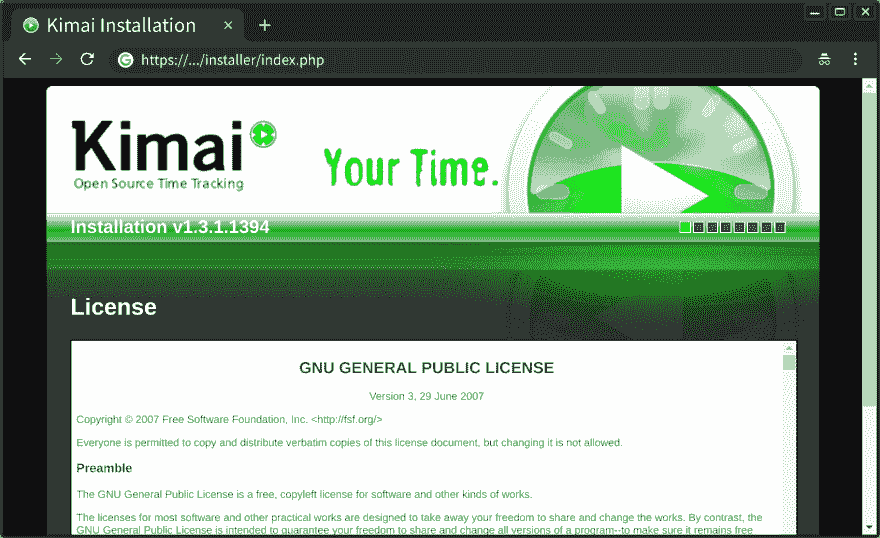](https://res.cloudinary.com/practicaldev/image/fetch/s--bAD_AiwZ--/c_limit%2Cf_auto%2Cfl_progressive%2Cq_auto%2Cw_880/https://thepracticaldev.s3.amazonaws.com/i/8meji6cdbhag99g4zit7.png)
[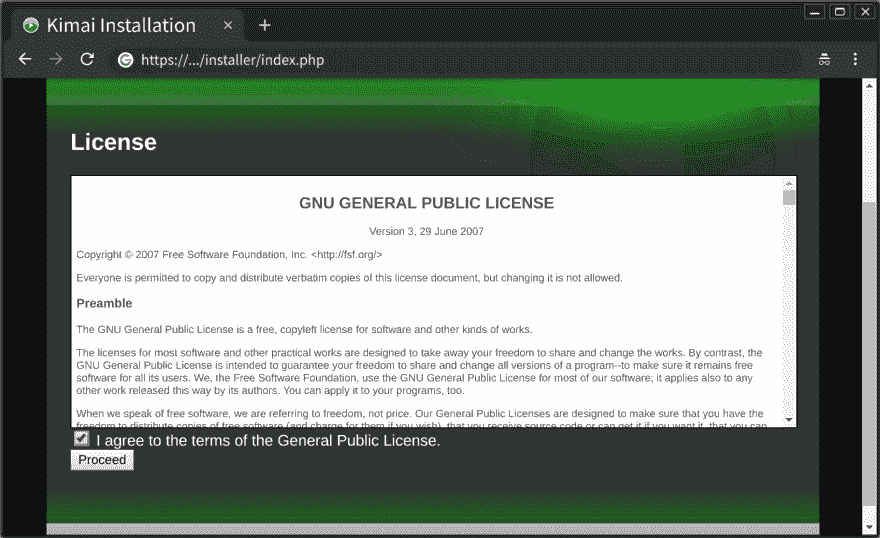](https://res.cloudinary.com/practicaldev/image/fetch/s--5ztYMqwS--/c_limit%2Cf_auto%2Cfl_progressive%2Cq_auto%2Cw_880/https://thepracticaldev.s3.amazonaws.com/i/480y9i0qq0ct386qfwrc.png)
[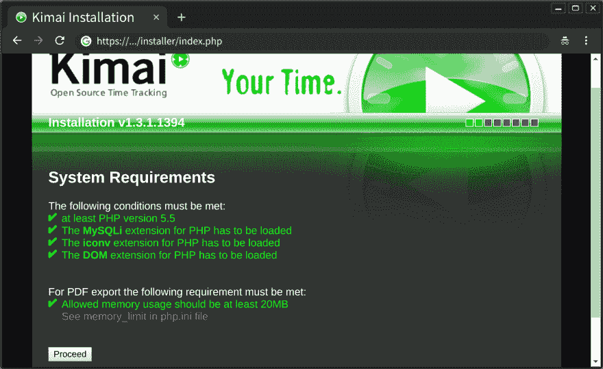](https://res.cloudinary.com/practicaldev/image/fetch/s--Z9rQEbd6--/c_limit%2Cf_auto%2Cfl_progressive%2Cq_auto%2Cw_880/https://thepracticaldev.s3.amazonaws.com/i/qt54pd014sm5mugdkj5x.png)
[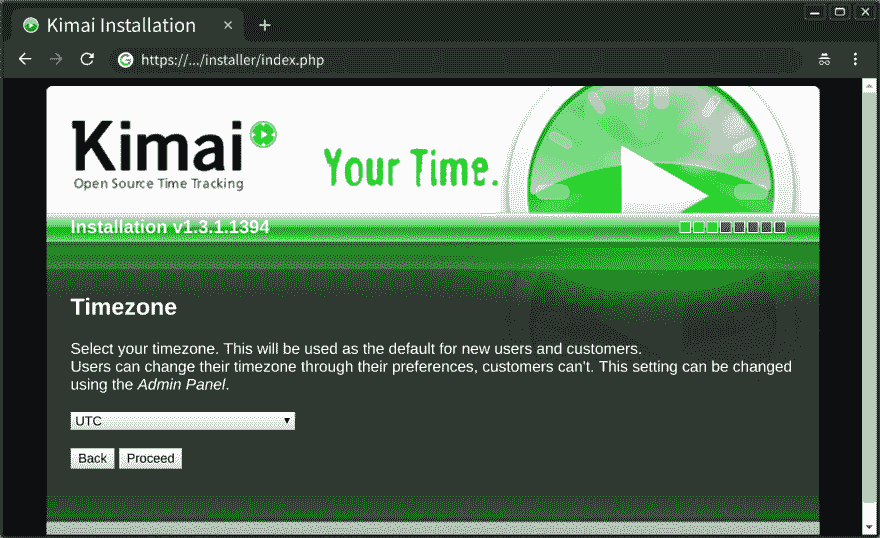](https://res.cloudinary.com/practicaldev/image/fetch/s--vTKurhqp--/c_limit%2Cf_auto%2Cfl_progressive%2Cq_auto%2Cw_880/https://thepracticaldev.s3.amazonaws.com/i/bm369vwe8c39fbpgkqld.png)
[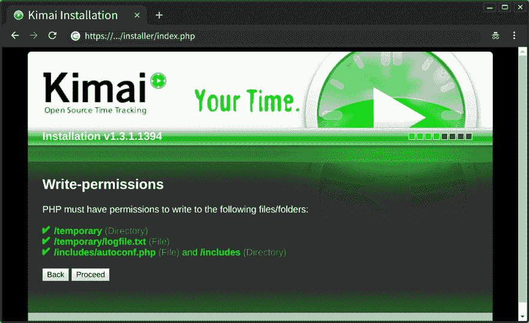](https://res.cloudinary.com/practicaldev/image/fetch/s--bO5BFqIi--/c_limit%2Cf_auto%2Cfl_progressive%2Cq_auto%2Cw_880/https://thepracticaldev.s3.amazonaws.com/i/ovxqs4yo1eqjttpw3lo8.png)
[T25】](https://res.cloudinary.com/practicaldev/image/fetch/s--8DUFQDxn--/c_limit%2Cf_auto%2Cfl_progressive%2Cq_auto%2Cw_880/https://thepracticaldev.s3.amazonaws.com/i/ypqwkhvjslhgv31l6ju1.png)

*注意:根据需要用`127.0.0.1`替换`localhost`。

[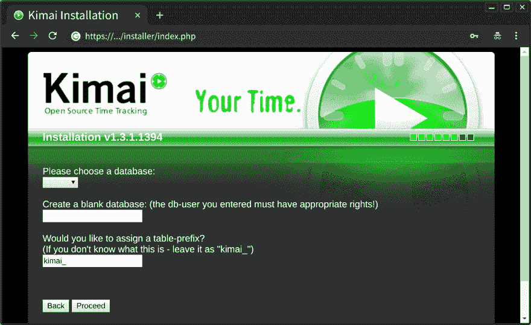](https://res.cloudinary.com/practicaldev/image/fetch/s--kV_ZYYD6--/c_limit%2Cf_auto%2Cfl_progressive%2Cq_auto%2Cw_880/https://thepracticaldev.s3.amazonaws.com/i/euwcse07m7e51wfu5655.png)
[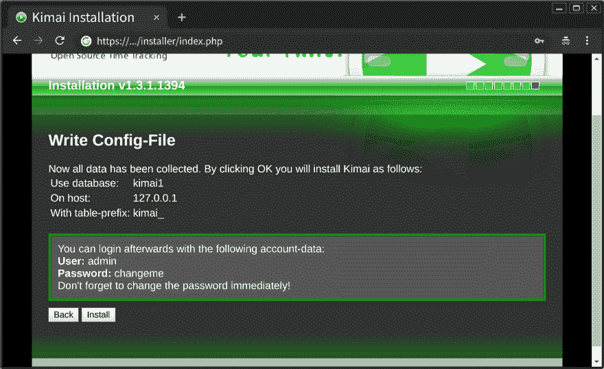T6】](https://res.cloudinary.com/practicaldev/image/fetch/s--y_IFivAC--/c_limit%2Cf_auto%2Cfl_progressive%2Cq_auto%2Cw_880/https://thepracticaldev.s3.amazonaws.com/i/803l0gibtu8wfazfdk67.png)

安装现在准备好了。点击“安装”按钮即可启动。

[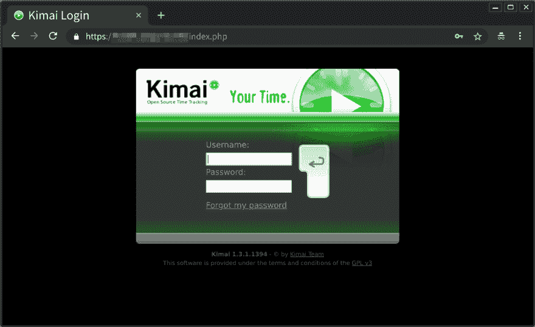](https://res.cloudinary.com/practicaldev/image/fetch/s--PCGb9Tew--/c_limit%2Cf_auto%2Cfl_progressive%2Cq_auto%2Cw_880/https://thepracticaldev.s3.amazonaws.com/i/es3hjuuwl157mz1t26v5.png)

我们已经到达登录表单。
初始设置是:

*   用户名:admin
*   密码:changeme

[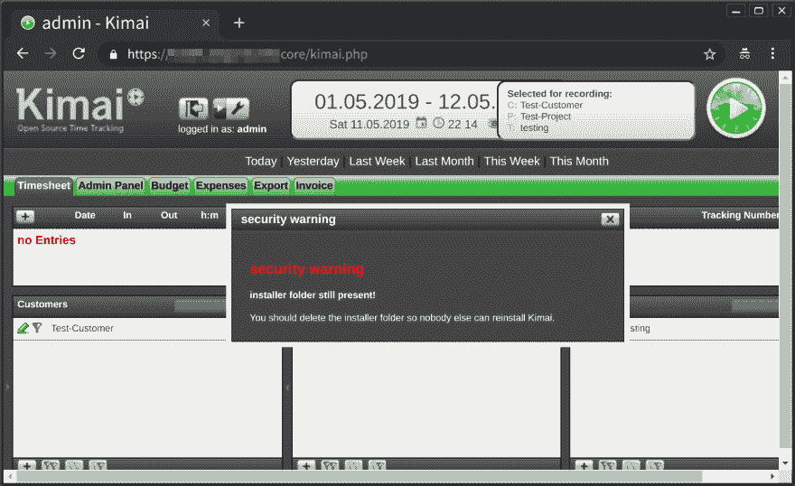](https://res.cloudinary.com/practicaldev/image/fetch/s--32I24s69--/c_limit%2Cf_auto%2Cfl_progressive%2Cq_auto%2Cw_880/https://thepracticaldev.s3.amazonaws.com/i/86upi8lm72tsj5f5g6n6.png)

好吧！
移除安装程序:

```
$  rm -rf installer 
```

仅此而已！

## 结论

这些是使用截图示例。独特酷炫的设计。不知何故，我有时会有点怀旧...:)

[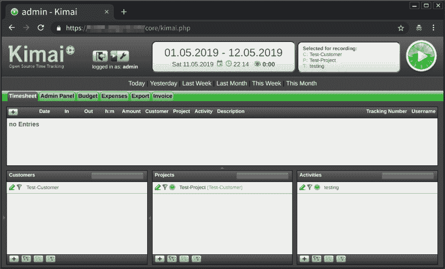](https://res.cloudinary.com/practicaldev/image/fetch/s--tcLX3PHL--/c_limit%2Cf_auto%2Cfl_progressive%2Cq_auto%2Cw_880/https://thepracticaldev.s3.amazonaws.com/i/fz3tv899u15855qonnzx.png)
[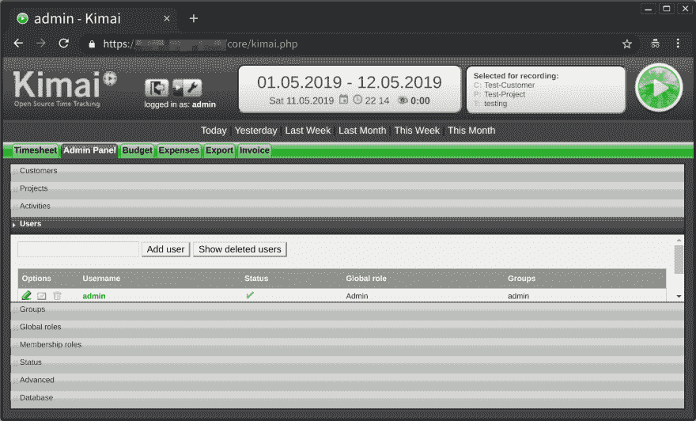](https://res.cloudinary.com/practicaldev/image/fetch/s--B7MwBjco--/c_limit%2Cf_auto%2Cfl_progressive%2Cq_auto%2Cw_880/https://thepracticaldev.s3.amazonaws.com/i/7zkb26vkimwe76tnapk5.png)
[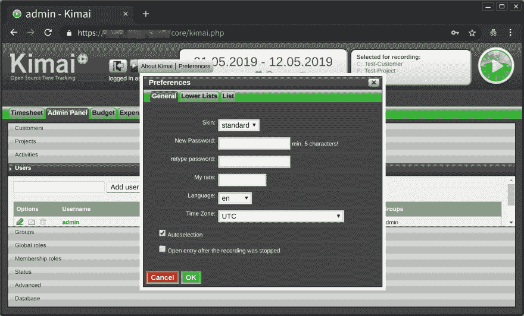](https://res.cloudinary.com/practicaldev/image/fetch/s--BabGqbx---/c_limit%2Cf_auto%2Cfl_progressive%2Cq_auto%2Cw_880/https://thepracticaldev.s3.amazonaws.com/i/vqjm32sgwii8k2ccycye.png)

感谢您的阅读。
快乐计算。