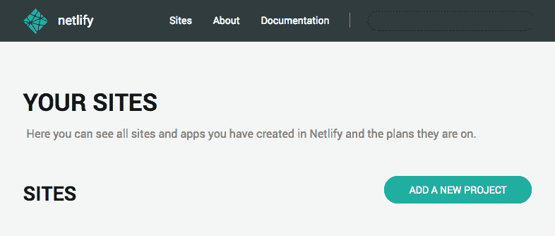
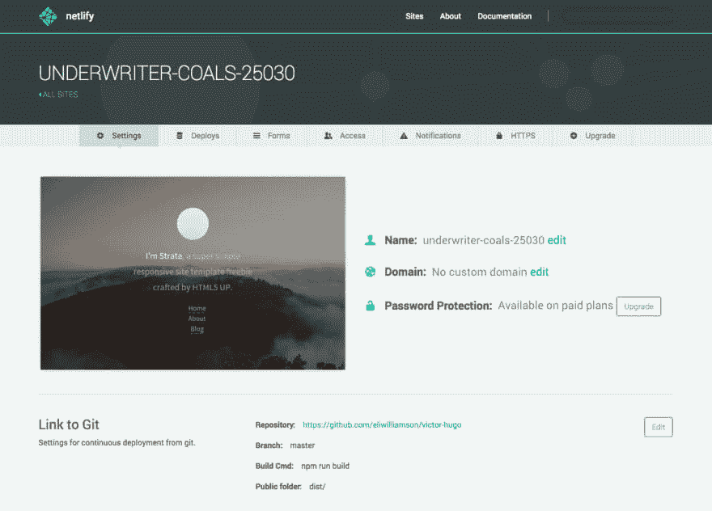

# 免费部署项目

> 原文：<https://dev.to/realabbas/deploy-project-for-free-46kl>

我列出了在高带宽和高正常运行时间的提供商上免费部署您的项目的最佳选项。

netlify[https://www.netlify.com/](https://www.netlify.com/)
Bitbucket Pages[https://pages.bitbucket.io/](https://pages.bitbucket.io/)T5】Github Pages[https://pages.github.com/](https://pages.github.com/)

像免费虚拟主机一样的免费虚拟主机——创建一个博客或个人网站。

