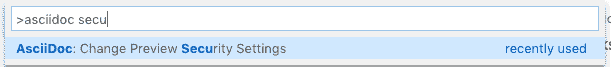
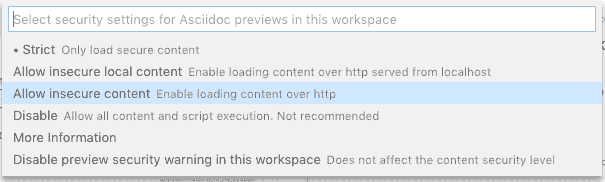
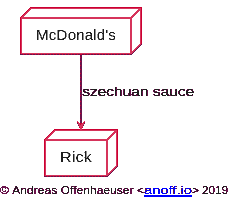
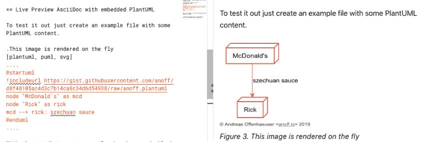
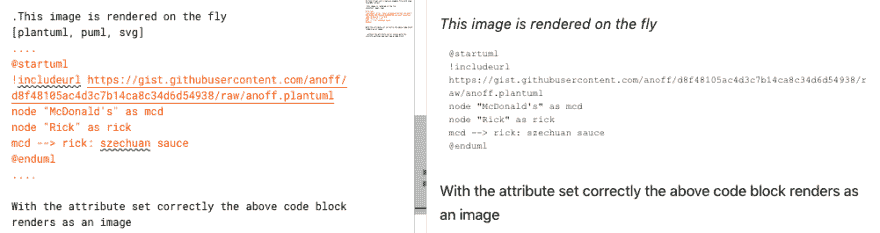

# 在 VS 代码中预览内嵌 PlantUML 的 AsciiDoc

> 原文：<https://dev.to/anoff/preview-asciidoc-with-embedded-plantuml-in-vs-code-3e5j>

> 从[blog.anoff.io/2019-05-08-asciidoc-plantuml-vscode](https://blog.anoff.io/2019-05-08-asciidoc-plantuml-vscode/)交叉发布

[](https://res.cloudinary.com/practicaldev/image/fetch/s--4TET67bB--/c_limit%2Cf_auto%2Cfl_progressive%2Cq_auto%2Cw_880/https://blog.anoff.io/assets/asciidoc-plantuml/title.png)

这篇文章是写给那些喜欢用 VS 代码写 AsciiDoc，但是也想在文档中嵌入 PlantUML 图的人的。在之前的一篇关于 PlantUML 图的文章中，我介绍了 PlantUML 以及如何在 VS 代码中预览图片。使用 VS 代码的最新版本的 AsciiDocs 插件，可以很容易地在 AsciiDocs 中预览嵌入的 PlantUML 图像。

在 Twitter 上关注我，在未来的博客更新中，不是所有的都可以更新到 dev.to。目前我主要写的是 docs-as-code。

## 先决条件

你应该已经在你的机器上安装了 Visual Studio 代码。写这篇文章的时候，我正在 MacOS 上使用 v1.33.1，并在 Windows 10 机器上验证了设置。

为了让 AsciiDoc 预览工作，我们将使用通过执行
可以获得的 [AsciiDoc 扩展](https://marketplace.visualstudio.com/items?itemName=joaompinto.asciidoctor-vscode)

```
code --install-extension joaompinto.asciidoctor-vscode 
```

> 💡我们将在这里使用的特性是相当新的，是 2.6.0 版的 AsciiDoc 插件附带的。

您需要的第三样东西是 PlantUML 服务器。有多种选择:

1.  使用公共的[plantuml.com/plantuml](http://plantuml.com/plantuml)服务器
2.  部署你自己的 java [plantuml-server](https://github.com/plantuml/plantuml-server)
3.  在本地机器上运行[plant UML/plant UML-server](https://hub.docker.com/r/plantuml/plantuml-server/)docker 容器

对于测试用例，选项 1 工作正常；即使服务器声称它不存储任何数据，如果你从事任何非开源的专业工作，我也会建议你托管自己的服务器。如果你熟悉 Docker，设置 PlantUML 服务器是相当容易的，你可以在 2019 年 3 月我的博客文章[中看到一个设置示例。最后，如果你在路上或坐在没有 WiFi 的地方，在 docker 中本地运行它的第三个选项是很棒的。](https://blog.anoff.io/2019-03-24-self-hosted-gitea-drone/)

这篇文章将使用选项 1，因为它只是按照这些说明开箱即用。

## 配置分机

我们将为这个特性使用的选项是`asciidoc.preview.attributes`，它允许您设置任意的 AsciiDoc 属性。这些属性将被注入到预览中。您也可以在每个文件上手动设置该属性，但是对于像服务器 URL 这样的通用配置，您确实不希望这样做。像[安托拉](https://antora.org/)这样的 AsciiDoc 生态系统中的构建系统允许你在构建过程中设置属性(参见[这个例子](https://github.com/anoff/antora-arc42/blob/master/playbook-remote.yml#L21))，所以拥有一个本地编辑器来注入这些属性是非常方便的。

在幕后，AsciiDoc VS 代码扩展依赖于 asciidoctor 的 javascript 端口和 [asciidoctor-plantuml.js](https://github.com/eshepelyuk/asciidoctor-plantuml.js) 扩展。这个扩展需要在 AsciiDoc 文档中设置`:plantuml-server-url:`属性来激活和解析 PlantUML 块。

所以在 VS 代码中你需要做的就是跳转到你的用户设置中，添加下面的条目

```
"asciidoc.preview.attributes": {
  "plantuml-server-url": "http://plantuml.com/plantuml"
} 
```

> ⚠️使用公共服务器的缺点是它不提供 SSL 加密的端点，你必须削弱你的 VS 代码安全设置才能正确预览。

PlantUML 图像通过`http://`提供，您必须允许您的预览包含来自不安全来源的数据。要做到这一点，打开你的命令面板(⌘+P，ctrl+P)，进入 asciidoc 预览安全，并选择*允许不安全的内容*。如果您运行的是本地 PlantUML 服务器，您可以选择允许不安全的本地内容。

[](https://res.cloudinary.com/practicaldev/image/fetch/s--pAMdhLOT--/c_limit%2Cf_auto%2Cfl_progressive%2Cq_auto%2Cw_880/https://blog.anoff.io/assets/asciidoc-plantuml/cmd1.png)

图一。打开 asciidoc 预览安全设置

[](https://res.cloudinary.com/practicaldev/image/fetch/s--CtNXYyt2--/c_limit%2Cf_auto%2Cfl_progressive%2Cq_auto%2Cw_880/https://blog.anoff.io/assets/asciidoc-plantuml/cmd2.png)

图二。允许不安全的内容

## 嵌入 PlantUML 的实时预览 AsciiDoc

要测试它，只需创建一个包含 PlantUML 内容的示例文件。
puml

[](https://res.cloudinary.com/practicaldev/image/fetch/s--lgADVFUF--/c_limit%2Cf_auto%2Cfl_progressive%2Cq_auto%2Cw_880/https://blog.anoff.io/assets/asciidoc-plantuml/puml.svg)

图 3。该图像是动态渲染的

正确设置属性后，上面的代码块呈现为一个图像

[](https://res.cloudinary.com/practicaldev/image/fetch/s--Y1nk3Igi--/c_limit%2Cf_auto%2Cfl_progressive%2Cq_auto%2Cw_880/https://blog.anoff.io/assets/asciidoc-plantuml/preview-ok.png)

..如果没有属性集或安全设置问题，您只会看到一个代码块

[](https://res.cloudinary.com/practicaldev/image/fetch/s--ywvN_3ie--/c_limit%2Cf_auto%2Cfl_progressive%2Cq_auto%2Cw_880/https://blog.anoff.io/assets/asciidoc-plantuml/preview-nok.png)

希望这篇文章对你有所帮助。如果您有任何问题或知道更好的/替代方法，请留下评论👋