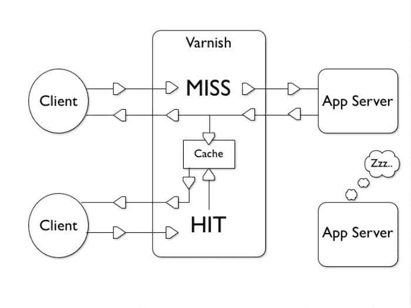
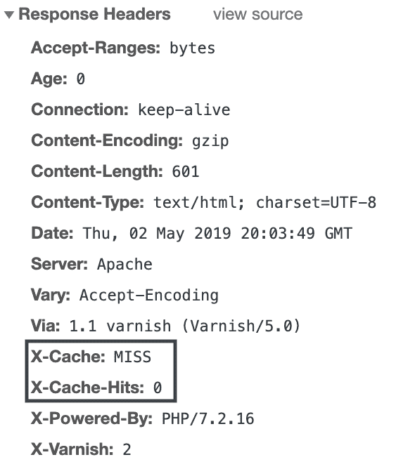
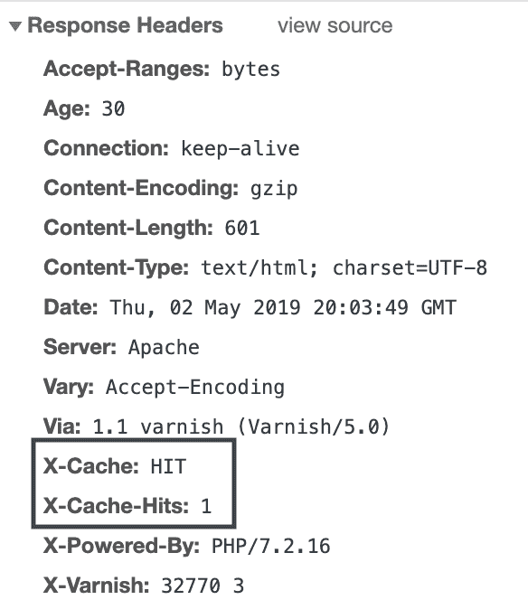
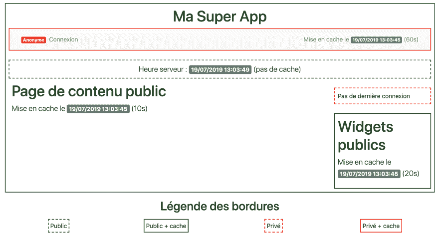
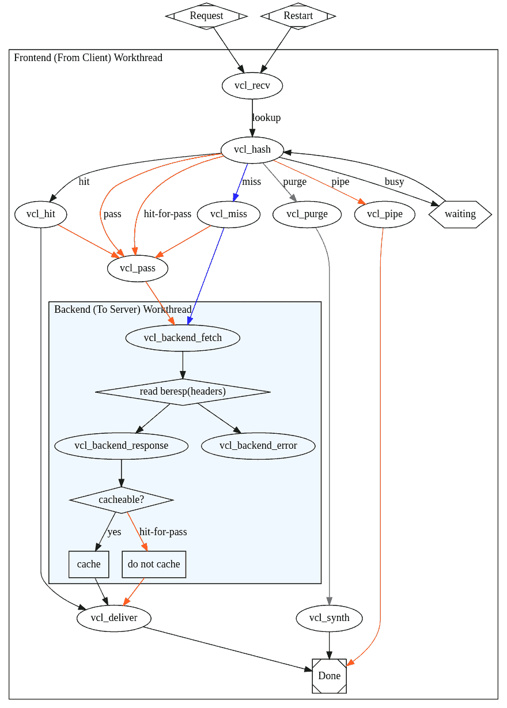

# 使用 Varnish 和 ESI 片段将网站响应时间除以 100

> 原文:# t0]https://dev . to/silar ri/除以您网站的回复时间-par-100-with-varnish-et-les-fragments-ESI-46 KD

应用程序缓存是最大限度地缩短站点响应时间的首选解决方案。只需在此处找到缩短网站响应时间的真正解决方案，只有 1%的人知道该解决方案。

如果你再看这些台词，那就是我做的很好的挑逗工作下面是缩短您站点响应时间的最终解决方案:**不要给您的站点打电话**。

<figure>[](https://i.giphy.com/media/ODU1I5zAgOwX6/source.gif) 

<figcaption>但这主意真有趣。</figcaption>

</figure>

启动后端并返回客户响应，即使使用了最新的超级框架，也是耗时且成本高昂的。框架引导、数据库连接、重定向服务器、用户权限检查、模板引擎等。不需要太大的压力，您可以快速恢复 200 毫秒的内容。

🤓*那么怎样才能缩短我的反应时间呢？我是否需要投资，提升我的制造服务器，并使发票金额加倍？*

**一点也不！**想法是充分利用 HTTP 缓存存储后端生成的 HTML 渲染。为此，我们将玩‘T2’varnish’T3’这个用 c 写的超强大的反向代理。这里所说的是‘T4’的顺序响应时间，如果缓存中存在该页面，则为‘t5’的几毫秒。

Varnish 的原理相当简单:反向代理是用户查询的前沿。如果已有该请求的答案，则只需发出该请求即可。否则，它会将请求转发到后端并存储结果。就这么简单。让我们来看看如何把这种流动变成现实。

<figure>[](https://res.cloudinary.com/practicaldev/image/fetch/s--_nl0DvKZ--/c_limit%2Cf_auto%2Cfl_progressive%2Cq_auto%2Cw_880/https://blog.silarhi.fr/conteimg/2019/05/introduction-to-varnish-vcl-6-1024.jpg) 

<figcaption>瓦讷的简单原理</figcaption>

</figure>

## 开始了

因此，我们的想法是将 Varnish 放在用户查询的前面。现在，他将监听端口 80，并将请求发送到您的 Web 服务器，该服务器一直处于前端。

第一步是更改后端侦听端口。例如，对于 Apache，我们将更改配置:

```
Listen 80 
```

标准杆

```
Listen 8000 
```

请记住 Web 服务器的新侦听端口。接下来我们要安装瓦尔德纳什。转到 packagecloud 并按照您的发行版中的说明进行操作:https://package cloud . io/varniscache。

## 第一个例子:静态内容

Varnish 使用自己的配置语言(VCL)，然后将其编译为 c。这是一个低级毛发，但是一旦配置好，您就可以将法拉利引擎放入您的 2 CV 中。

我们先从最小 VCL 开始:

```
vcl 4.0;

backend default {
    .host = "127.0.0.1"; 
    .port = "8000"; # Le port d'écoute de votre backend (Apache, Nginx, ...)
}

# Appelé à la fin de chaque réponse (en cache ou non)
sub vcl_deliver {
    if (obj.hits > 0) {
        set resp.http.X-Cache = "HIT";
    } else {
        set resp.http.X-Cache = "MISS";
    }

    set resp.http.X-Cache-Hits = obj.hits;

    return (deliver);
} 
```

花点时间熟悉语法和配置。在此，Varnish 被告知，端口 8000 上有一个后端(缺省)可从 127.0.0.1 访问(请记住，这是 Web 服务器的新侦听端口)。还设置了一个名为 *X-Cache* 的应答头，以确定是否已从缓存中检索到应答。第一次访问我们的站点主页来验证结果:

<figure>[](https://res.cloudinary.com/practicaldev/image/fetch/s--A5L8K_vT--/c_limit%2Cf_auto%2Cfl_progressive%2Cq_auto%2Cw_880/https://blog.silarhi.fr/conteimg/2019/07/image-1.png) 

<figcaption>第一次查询:Varnish 没有缓存</figcaption>

</figure>

由于这是第一次访问资源，因此 Varnish 在其缓存中没有答案，这是合乎逻辑的。因此，它会正常调用后端，并将结果存储 120 秒(这是 Varnish 的默认设置，您可以根据需要进行更改)。如果你刷新页面，你会发现瓦讷的反应不同:

<figure>[](https://res.cloudinary.com/practicaldev/image/fetch/s--LcYtgw8o--/c_limit%2Cf_auto%2Cfl_progressive%2Cq_auto%2Cw_880/https://blog.silarhi.fr/conteimg/2019/07/image-2.png) 

<figcaption>第二个查询:Varnish 直接返回</figcaption>

</figure>

的回答

太好了！Varnish 直接返回了他在第一次请求中存储的结果。未请求后端，您将无法在 Web 服务器日志中找到任何访问记录。**它开始看起来有些东西。**

🤓*但是如果我的内容因用户而异-我...。我不想把同样的内容还给大家怎么做？*

这就是 ESI 片段发生的地方。

## 使用 ESI 缓存页面片段

使用 edge side includes)缓存块可以缓存页面的部分。该规范是 Akamai 十年前编写的，目的是为“块”制定不同的缓存策略。例如:我的页面有用户专用的菜单*【nav bar】*。我页面的其馀部分对每个人都一样因此，我可以建立一个包含菜单和缓存所有其他内容的块。

理论上来说，让我们看看它如何转化为一个应用程序:

```
<!DOCTYPE html>
<html>
    <body>
        <h1>Ma super app</h1>

        <!-- Le bloc du ESI est défini là -->
        <esi:include src="/mon-menu-prive.php"/>
    </body>
</html> 
```

就这么简单！除了由反向代理(Varnish)发出请求外，可以将其视为对每个块发出的 Ajax 调用。不同之处在于子查询是由服务器而不是客户端执行的。

### 一个具体案例研究

我们将设置一个具体的页面，它将由几个块组成。某些区块会因使用者而异(例如功能表)，而其他区块则为公用区块。区块快取时间也会有所不同。

个案研究:[可用示范](https://labs.silarhi.fr/esi)

<figure>[](https://res.cloudinary.com/practicaldev/image/fetch/s--Qb_ewIvB--/c_limit%2Cf_auto%2Cfl_progressive%2Cq_auto%2Cw_880/https://blog.silarhi.fr/conteimg/2019/07/Screenshot-2019-07-19-at-13.06.00.png) 

<figcaption>佩服这些美丽的边框</figcaption>

</figure>

让我们进入主题的核心，这是代码:

```
<?php // index.php
    header('Surrogate-Control: abc=ESI/1.0');
    header("X-Reverse-Proxy-TTL: 10");
?>
<!DOCTYPE html>
<html>
<head>
    <meta charset="utf-8">
    <meta name="viewport" content="width=device-width, initial-scale=1, shrink-to-fit=no">
    <link rel="stylesheet" href="https://stackpath.bootstrapcdn.com/bootstrap/4.3.1/css/bootstrap.min.css" integrity="sha384-ggOyR0iXCbMQv3Xipma34MD+dH/1fQ784/j6cY/iJTQUOhcWr7x9JvoRxT2MZw1T" crossorigin="anonymous">
    Ma super page
</head>
<body class="public cached p-2">
    <esi:include src="/menu.php"/>
    <div class="container">
        <esi:include src="/time.php"/>
        <div class="row">
            <div class="col-md-8 col-lg-9">
                <h1>Page de contenu public</h1>
                <p class="lead">Mise en cache le <span class="badge badge-secondary"><?= date('d/m/Y H:i:s') ?></span> (10s)</p>
            </div>
            <div class="col-md-4 col-lg-3">
                <esi:include src="/user.php"/>
                <esi:include src="/sidebar.php"/>
            </div>
        </div>
    </div>
</body>
</html> 
```

请不要过于专注于此代码的细节，只需设想一下在应用程序中设置自己的块即可。

除了这个质量设计外，你大概已经确定了四个街区。顶部的菜单(menu.php)、带有图例的服务器时间(time.php)、上次登录时间(user.php)和小部件(sidebar.php)。4 个区块代表 4 个不同的快取原则。将 Varnish 中的配置与通过后端发送 HTTP 响应相结合，可以实现我们的 4 个策略。

### 配置丹清漆

```
# /etc/varnish/default.vcl
vcl 4.0;

import std;
import directors;

backend default {
    .host = "127.0.0.1";
    .port = "8000"; # Le port d'écoute de votre serveur Apache / Nginx
}

# Appelé au début de chaque requête
sub vcl_recv {
    # Pas de mise en cache pour les méthodes type POST / DELETE
    if (req.method != "GET" && req.method != "HEAD") {
        return (pass);
    }

    # On supprime les cookies sur les pages publiques (cf vcl_hash)
    if(! req.url ~ "^/(login|logout|menu|user)\.php") {
        unset req.http.Cookie;
    }

    # On supprime tous les autres cookies que PHPSESSID pour les pages privées
    if (req.http.Cookie) {
        set req.http.Cookie = regsuball(req.http.Cookie, "; +", ";");
        set req.http.Cookie = regsuball(req.http.Cookie, ";(PHPSESSID)=", "; \1=");
        set req.http.Cookie = regsuball(req.http.Cookie, ";[^][^;]*", "");
        set req.http.Cookie = regsuball(req.http.Cookie, "^[;]+|[;]+$", "");
        set req.http.Cookie = regsuball(req.http.Cookie, "^;\s*", "");

        if (req.http.Cookie ~ "^\s*$") {
            unset req.http.Cookie;
        }
    }

    return (hash);
}

# Appelé pour calculer un hash de la requête
sub vcl_hash {
    hash_data(req.url);

    if (req.http.host) {
        hash_data(req.http.host);
    } else {
        hash_data(server.ip);
    }

    if (req.http.Cookie) {
        hash_data(req.http.Cookie);
    }
}

# Appelé si le hash a été trouvé (= page en cache)
sub vcl_hit {
    if (obj.ttl >= 0s) {
        return (deliver);
    }

    return (miss);
}

# Appelé au retour de la réponse par le backend
sub vcl_backend_response {
    # L'entête est envoyée par index.php
    if (beresp.http.Surrogate-Control ~ "ESI/1.0") {
        unset beresp.http.Surrogate-Control;
        set beresp.do_esi = true;
    }

    # Notre fameuse entête custom
    if (beresp.http.X-Reverse-Proxy-TTL) {
        set beresp.ttl = std.duration(beresp.http.X-Reverse-Proxy-TTL + "s", 0s);
        unset beresp.http.X-Reverse-Proxy-TTL;
    }

    return (deliver);
}

# Appelé à la fin de chaque réponse (en cache ou non)
sub vcl_deliver {
    if (obj.hits > 0) {
        set resp.http.X-Cache = "HIT";
    } else {
        set resp.http.X-Cache = "MISS";
    }

    set resp.http.X-Cache-Hits = obj.hits;

    return (deliver);
} 
```

在此配置中有几个关键概念需要了解。其实质思想是为每个查询/子查询生成一个单一的散列。此散列值必须取决于专用块的用户上下文，而公用块的散列值并非必需的。在 PHP 中，用户通过 phpsessid cookie 连接到服务器会话。为了在我们感兴趣的页面上生成这种著名的唯一散列值，必须保留 cookie 值。对于其它页面，您可以删除此 cookie，以最大限度地提高其他用户发送缓存内容的可能性。

此外，我们还会删除后端无用的 cookies(如 Google Analytics 等)，这样可以降低垃圾邮件的命中率。当然，您可以根据需要自定义 vcl_recv 功能。

下图清楚地概述了我们必须采取行动的各个步骤:

<figure>[](https://res.cloudinary.com/practicaldev/image/fetch/s--cctWs6fY--/c_limit%2Cf_auto%2Cfl_progressive%2Cq_auto%2Cw_880/https://blog.silarhi.fr/conteimg/2019/05/simplified_fsm.svg) 

<figcaption>学分:[【瓦尔德纳什基础】](https://book.varnish-software.com/4.0/chapters/VCL_Basics.html)</figcaption>

</figure>

### 【sidebar.php】T2

```
<?php //sidebar.php
    header("X-Reverse-Proxy-TTL: 20");
?>
<div class="public cached p-2">
    <h1>Widgets publics</h1>
    <p class="lead">
        Mise en cache le <span class="badge badge-secondary"><?= date('d/m/Y H:i:s') ?></span> (20s)
    </p>
</div> 
```

区块快取原则:快取 20 秒的公用内容。

正是头部`X-Reverse-Proxy-TTL`将给出瓦尔德纳斯的缓存时间。这个头**不是标准**。本来可以在标准头`Cache-Control`上玩，但它有一个主要的缺点:**使用指令`Cache-Control: public, smax-age=20`无法控制缓存**的传播。是的，客户端和服务器之间可能还有其他代理服务器可以使用此指令缓存 HTML 内容。如果您在缓存控制策略中设置了较大的 TTL 值，您将无法控制更新。最好保持对内容传播的掌控。另一方面，对于图像/CSS/JS 类型的内容，如果您掌握了 busting 缓存，请使用较大的 TTL 使 cache-public control 成为可能。

### menu.php

```
<?php //menu.php
    session_start();
    header("X-Reverse-Proxy-TTL: 60");
?>
<nav class="navbar navbar-expand-lg navbar-light bg-light private cached">
    <div class="container">
        <div class="collapse navbar-collapse" id="navbarSupportedContent">
            <ul class="navbar-nav mr-auto">
                <?php if (isset($_SESSION['logged'])): ?>
                    <li class="navbar-text">
                        <span class="badge badge-success">Connecté</span>
                    </li>
                    <li class="nav-item">
                        <a class="nav-link" href="logout.php">Déconnexion</a>
                    </li>
                <?php else: ?>
                    <li class="navbar-text">
                        <span class="badge badge-danger">Anonyme</span>
                    </li>
                    <li class="nav-item">
                        <a class="nav-link" href="login.php">Connexion</a>
                    </li>
                <?php endif; ?>
            </ul>
            <span class="navbar-text">
                Mise en cache le <span class="badge badge-secondary"><?= date('d/m/Y H:i:s') ?></span> (60s)
            </span>
        </div>
    </div>
</nav> 
```

块高速缓存策略:高速缓存 60 秒的专用内容。

将直接在 Varnish 中按用户管理内容缓存。问题是在计算此块的查询的“散列”时包括用户的 phpsessid 这是我们在 vcl_recv 方法中所做的。

### time.php

```
<?php //time.php ?>
<div class="text-center p-2 public">
    <p class="lead text-center">Heure serveur : <span class="badge badge-secondary"><?= date('d/m/Y H:i:s') ?></span> (pas de cache)</p>
    <div class="row">
        <div class="col-3"><span class="public p-1">Public</span></div>
        <div class="col-3"><span class="public cached p-1">Public + cache</span></div>
        <div class="col-3"><span class="private p-1">Privé</span></div>
        <div class="col-3"><span class="private cached p-1">Privé + cache</span></div>
    </div>
</div> 
```

区块快取原则:不含特殊快取的公用内容。

系统为此块调用后端(我已将 Varnish 的基本配置更改为默认 ttl 秒)。

### user.php

```
<?php //user.php
    session_start();
?>
<br />
<div class="private p-2">
    <?php if($_SESSION['logged'] ?? false): ?>
        Dernière connexion il y a <?= time() - $_SESSION['last_login'] ?>s
    <?php else: ?>
        Pas de dernière connexion
    <?php endif; ?>
</div> 
```

块高速缓存策略:不含特殊高速缓存的专用内容。

系统地为此块调用后端。

### login.php

```
<?php // login.php

session_start();
$_SESSION['logged'] = true;
$_SESSION['last_login'] = time();

header('Location: /', true, 301); 
```

没什么大不了的我们在一个非常传统的家庭登录系统里。

### logout.php

```
<?php // logout.php

if ( isset( $_COOKIE[session_name()] ) ) {
    setcookie( session_name(), "deleted", time()-3600, "/");
}

session_start();
session_destroy();

header('Location: /', true, 301); 
```

这里有一个重要的特点:**PHP 会话中的 cookie** 被完全销毁，这样 Varnish 就不会将不再存在的旧缓存用户内容返回给我们。

我们了解了如何根据页面的块类型设置不同的缓存策略。别忘了使用 ESI 片段的 HTTP 快取概念，并广泛使用它来大幅缩短美丽网页的回应时间。

### 要更进一步

[使用的示例演示](https://labs.silarhi.fr/esi)

[【演示源代码要清楚理解(使用坞站)](https://github.com/silarhi/labs.silarhi.fr/tree/master/esi)
[【瓦尔纳官方文献】](https://varnish-cache.org/docs/4.1/users-guide/index.html)