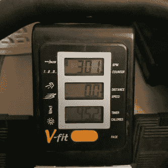
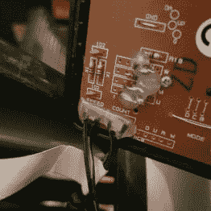
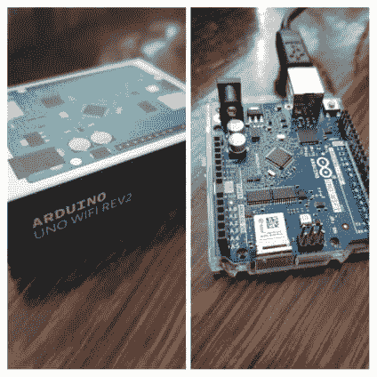
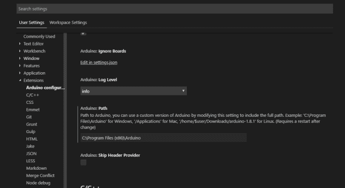

# 用 Arduino 改装我的划船机——第 1 部分——Arduino 基础知识

> 原文：<https://dev.to/alistairjevans/modding-my-rowing-machine-with-an-arduino-part-1-arduino-basics-21c5>

我的车库里有一台赛艇机，我经常使用它，它会在一个基本的小读数上显示一些统计数据，包括速度、燃烧的卡路里、划水次数等等。

<figure> 

<figcaption>划船器读出。</figcaption>

</figure>

我的任务是用我自己的电路板取代简单的 LED 读出器，它将捕获它使用的传感器数据，上传到某个地方，然后用这些数据做一些有趣的事情。

背景方面，我过去有一点嵌入式编程的经验，但是已经很多年没用过了。我了解 GPIO 引脚和类似的基础知识，但我坚定地把自己放在嵌入式开发的“初学者”类别中。

在今天之前，当我开始写这篇文章的时候，我还没有接触过 Arduino，所以这将包括掌握 Arduino 的基础知识，后续的更新将经历修改我的划船机所需的所有步骤！

## 挑选 Arduino 板

我挑选 Arduino 板的唯一真正标准是，我可以连接我的划船机上的传感器，并且我可以连接到 WiFi 来获取数据。

<figure> 

<figcaption>划船机的背面显示。</figcaption>

</figure>

从我的划船机上的连接，我可以知道我需要板上的两个连接来读取模拟传感器值，所以我知道我的板上需要两个 ADC(模数转换器)，一个用于速度，一个用于计数器。

在 Arduino 网站上寻找我想要的主板(结果有很多选择)，我选择了 [Arduino Uno Wifi 版本 2](https://store.arduino.cc/arduino-uno-wiFi-rev2) ，它:

*   有 2 个 ADC(用于读取我的划船机上的传感器)。
*   用于连接的内置 WiFi 模块(这样我就可以上传我的数据)。
*   相当有吸引力的价格，约 35 英镑(截至 2019 年 5 月撰写本文时)外加运费。

运输只花了几天时间，一旦货物到达，我就可以出发了。你还需要一根 USB 型电缆。你可以在亚马逊上花大约 5 英镑买到一台，但我有一台旧的。

## 设置

在用 USB 连接器插入 Arduino 板后，我去了我的特定板的[入门指南](https://www.arduino.cc/en/Guide/ArduinoUnoWiFiRev2)(该网站对每种板有不同的页面)。

> 我相信下面的很多内容对于大部分没有 WiFi 的 Arduino 板卡应该是管用的，但我不确定。

从那时起，我尝试了 Arduino 提供的基于 web 和桌面的 IDE，但是我决定在一个熟悉的环境中工作。幸运的是，事实证明可信的 [VS Code](https://code.visualstudio.com/) 可以拯救我，因为它有一个与 Arduino 一起工作的扩展，并具有不错的智能感知。

你需要从[这里](https://www.arduino.cc/en/guide/windows)下载常规的 Arduino 桌面 IDE，然后才能在你的 Arduino 上使用 VS 代码；扩展需要使用它提供的工具。

继续安装 VS Code Arduino 扩展(由微软提供)，然后如果您需要将 Arduino 安装的安装路径设置为非默认设置，请继续配置该扩展。

## 什么是 Arduino 程序？

究竟什么是 Arduino 程序，它和我桌面上的控制台程序有什么不同？

基本上，所有 Arduino“程序”都运行你写的 C++代码。每个程序基本上都由一个**设置**和一个**循环**组成。