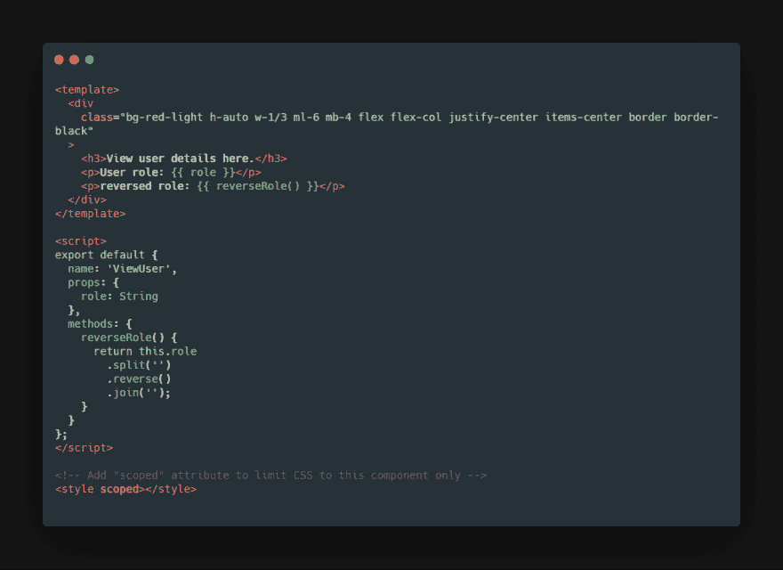
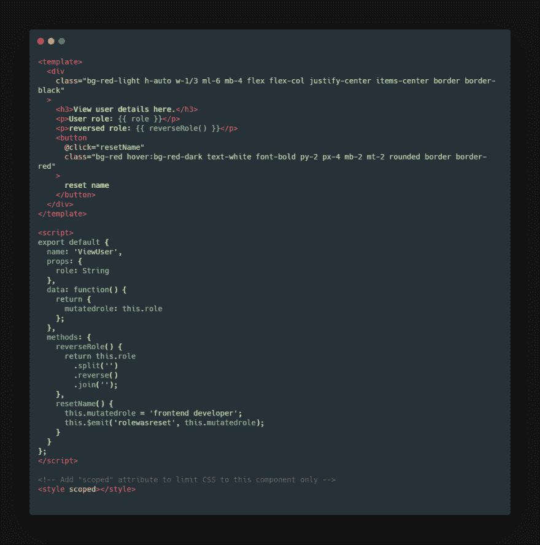
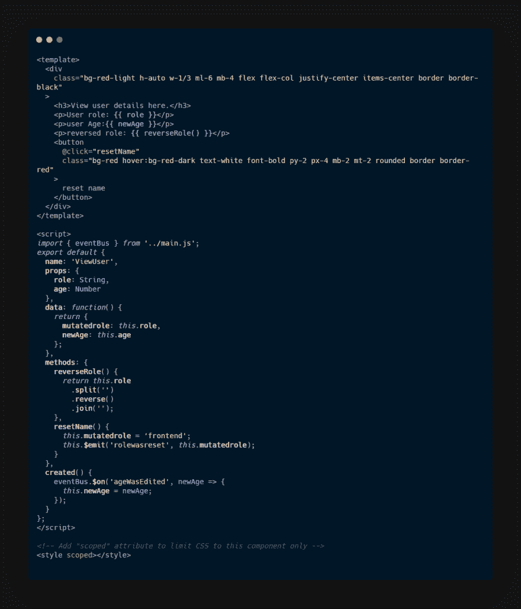

# Vue 中组件之间的通信

> 原文：<https://dev.to/paulwvnjohi/communication-between-components-in-vue-3bad>

我们将使用这个沙盒来说明不同组件之间的通信，请随意使用它。我用[顺风](https://tailwindcss.com/docs/what-is-tailwind/)做造型。当您已经为一个组件设置了一个数据属性，并且想要在另一个组件中呈现数据或者甚至改变数据时，您将需要这个

[https://codesandbox.io/embed/nwy6njnl3j](https://codesandbox.io/embed/nwy6njnl3j)

# 亲子沟通

props 允许父组件和子组件之间的单向通信。在上面的沙箱中，`app.vue`是我们的父组件，`role`是数据属性，我们希望将数据从 app 组件传递到 ViewUser 组件，为此，我们向 ViewUser 注册了一个 props 属性，这是一个带有字符串的数组，在每个字符串中，我们指定应该可以从外部设置的属性，我们在字符串中设置的名称必须与我们在模板中使用的名称相匹配。

[](https://res.cloudinary.com/practicaldev/image/fetch/s--a6RYaZQR--/c_limit%2Cf_auto%2Cfl_progressive%2Cq_auto%2Cw_880/https://thepracticaldev.s3.amazonaws.com/i/t234mr7c50rvizvr0adf.png)

为了传递属性，我们将属性名称 v-bind 到父组件中的数据属性，在父组件中我们呈现模板
`<div class="flex"><ViewUser :role="role" /></div>`

我们可以像使用普通属性一样使用 props，用`this`访问它，并运行一个方法，就像在示例
中看到的那样

```
 methods: {
    reverseRole() {
      return this.role
        .split('')
        .reverse()
        .join('');
    }
  } 
```

为了验证 props，我们使用对象语法。如果没有满足需求，Vue 会在开发时在浏览器的 JavaScript 控制台中警告你

```
 props: {
    role: String
  }, 
```

props 的其他验证器有:数字、布尔值、数组、对象、日期、函数
和符号

# 子对父

为了演示这一点，我们将制作一个按钮，将角色恢复为“前端开发人员”，并将值从子组件- `ViewUser.vue`传递到根组件`app.vue`，为此我们将使用自定义事件。当数据改变并且父节点监听时，子节点将发出新的事件

当我们初始化 vue 实例时，我们得到了`emit`方法，在 emit 上，我们指定了我们想要发出的名称和作为第二个参数的数据作为`this.$emit('rolewasreset', this.mutatedrole);`。我们监听用 v-on 指令发出的事件，或者在根组件中发出事件的组件的选择器中的简写@,这个名称必须与我们给出的发出事件的名称相同，在我们的例子中，这个名称是`rolewasreset`

[](https://res.cloudinary.com/practicaldev/image/fetch/s--PH3sj1nY--/c_limit%2Cf_auto%2Cfl_progressive%2Cq_auto%2Cw_880/https://thepracticaldev.s3.amazonaws.com/i/eo9ygroqvgluvj1x9tsz.png)

传递事件
`<ViewUser :role="role" @rolewasreset="role = $event;" />`

注意，我们没有直接改变属性，而是定义了一个本地数据属性，该属性使用属性作为初始值。如果您这样做，您将在控制台中得到一个警告

# 同胞对同胞

对于兄弟之间的通信，我们将使用 eventBus。请注意，我们也可以使用 Vuex，但我们不会在本例中使用它。

在我们的 main.js 中，我们创建了一个新的 vue 实例，并将其存储在一个我们导出的常量中。我们在 edituser 和 viewuser 中导入，分别发出事件和监听事件。eventBus 是一个 vue 实例，所以默认情况下我们得到$emit 方法

[](https://res.cloudinary.com/practicaldev/image/fetch/s--RfGBxCtM--/c_limit%2Cf_auto%2Cfl_progressive%2Cq_auto%2Cw_880/https://thepracticaldev.s3.amazonaws.com/i/qf6y4kcacjt5qed5lobo.png)

在 edituser 组件内部的一个方法中，我们调用 eventbus 传递所需的参数`eventBus.$emit('ageWasEdited', this.newAge);`

[](https://res.cloudinary.com/practicaldev/image/fetch/s--U6SH32_0--/c_limit%2Cf_auto%2Cfl_progressive%2Cq_auto%2Cw_880/https://thepracticaldev.s3.amazonaws.com/i/2bjp0yp92a13elpexlw8.png)

我们使用`eventBus.$on('ageWasEdited', newAge => {
this.newAge = newAge;`
在创建[生命周期挂钩](https://vuejs.org/v2/guide/instance.html#Lifecycle-Diagram)中监听 viewuser 组件中的事件。第一个参数是事件的名称，第二个参数是数据，它总是一个回调。

如果我们还在根组件中呈现年龄，您将会注意到，一旦我们编辑了年龄，变化将不会反映出来，这意味着数据不会传递给父组件，然后传递给接收数据的子组件。

希望这有助于您理解如何在组件之间进行通信