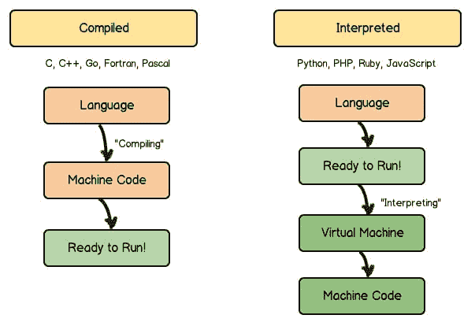

# 超越 php 中流行的数组函数[有例子]

> 原文：<https://dev.to/anastasionico/beyond-popular-array-functions-in-php-with-examples-2bd0>

*2019 年 5 月 10 日*
让你轻松掌握一些额外的数组函数

几年前的一个炎热的夜晚，当我记下前一天早上的学校笔记时，

我发现我被布置了一个非常有趣的作业。

计算机科学教授希望我和我的伙伴们做的测试是，选择一个句子(至少有 12 个单词),将它转换成一个由单词本身而不是元素组成的数组。

然后复制该数组并创建一个新变量，该变量由一个字符串组成，该字符串包含从新创建的数组中提取的单词。

最后，通过编写条件语句，验证两个字符串是否相同，并根据结果发送成功或错误消息。

我仍然记得，在最初的几个小时里，我尝试了多变量创建、foreach 循环、这里循环、那里循环等等，然后我把记事本挂在墙上，睡着了。

沮丧程度:100/100；

[](https://res.cloudinary.com/practicaldev/image/fetch/s--1FNZz6h5--/c_limit%2Cf_auto%2Cfl_progressive%2Cq_auto%2Cw_880/http://anastasionico.uk/img/1/unnamed.png)

请记住，我还是一个学生，PHP 语言对我来说是一个新事物。

第二天，这位教授告诉我，要完成这个练习，使用语言中已经内置的**函数就足够了，3 行就足够了，而不是我正在使用的 600 行。**

这永远改变了我的职业生涯，我相信一旦你明白了这一点，它也会改变你的职业生涯。

这里的原则是:不要重新发明轮子

在过去的几周里，我们已经看到 PHP 提供了不同类别的函数，以便更好地处理数组和数组中的元素。

如果你是新来的或者没有仔细看过这个系列，**这个系列已经被分成了几个部分**，

在第一部分中，我们看到了什么是数组，以及如何使用 PHP 中的[内置函数最好地利用它们，在第二章中，所有](http://anastasionico.uk/blog/php-array-functions-exposed)[最流行的特性](http://anastasionico.uk/blog/array-function-in-php)都被链接起来，

然后我们看到了如何[过滤数组](http://anastasionico.uk/blog/filtering-with-array-functions)的元素(这是 web 开发人员使用的主要函数之一)，最后是如何[排序数组元素](http://anastasionico.uk/blog/sorting-arrays-element-using-php-functions)本身。

在这一章中，你会看到一些额外的功能，一些秘密和提示，你可以决定马上使用。

这些特性中的大部分都非常容易理解，当你继续从事 PHP 框架和核心包的 web 开发时，你会发现其他的特性。

您今天将学习的功能

[explode()](http://anastasionico.uk/blog/built-in-array-functions-in-php-with-examples#explode)
[【内爆()](http://anastasionico.uk/blog/built-in-array-functions-in-php-with-examples#implode)
[array _ sum()](http://anastasionico.uk/blog/built-in-array-functions-in-php-with-examples#sum)
[array _ product()](http://anastasionico.uk/blog/built-in-array-functions-in-php-with-examples#product)
[array _ column()](http://anastasionico.uk/blog/built-in-array-functions-in-php-with-examples#column)
[compact()](http://anastasionico.uk/blog/built-in-array-functions-in-php-with-examples#compact)
[extract()](http://anastasionico.uk/blog/built-in-array-functions-in-php-with-examples#extract)

## 爆炸()

这是那天教授教我的第一个函数。

绝对没有必要为了让**从字符串**中导出一个数组而进行多次循环或者使用复杂的解决方案。

PHP 在其核心中提供了这个内置函数，并且已经实现了这个功能。

*explode()* 函数有 3 个参数。

前两个是强制性的，第三个不是强制性的，坦率地说，我甚至没怎么用过。

**第一个参数是分隔符**，如上所述在我们的例子中它将由空格组成，

第二个参数是**字符串本身**，这里没什么好说的。

第三个参数有点复杂，并且**由极限值**组成。

极限可以是正的、负的或零。

如果为负，则返回除最后一个组件之外的所有组件。

如果显示的极限为 0，则考虑的极限将是一个元素。

正限制返回的数组包含的最大元素数等于指定的数目。

现在，

当我们想从一个字符串中创建不同的元素时，我们需要什么？

很简单！

我们需要绳子和组成绳子的元素。

让我们来看看这个例子:

*“嗨嗬嗨嗬该上班了我们走吧”*

这是字符串，我们需要的，必须插入数组的元素是单词。

插入单个单词的最简单方法是使用分隔符，在本例中，分隔符是分隔单词的空格

这个函数的结果将是一个有 10 个元素的数组。

让我们分析一下这个字符串是如何构造的:

下面是一个使用第三个参数的示例:

```
$str = "Hi Ho Hi Ho Its Off To Work We Go";
// With no limit
print_r(explode('', $str));

// With limit
print_r(explode('', $str, 2));

Array
(
    [0] => Hi
    [1] => Ho
    [2] => Hi
    [3] => Ho
    [4] => Its
    [5] => Off
    [6] => To
    [7] => Work
    [8] => We
    [9] => Go
)
Array
(
    [0] => Hi
    [1] => Ho Hi Ho Its Off To Work We Go
) 
```

在应用 *explode()* 函数时，您需要考虑几个因素:

如果分隔符由空字符串组成，则函数将返回值 FALSE，如果分隔符不在字符串中，并且指示的限制为负，则返回值将为空字符串。

你可以在 W3schools 上找到 [explode 函数的其他例子](https://www.w3schools.com/php/func_string_explode.asp)

## 内爆()

在上一段中，您看到了如何从字符串中获取数组，

正如你已经推断的那样， **PHP 也允许你做相反的操作**。

通过向 *implode()* 函数提供一个数组，您将得到一个包含数组元素值的字符串，

没有比这更简单的了。

有一些特点需要注意，

作为一个最初在 PHP 4 中发布的函数，在经历了这么多年和语言的不同版本之后，这个函数已经发生了变化，这并不奇怪。

让我们深入了解一下:

*内爆()*有两个属性:

第一个被正式称为 glue，由一个字符串组成，该字符串包含一组字符或单词，用于分隔数组的不同元素。

比稀有更独特，甚至作为函数的第一个参数，它不是强制字段，

事实上，它可以被省略，并由该函数的第二个参数代替。

**函数的第二个参数是数组，**

它最终会被转换成字符串。

你想知道一个特性吗，

数组也不是必填字段。

怎么可能呢？

PHP 允许你**调用这个函数而不指定任何参数**，结果会提供一个空的字符串变量。

这似乎是一个积极的因素，但由于没有错误，您必须更加注意该函数获得的结果，这里是一个示例:

```
$dwarfs = ['Doc', 'Grumpy', 'Happy', 'Sleepy', 'Dopey', 'Bashful', 'Sneezy'];
$string = implode(",", $dwarfs);

echo $string; // Doc, Grumpy, Happy, Sleepy, Dopey, Bashful, Sneezy 
```

## array_sum()

这个函数是数组中元素的一个特殊用法的快捷方式。

假设你有一个包含几个数字的数组，你想对它们求和。

最符合逻辑的推理是创建一个**循环，并对变量**中的元素求和。

**array_sum()** 在一行中自动执行这个操作。

它适用于数值数组和关联数组。

该函数考虑的值是整数或浮点数，而返回值是数值类型值，可以是 0(如果数组为空)或元素的总和。

```
$numbers = array(
    "first" => 11.4, 
    "second" => 4.1, 
    "third" => 8.9
);
echo array_sum($numbers); // 24.4 
```

它也可以用来导出一组数字的平均值。

复制并粘贴下面这行:

```
$average_of_numbers = array_sum($numbers) / count($numbers); // 8.13 
```

## 数组 _ 乘积()

居然和 *array_sum()* 相似

语法和条件都与前一章中指出的相同。

这两个函数的唯一区别在于， *array_product()* **的最终结果是元素**之间所有数字的乘积。

```
$numbers = array(2, 4, 6, 8);
echo array_product($numbers); // 384 
```

好奇:如果选择作为参数的数组是一个空数组，与您可能认为的相反，该值派生的不是 0 或 NULL 而是数字 1。

下面是一个演示。

```
echo array_product([]); // 1 
```

## 数组 _ 列()

该函数返回作为参数提供的关联数组的列中的值**，**

*array_column()* 来自 PHP 5.5 版本，使用 3 个参数，其中前 2 个是强制的。

**第一个参数是数组**,我们要从中获取值，

第二个参数**由数组**的键名组成。

通常，返回的数组是数值型的，但是，指示所选数组中存在的另一个其他列，返回的数组将是关联类型的，并将第三个字段的值作为键。

考虑到该函数使用的所有活动部件，不难理解它的使用会导致几个错误，

事实上，

这是一个相当复杂的函数，我建议您始终关注提供的结果，不要有错误或警告。

```
$dwarfs = array(
   array(
       'id' => 1,
       'name' => 'Doc',
       'voice' => 'Roy Atwell'
   ),
   array(
       'id' => 2,
       'name' => 'Grumpy',
       'voice' => 'Pinto Colvig'
   ),
   array(
       'id' => 3,
       'name' => 'Happy',
       'voice' => 'Otis Harlan'
   ),
   array(
       'id' => 4,
       'name' => 'Sleepy',
       'voice' => 'Pinto Colvig'
   ),
   array(
       'id' => 5,
       'name' => 'Dopey',
       'voice' => 'Eddie Collins'
   ),
   array(
       'id' => 6,
       'name' => 'Bashful',
       'voice' => 'Scotty Mattraw'
   ),
   array(
       'id' => 7,
       'name' => 'Sneezy',
       'voice' => 'Billy Gilbert'
   )
);

print_r(array_column($dwarfs, 'name', 'id'));

Array
(
   1 => Doc
   2 => Grumpy
   3 => Happy
   4 => Sleepy
   5 => Dopey
   6 => Bashful
   7 => Sneezy
) 
```

## 紧凑()

如果你曾经**使用过任何一个 PHP 框架**，你肯定已经遇到过这个函数。

如果你从未使用过 PHP 框架或者想看看市场上有什么可用的。

我写了一篇文章，回顾了 24 个最流行的框架，并采访了其中一些框架的开发者。

compact() 被广泛用于创建独特的变量，这些变量可以被发送到使用 MVC 范例的**应用程序的视图中。**

一些 PHP 框架甚至修改了这个函数，使其更适合自己的需求，

[Laravel 使用 *with()* 函数，例如](https://www.quora.com/What-does-compact-do-in-Laravel)

如上所述，该函数创建一个数组类型的变量，包含所有变量和作为参数插入的值。

*compact()* **检查代码并搜索给定名称的所有变量。**

下面是一个具体的例子:

```
$name = "Doc";
$voice = "Roy Atwell";
$movie = "Snow White and the Seven Dwarfs";

print_r(compact("movie", "empty_variable", array("name", "voice")));
Array
(
    [movie] => Snow White and the Seven Dwarfs
    [name] => Doc
    [voice] => Roy Atwell
) 
```

## 提取()

我们来做一些计算机科学:

在计算机科学中，符号表是语言翻译器使用的数据结构，在 PHP 的情况下是解释器。

解释语言是一种编程语言**。**

[](https://res.cloudinary.com/practicaldev/image/fetch/s--pZ8o_VBf--/c_limit%2Cf_auto%2Cfl_progressive%2Cq_auto%2Cw_880/http://anastasionico.uk/img/1/1_oUPhgu1G22fxhl8L6g3YCg.jpg)

它的大多数实现直接执行指令，

不需要事先将代码编译成机器- **语言**指令。

[我在 PHP 专家基础系列中对此做了更多的解释](http://anastasionico.uk/blog/php-basics-for-web-developer)

程序源代码中每个称为符号的标识符都与其声明信息相关联。

符号表存储关于符号的信息。

*extract()* 函数从数组中导入当前符号表中的变量。

简单来说，它产生了与 *compact()* 完全相反的结果。

它有 3 个参数，其中 2 个不是强制的。

**第一个参数是数组**，它必须是关联类型。

第二个参数**由一个可用标志**组成，它指示在无效输入的情况下如何处理按键。

有几个可用的标志:

**EXTR_OVERWRITE** 如果发生冲突，该函数会覆盖现有变量。

如果没有指定键，该标志将是默认值。

**EXTR_SKIP**

在发生冲突时，该功能不会覆盖现有变量。

**EXTR _ PREFIX _ SAME**
T3】如果有冲突，输入 PREFIX 作为变量名的前缀。

**EXTR_PREFIX_ALL**

它给所有变量名加上前缀。

**EXTR_PREFIX_INVALID**

**EXTR_IF_EXISTS**

只有当变量已经存在于当前符号表中时，才会覆盖该变量，否则不会执行任何操作。

**EXTR _ PREFIX _ IF _ EXISTS**
T3】仅当同一变量的非固定版本已经出现在当前符号表中时，创建带前缀的变量名。

**EXTR_REFS**

提取变量作为参考。这意味着变量值指的是数组参数的值。

您可以单独使用此标志，也可以将它与任何其他标志结合使用(在本例中使用或)。

您可以通过使用官方 PHP 手册来更详细地查看这些[标志](https://www.php.net/manual/en/function.extract.php)

第三个参数也是可选的，它是一个字符串类型的变量，由创建的变量的前缀组成。

与本文中已经看到的一些函数一样，数组被作为引用，这有两种含义。

**首先是数组本身被修改**，而不是数组返回的变量。

**第二个是函数返回的变量是另一种类型**在这种情况下是整数类型，表示符号表中导入的变量数量。

从某种意义上说，这个函数与 PHP 解释器密切配合。

这意味着我们需要更加关注要使用的值。

```
$name = "Doc";
$dwarf = array(
             "movie" => "Snow White and the Seven Dwarfs",
             "name" => "Happy",
             "voice" => "Roy Atwell"
);
extract($dwarf, EXTR_PREFIX_SAME, "pre");

echo "$movie, $name, $voice, $pre_name";
// Snow White and the Seven Dwarfs, Doc, Roy Atwell, Happy 
```

有经验的开发人员和手册本身都多次强调的一句话是，您不必使用带有不可信日期的 extract()作为像$ _GET 或$ _FILES 这样的全局变量

## 系列的结论

至于我博客中的其他系列([点击这里浏览其中的](http://anastasionico.uk/blog))我们又一次走到了另一条路的尽头。

在这个系列中，我们已经看到了 50 多个或多或少直接涉及数组及其元素的函数，我们已经从**基本函数发展到特定的部分，例如元素的排序和过滤**。

尽管一些 PHP 框架现在使用集合而不是数组，了解它们如何工作以及如何最好地使用它们不仅会让你更深入地理解这种编程语言的核心，还会让你成为一名更好的程序员，这在你职业生涯的任何阶段都是无价的。

这个系列已经结束了，

这并不意味着你需要完成学习！

恰恰相反，

有大量的信息和平台是为了让你成为更好的程序员和学习新技能而创建的。

在我看来，teamtreehouse.com 是最好的平台之一，也是我学到很多东西的地方。

如果你是自由职业者，他们有关于 PHP、Python、API 创建以及如何创业的课程、视频和测验。

今天对你来说，他们的基本年度计划也有 4 个月的假期

[点击此处，立即享受优惠](//treehouse.7eer.net/c/1374240/294479/3944)

([附属链接](//treehouse.7eer.net/c/1374240/294479/3944)

我的最后一个建议是**在接下来的几个月里，反复阅读这篇文章和本系列中的其他文章**(将它添加到你的浏览器书签中以使事情变得更简单)，并回顾你觉得最有趣的特性。

一旦你深刻理解了它们是如何工作的，你会发现将它们应用到日常代码中会容易得多。

[](http://eepurl.com/dIZqjf)