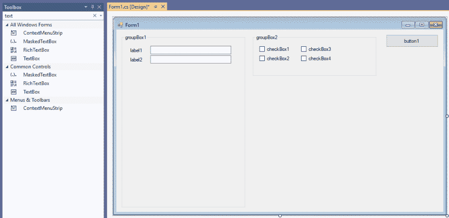
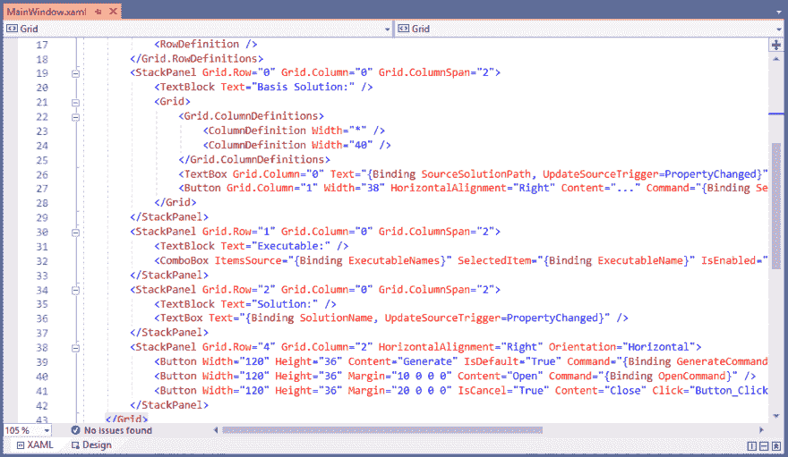
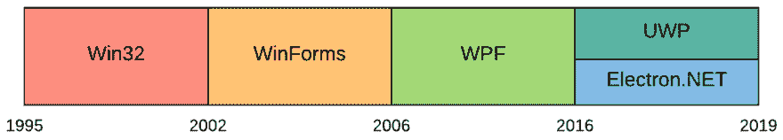

# 。用于 Windows 桌面开发的. NET 技术堆栈

> 原文：<https://dev.to/claudiobernasconi/net-technology-stacks-for-windows-desktop-development-2kl3>

尽管现代软件开发趋向于 web 和移动平台，但桌面应用程序仍然无处不在。说到业务线应用程序，许多应用程序只能在 Windows 桌面计算机上运行。

大多数开发人员必须处理现有的应用程序。当我们读到关于即将到来的变化的新闻时。NET Core 或 Blazor 或 Web assembly 等闪亮的新东西，我们有点感觉被忽略了。

我们需要记住的是，创新也发生在。Windows 桌面应用程序的. NET 开发。当涉及到将旧项目迁移到较新的框架时，或者当我们必须为全新的应用程序选择一个堆栈时，我们有许多选择。

本文旨在概述所有可用的选择，并给出(有时是固执己见的建议)何时为您的(下一个)应用选择哪种技术堆栈。

在本文中，我们将了解以下技术:

*   Win32 和 COM
*   WinForms
*   Windows 演示框架(WPF)
*   通用 Windows 平台(UWP)
*   电子(。网)
*   阿瓦隆尼亚

# Win32 和 COM

构建 Windows 桌面应用程序的最古老的可行方法是使用 C++和 Win32 API。诚然，它不是最新和最热门的技术，但它仍在使用，并且应用程序可以在大多数 Windows 版本上运行。

Win32 是在 1995 年末随着 Windows 95 的发布而引入的，可用于包括 Windows 10 在内的所有后续 Windows 版本。

对使用 C++和 Win32 APIs 编写的应用程序进行现代化是一项艰巨的任务。除了使用另一种技术堆栈重写整个应用程序之外，我不知道其他任何事情。大多数较新的技术需要 Visual Basic。NET 或者更常见的 C#作为编程语言。

如果你有另一个迁移途径，而不是完全重写，请写在这篇文章下面的评论里。

# Windows 窗体(WinForms)

[WinForms](https://github.com/dotnet/winforms) 是随。NET 框架，使桌面开发变得更加简单。经过大约 15 年的闭源开发，微软于 2018 年 12 月 4 日宣布对 WinForms 进行开源。

WinForms 允许开发人员快速获得结果。Visual Studio 有一个内置的编辑器，使我们能够将控件从工具栏拖放到对话框中。通过双击对话框上的控件，Visual Studio 在代码中生成了单击处理程序，允许我们编写应用程序逻辑。

WinForms 的优势是显而易见的:快速原型制作、快速获得结果以及有机会在 Visual Studio 中使用图形编辑器来创建用户界面。WinForms 应用程序可以在安装了的所有 Windows 计算机上运行。NET 框架。

因为微软开始捆绑。NET 框架到 Windows 操作系统几乎每台计算机都至少运行一个，大多数时候是多个版本的。NET 框架。

WinForms 的缺点是设计选项有限，与 Visual Studio 的密切关系使得在 Visual Studio 之外开发应用程序几乎是不可能的，并且当多个开发人员在同一个项目上协作时，使用版本控制系统生成的代码可能会很麻烦。

在我看来，如果开发人员希望或需要快速获得结果，在 UI 编程或一般编程方面经验有限，并且用户体验要求不是很高，WinForms 仍然是可行的。

微软宣布从发布。NET Core 3.0 将有一个选项来运行 WinForms 应用程序。NET Core 代替了(full)。NET 框架。

在我看来，每一个仍在开发并运行在 WinForms 上的应用程序都应该迁移到。NET 核心，或者至少在头脑中有一个如何实现它的策略。。NET Core 有如此多的优势，在大多数情况下你都不想错过它们。

# Windows 演示框架(WPF)

随着的发布。NET Framework 3.0 2006 年，微软推出了 [Windows 演示框架(WPF)](https://docs.microsoft.com/en-us/dotnet/framework/wpf/getting-started/) 作为 Windows 桌面开发的 WinForms 的替代方案。

WinForms 和 WPF 的主要区别在于设计语言。对于 WinForms 应用程序，我们使用图形设计器，对于 WPF 应用程序，我们使用 XAML 作为标记语言来描述我们的用户界面。

优势显而易见。使用类似 XML 的语言，开发者可以完全控制他们用户界面的结构。WPF 支持定制设计，实现定制控件来构建更丰富的用户体验成为可能。

使用数据绑定机制和利用 MVVM 设计模式，WPF 应用程序允许开发人员在用户界面设计代码和业务逻辑之间拆分代码。应用程序逻辑可以而且应该在类库中编写，不依赖于任何用户界面框架。它允许更易维护和重用的代码。

另一方面，开发变得要求更高，需要更多的知识。获得结果在开始时可能很难，并且总是有多种方法来解决一个问题。WinForms 通常是有限的，但会迫使您在另一方面采用更直接的解决方案。

WPF 赋予开发者巨大的权力，允许他们选择创建令人惊叹的用户界面。如果开发者在对话框中放了太多的元素，或者一次加载了太多的数据，应用程序很快就会感觉很慢。此外，与 WinForms 应用程序相比，WPF 应用程序通常需要更长的启动时间。

很长一段时间，WPF 是 Windows 桌面开发的准标准。我从 2008 年到 2018 年参与了 WPF 项目，有许多成功的项目仍在 WPF 运行。

如果你需要创建一个只在 Windows 桌面电脑上运行的应用， [WPF 在 2019 年](https://www.claudiobernasconi.ch/2019/01/30/is-wpf-still-relevant-in-2019/)仍然是一个可行的选择。

微软宣布从发布。NET Core 3.0 不仅可以运行 WinForms，而且可以运行 WPF 应用程序。NET Core，这意味着 WPF 应用程序可以利用。网芯。当记住性能是使用 WPF 的最大缺点之一时，这是一件很棒的事情。

# 通用视窗平台(UWP)

UWP 应用程序是 WPF 和 WinForms 应用程序的现代替代品。UWP 取代了 Windows 运行时(WinRT)并需要 Windows 10。

UWP 应用程序可以使用微软商店分发，并且是最终用户应用程序的绝佳选择，因为应用程序的分发可以使用微软商店来完成。感觉很像移动开发，但是是针对桌面计算机的。

UWP 不仅可以在台式电脑上运行，也可以在 Xbox One 和其他微软设备上运行。

UWP 应用程序既可以用 C#开发，使用 XAML，感觉很像写 WPF 应用程序(有一些限制)，也可以使用 JavaScript 和 HTML。

几周前，我在这个博客上写了一篇介绍通用 Windows 平台的文章。如果你想更深入地了解 UWP 应用程序，你可能想去看看。

你还可以在上面的文章中找到我关于何时创建 UWP 应用程序而不是 WPF 应用程序的建议。

# 电子(。网)

Electron 允许使用 web 技术(HTML、CSS 和 JavaScript)开发桌面应用程序。Electron 在 Chromium 上将您的应用程序作为节点应用程序运行，这意味着 Electron 会打开一个浏览器窗口，让您像运行本地桌面应用程序一样运行您的 web 应用程序。

优点是电子应用程序是跨平台的，也可以在 iOS 和 Linux 上运行。使用 Electron 的一些比较知名的应用程序包括 Slack、GitHub Desktop 和 Visual Studio Code。

不利的一面是，我们的 CPU 和 RAM 使用率很高，因为幕后运行 Chromium 进程消耗了大量资源。电子应用程序在 Windows 7 和更新版本上运行。

这个技术和这篇文章有什么关系？答案是 Electron.NET。

[Electron.NET](https://github.com/ElectronNET/Electron.NET)允许我们使用 ASP.NET 核心开发电子应用。我们可以编写 C#并拥有与 Electron 提供给 JavaScript 开发人员相同的 API。总的来说，Electron.NET 与电子相比有相同的优点和缺点。

对于需要访问网上没有的计算机资源的 web 应用程序来说，Electron.NET 是一个可行的迁移途径。对于想要在. NET 中开始(Windows)桌面开发的有经验的 web 开发人员来说，这也是一项优秀的技术。

# 阿瓦隆

Avalonia 是一个跨平台的 XAML 框架。NET 框架，。网芯和 Mono。Avalonia 的外观与 WPF 或 UWP 接口定义相似，因为它使用 XAML 方言进行视图定义。它还支持 MVVM、数据绑定等等。

Avalonia 是新的，这意味着他们的框架中没有很多遗留代码。不像 WPF，那里有超过十年的代码，因为兼容性问题而不能删除。

我还没有在我的项目中使用过 Avalonia，因此我不能详细说明我是否会建议在生产中使用它。请记住，Avalonia 在其网站上声明他们的框架目前处于测试阶段。

但我能说的是，对于那些希望寻求更新、更前沿的选择，而不是使用现有的 WPF 或 UWP 技术，并且不热衷于将他们的应用程序放在微软商店的开发者来说，这是一种替代选择。

# 总结

就是这样。我们讨论了许多老的和新的技术栈，它们使开发人员能够使用。NET 编程语言。它们都有自己独特的优点和缺点。

当谈到开始一个新项目时，如果你不知道从哪里开始，我会推荐 WPF 和 UWP。WPF 非常成熟，互联网上有很多可用的知识。如果你想使用微软商店，UWP 是一个很好的选择。

对于传统的基于数据的表单应用程序，WinForms 也是一个可行的选择。在选择 WinForms 而不是 WPF 或 UWP 之前，请确保 WinForms 能够满足所有客户要求。

对于步入桌面世界的有经验的 ASP.NET(核心)开发人员来说，Electron.NET 可能是一个令人兴奋的选择。如果应用程序应该是跨平台的，那就更是如此。

Avalonia 是实验项目或开发人员的一个可行选择，他们希望在。网芯。

请在下面的评论中告诉我你最喜欢哪种技术，以及在你当前的项目中使用哪种技术以及为什么使用。

*本文原载于 2019 年 5 月 9 日 [claudiobernasconi.ch](https://www.claudiobernasconi.ch/2019/05/09/net-technology-stacks-for-windows-desktop-development/) 。*