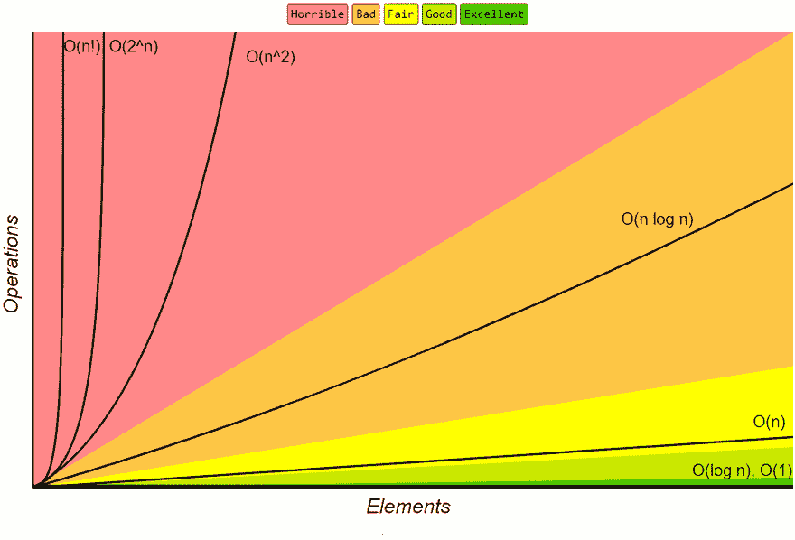
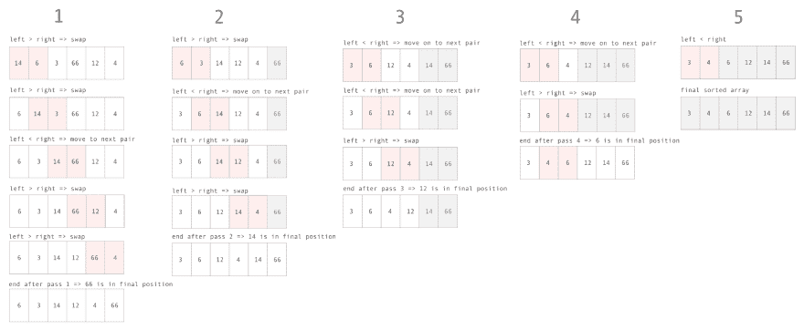
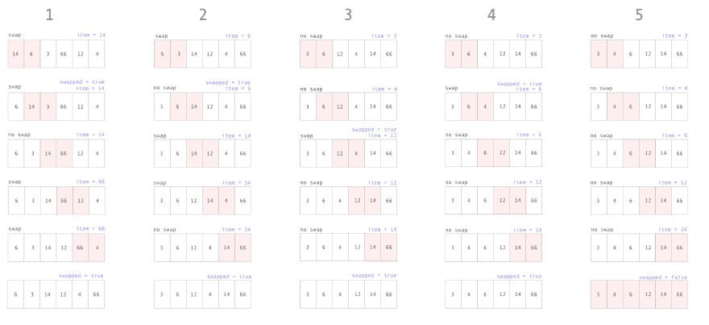

# JavaScript 中的冒泡排序

> 原文：<https://dev.to/emmabostian/bubble-sort-in-javascript-2con>

冒泡排序是讨论最广泛的算法之一，仅仅是因为它对数组排序效率低下。如果数组已经排序，冒泡排序将只通过数组一次(使用下面的概念二)，然而最坏的情况是运行时间为 O(N)，这是非常低效的。

甚至前总统巴拉克·奥巴马也承认泡沫式的低效。

当我们绘制 O(N)的增长率图表时，我们看到，与其他排序算法(如 O(N Log N)的合并排序)相比，它的增长速度要快得多。

[](https://res.cloudinary.com/practicaldev/image/fetch/s--gYjr8CLQ--/c_limit%2Cf_auto%2Cfl_progressive%2Cq_66%2Cw_880/https://cdn-images-1.medium.com/max/1600/0%2ADYHEh5fB-3WzQSJO.gif)

考虑到冒泡排序的暴行，理解这种算法并解释它为什么如此糟糕仍然很重要。

让我们深入研究编码冒泡排序的两个概念。

# 概念 1

*   遍历数组，并对照数组中的下一个元素检查每个元素。
*   如果当前元素大于下一个元素，则交换它们。
*   如果不是更大，向上移动指针并比较接下来的两个元素。
*   一旦我们到达数组的末尾，我们知道最大的元素在最后一个位置。
*   重复这个过程 N 次，其中 N 是数组的长度，每次迭代到最后排序的元素。

### 可视化概念 1

让我们看看如何在长度为 6 的数组上运行。

[](https://res.cloudinary.com/practicaldev/image/fetch/s--A9v7QJmH--/c_limit%2Cf_auto%2Cfl_progressive%2Cq_auto%2Cw_880/https://cdn-images-1.medium.com/max/2400/1%2AaR2lKzbQtjc2afMbC8cwBg.png)

### 概念 1 代码

对于概念一，我们需要两个指针(两个嵌套循环)。我们每迭代一次，上限就减一，因为我们知道这个索引包含一个排序后的值。

```
function bubbleSortConcept1(arr) {
  for (let j = arr.length - 1; j > 0; j--) {
    for (let i = 0; i < j; i++) {
      if (arr[i] > arr[i + 1]) {
        let temp = arr[i];
        arr[i] = arr[i + 1];
        arr[i + 1] = temp;
      }
    }
  }
} 
```

Enter fullscreen mode Exit fullscreen mode

# 概念二

*   遍历数组，并对照数组中的下一个元素检查每个元素。
*   如果当前元素大于下一个元素，则交换它们。
*   表示已经发生了交换。
*   如果发生交换，则再次循环遍历数组。
*   我们知道，当没有发生交换时，数组是排序的。

[](https://res.cloudinary.com/practicaldev/image/fetch/s--Kun9laYk--/c_limit%2Cf_auto%2Cfl_progressive%2Cq_auto%2Cw_880/https://cdn-images-1.medium.com/max/2400/1%2As1TDbwc9WnF8QBOxObkm7g.png)

### 概念二代码

对于这个方法，我们只需要一个指针，因为我们使用一个变量来存储一个布尔值，指示是否发生了交换。与概念一相反，这个概念要求我们每次遍历数组时都要遍历数组中的每一项。

```
function bubbleSortConcept2(arr) {
  let swapped;

  do {
    swapped = false;
    console.log(arr);
    arr.forEach((item, index) => {
      if (item > arr[index + 1]) {
        // Save the value to a variable so we don't lose it
        let temp = item;
        arr[index] = arr[index + 1];
        arr[index + 1] = temp;
        swapped = true;
      }
    })
  } while (swapped);
} 
```

Enter fullscreen mode Exit fullscreen mode

# 运行时间

冒泡排序是效率最低的排序算法之一，排在 O(N)之后。在最坏的情况下，我们必须将数组中的每个元素与其他元素进行比较，因此是 O(N)。