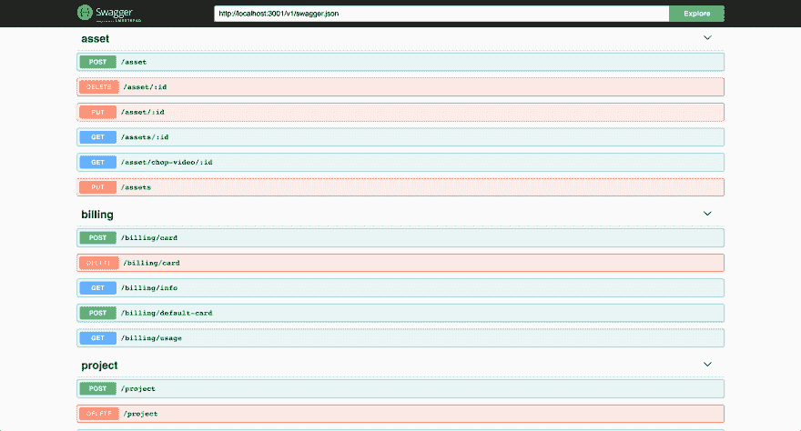

# 终极 React 入门套件

> 原文：<https://dev.to/andrewpierno/the-ultimate-react-starter-kit-29k6>

在 [SugarKubes.io](https://sugarkubes.io) 了解更多信息

# 全栈首发项目

*   反应
*   材料-用户界面
*   extjs
*   Mobx
*   寇阿相思树
*   种类
*   图像和视频上传程序
*   可立即部署在 Google Cloud Run 上(无服务器)
*   埃斯林特
*   巴比伦式的城市
*   Swagger API 文档

## 特性:

*   **认证**:通过 [Auth0](http://auth0.com) 实现企业级无密码登录(密码重置、多重认证)
*   **文件上传**:完整的文件上传系统(s3、wasabi、Google cloud)；
*   API :完成用户注册、电子邮件发送和一些有用的 CRUD 操作。
*   **猫鼬**:猫鼬 ORM 用于 mongodb。包括用户 CRUD。
*   **MongoDB** : ready -使用 Mongo Atlas、compose.io 或 Amazon 的文档 DB 进行部署。
*   没有膨胀。:在几分钟内完成构建和部署，而不是几小时。
*   **上传服务器**:通过 Google Drive、Dropbox、网络摄像头、URL、Instagram 上传图片！
*   **条纹集成**:在前端和后端都用一些辅助条纹类开始快速收费。
*   **分析** : [混合面板](https://mixpanel.com/)和【振幅】[【https://amplitude.com】T4]分析准备就绪。
*   新用户演练:当一个新用户注册时，你可以带他们通过几个指令。

## 视频穿行

[视频浏览](https://youtu.be/_Zw6KD2nWFk)

# App -前端

[](https://res.cloudinary.com/practicaldev/image/fetch/s--L3jMvsvA--/c_limit%2Cf_auto%2Cfl_progressive%2Cq_auto%2Cw_880/https://s3.us-west-1.wasabisys.com/public.sugarkubes/repos/starter-kit-MKRN/login.png)

## 使用的技术

SSR(服务器端渲染)react 初学者工具包

*   [nexts](https://nextjs.org/)的缩写形式
*   [mobx](https://mobx.js.org/)
*   [材料界面](https://material-ui.com/)

## 开始

*   确保填写配置文件以启动。将它们放在 *config.dev.json* 中。对于生产，将您的配置放在 config.prod.json 中

```
cd app
npm i
npm run dev 
```

## 建造外码头

```
cd app
npm run build
npm run prod 
```

## 构建 docker 容器

```
cd app
# Replace values in build_push.sh with your docker credentials or google credentials
./build_push.sh 
```

## 投入生产运行

```
docker run -dti -p 8080:8080 -e PORT=8080 <your image name> 
```

## 部署在 Google Cloud 上运行

*   Google 的 Cloud Run 是我最喜欢的服务之一，你可以立即部署 docker 容器，它可以自动扩展，并可以附加到一个定制的域中。

*   这个 repo 可以立即部署在 cloud run 上，只需使用*推送到 google container hub。/build_push.sh* 命令，瞧！

# API -后端

[](https://res.cloudinary.com/practicaldev/image/fetch/s--91lkD4hR--/c_limit%2Cf_auto%2Cfl_progressive%2Cq_auto%2Cw_880/https://s3.us-west-1.wasabisys.com/public.sugarkubes/repos/starter-kit-MKRN/api-docs.png)

*   确保填写配置文件以启动。将它们放在 *config.dev.json* 中。对于生产，将您的配置放在 config.prod.json 中

```
cd api
npm run dev 
```

## 昂首阔步

*   Swagger 已打开/docs
*   要构建文档，请运行

```
npm run docs 
```

## 构建 docker 容器

```
cd app
# Replace values in build_push.sh with your docker credentials or google credentials
./build_push.sh 
```

## 投入生产运行

```
docker run -dti -p 8080:8080 -e PORT=8080 <your image name> 
```

### 创建数据库

*   您可以使用 Mongo 的 Atlas 免费层轻松部署免费的 mongodb 实例！

```
mongo admin --username root -p --host xx.xxx.xx.xxx

db = db.getSiblingDB("your-db-dev")
db.createUser( { user: "dev", pwd: "xoxoxo", roles: [ "readWrite", "dbAdmin" ]} )

db = db.getSiblingDB("your-db-prod")
db.createUser( { user: "prod", pwd: "xoxoxo", roles: [ "readWrite", "dbAdmin" ]} ) 
```

# [上传者](#uploader)

*   坐在不同的服务
*   上传者/自述文件中的自述文件中关于在 google cloud 上设置的说明
*   使用 google cloud run 即时部署

```
cd uploader
npm run dev 
```