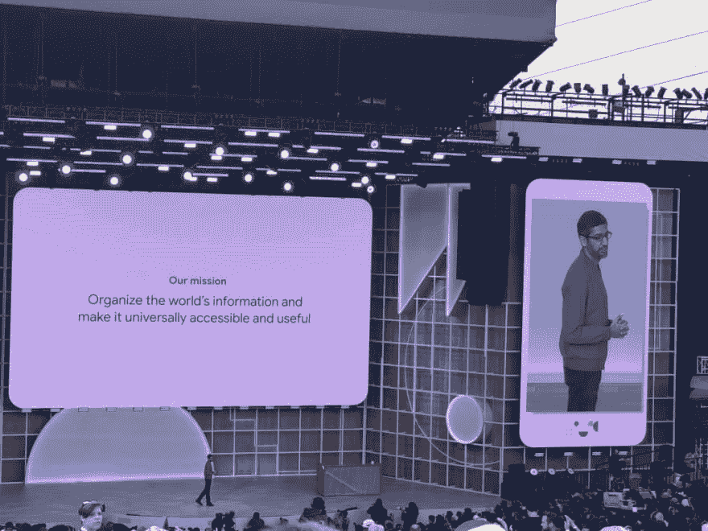
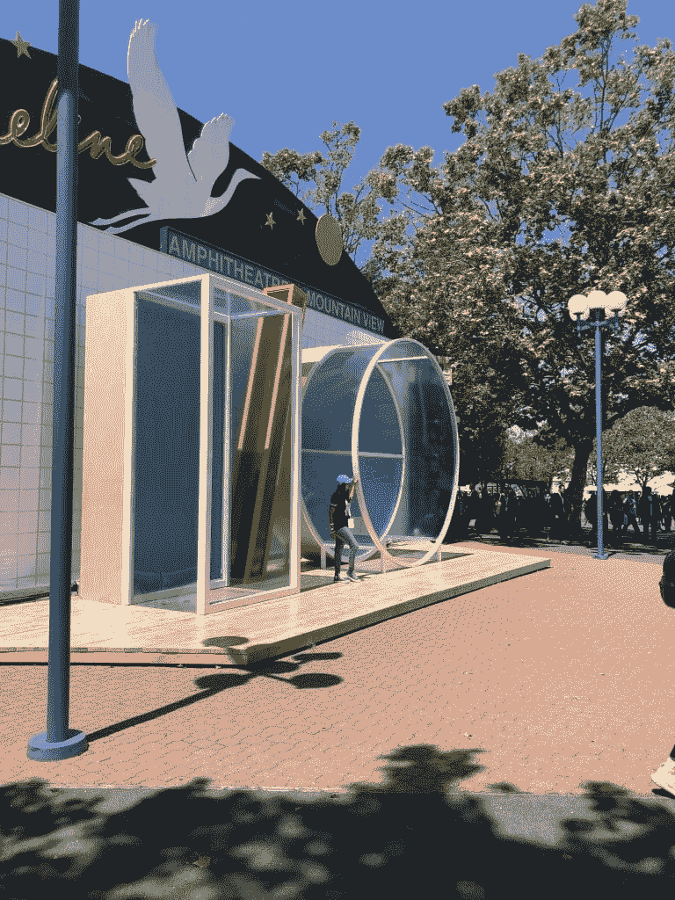
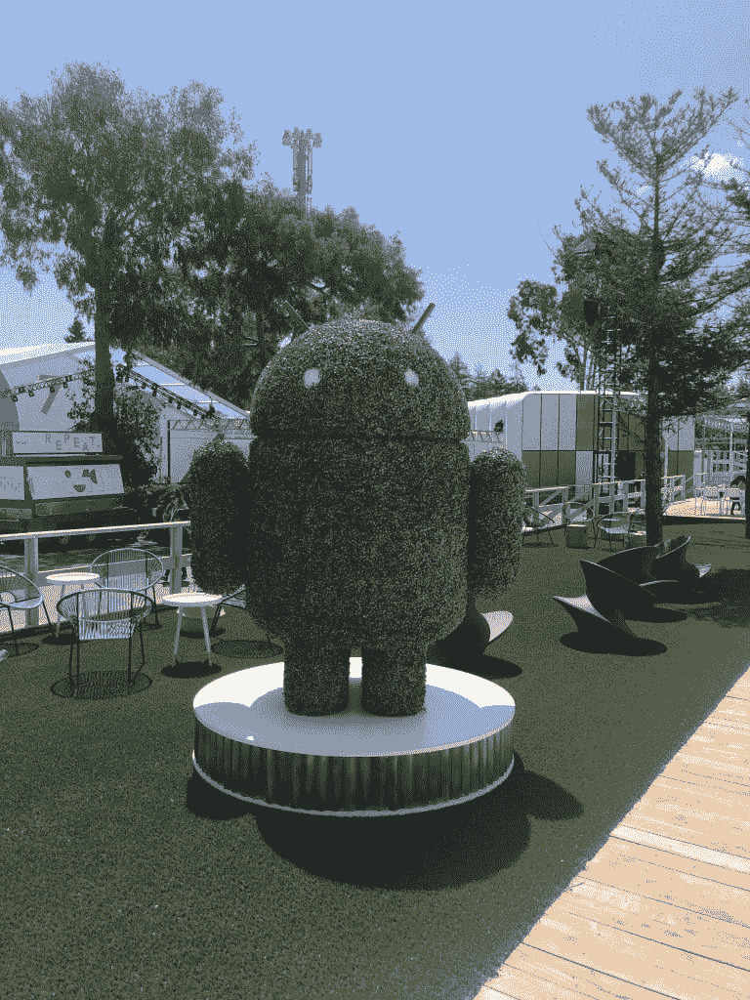
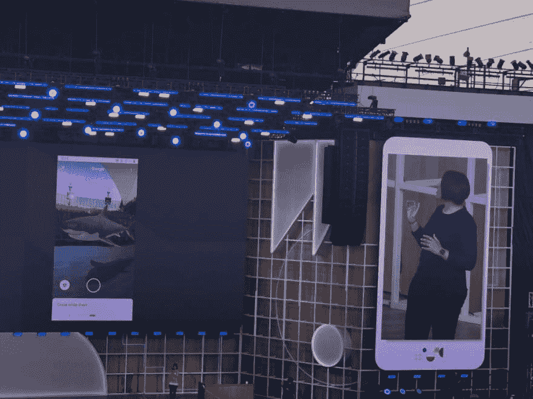
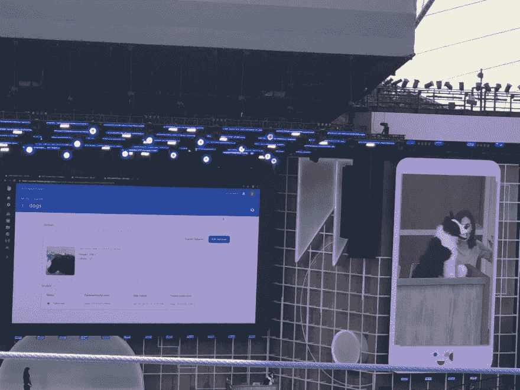
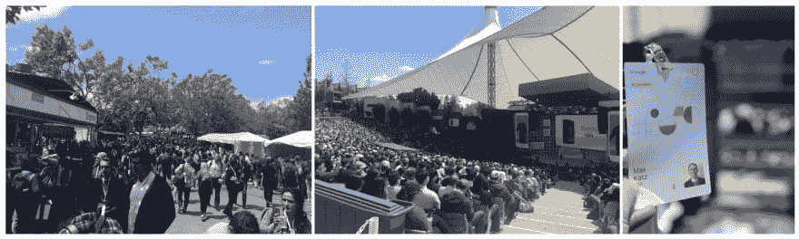

# 10 张图中的 Google I/O 2019

> 原文：<https://dev.to/maxkatz/google-i-o-2019-in-10-pictures-bn6>

本周，我参加了我的第一次谷歌输入输出会议。我只在那里呆了一天，参加产品和开发者主题演讲。这很有趣，也是一次很棒的经历。以下是我在 Google I/O 2019 的一天，分十张图。

<figure> 

<figcaption id="caption-attachment-10411">接送与会者往返活动的班车。Google I/O 是一个免费停车的事件(这真的很好)</figcaption>

</figure>

<figure> 

<figcaption id="caption-attachment-10399">谷歌 CEO 桑德尔·皮帅正在凝视产品主题演讲</figcaption>

</figure>

<figure> 

<figcaption id="caption-attachment-10402">加州山景湖岸线露天剧场</figcaption>

</figure>

<figure> 

<figcaption id="caption-attachment-10397">入口处大 I/O 字母</figcaption>

</figure>

<figure> 

<figcaption id="caption-attachment-10396">你好，安卓！</figcaption>

</figure>

<figure> 

<figcaption id="caption-attachment-10403">鲨鱼登台！您可以将 AR 图像放置在任何场景中，甚至是家中的桌子上</figcaption>

</figure>

<figure> 

<figcaption id="caption-attachment-10401">新的实时字幕功能为在您的 Android 手机上播放的音频或视频添加实时字幕</figcaption>

</figure>

<figure> 

<figcaption id="caption-attachment-10400">谷歌认为，最大的突破正在 AI +软件+硬件</figcaption>

</figure>

的交叉点上发生

<figure> 

<figcaption id="caption-attachment-10398">谷歌新云领袖托马斯·库里安首发开发者主题演讲</figcaption>

</figure>

<figure> 

<figcaption id="caption-attachment-10410">Firebase 团队正在展示其新的 AutoML Vision Edge 功能:简化构建和训练自定义 TensorFlow Lite 模型的工作流程，以对图像进行分类</figcaption>

</figure>

还有几张加分图:
