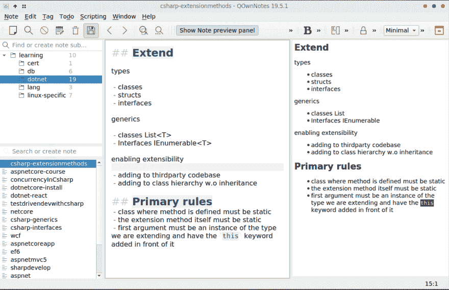
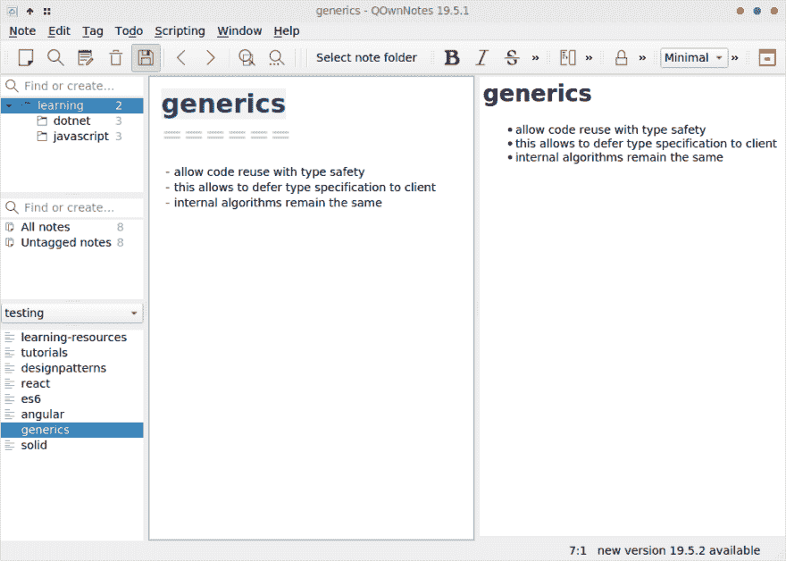
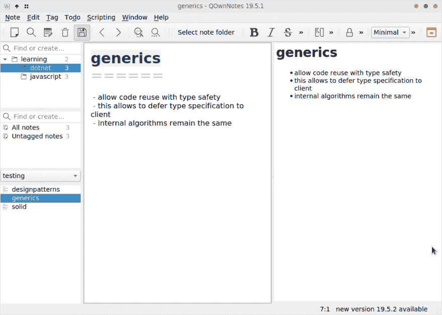
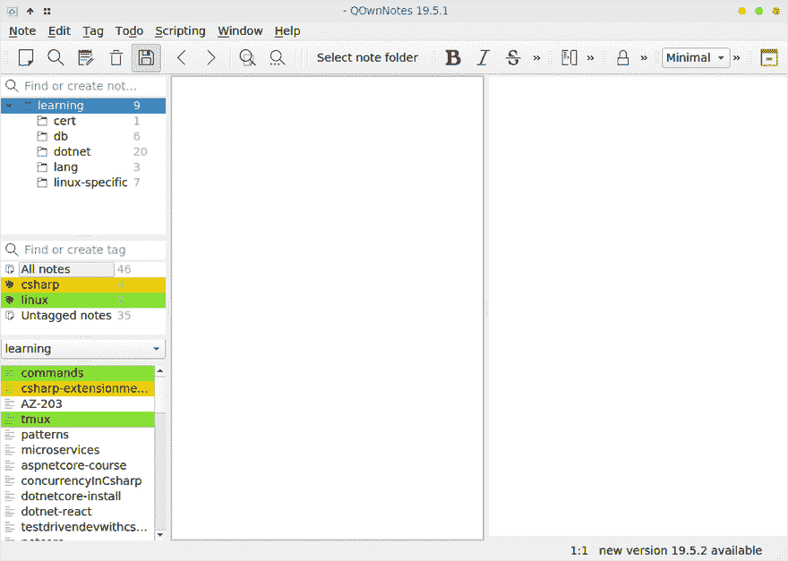

# 使用 QOwnNotes 做笔记

> 原文：<https://dev.to/animesh/note-taking-with-qownnotes-4iop>

几天前，我写了一篇关于[搜索](https://dev.to/animesh_bulusu/search-for-the-near-perfect-note-taking-software-2phi/)近乎完美的笔记软件的文章。我想在这篇文章中简要介绍一下 QOwnNotes 的特性。

QOwnNotes 是一个开源的记事本，支持 markdown 和层次笔记。让我们来看一些特征。

## 降价支持

Markdown 是默认的明文编辑选项。文件可以以纯文本格式编写，并保存为 markdown 文件。这对我来说至关重要，因为我的基本目标是创建一个我可以在浏览器中访问的个人知识库。它可能是公共可访问的网站，也可能是我的机器本地的网站。

QOwnNotes 有一个 markdown 预览面板，让我们可以在编辑器面板旁边实时查看渲染的 markdown。有了实时预览版，我就不用其他 Linux 桌面 markdown 编辑器了，比如 typora、abricotine、retext 和 approval。

这是编辑器和预览的样子。

[](https://i.imgur.com/qze0U4d.png)

## 层次注释

比方说，我们有下面的结构和一些注释。注意文件`learning-resources.md`和`tutorials.md`位于`learning`文件夹的根层。

```
└── learning
    ├── dotnet
    │   ├── designpatterns.md
    │   ├── generics.md
    │   └── solid.md
    ├── javascript
    │   ├── angular.md
    │   ├── es6.md
    │   └── react.md
    ├── learning-resources.md
    └── tutorials.md

3 directories, 9 files 
```

Enter fullscreen mode Exit fullscreen mode

为了能够在 QOwnNotes 中查看这个结构

*   从设置对话框创建一个便笺文件夹`testing`
*   选择`learning`文件夹路径作为便笺文件夹路径
*   选择“使用便笺子文件夹”选项

这是它看起来的样子。正如您在这里看到的，我们之前创建的文件夹结构显示为原样。

[](https://i.imgur.com/7G9vFbo.png)

在顶部面板中，我们看到文件夹，并且选择了`learning`文件夹。在底部面板中，我们可以看到`learning`文件夹中的所有文件，包括其子文件夹。如果我们现在选择底部面板中的`dotnet`文件夹，我们将只能看到该文件夹中的文件。

[](https://i.imgur.com/2mdgNLH.png)

除了显示文件夹层次结构，我们还可以对文件应用标签。在名为`testing`的整个笔记文件夹中创建的所有标签将显示在中间。

这是我的一个笔记文件夹中的一个例子，有两个标签，`csharp`和`linux`。

[](https://i.imgur.com/ih2DFbF.gif)

## 便笺文件夹

我们可以在设置对话框中创建多个便笺文件夹。每个便笺文件夹将作为一个工作区。便笺文件夹中的便笺只会显示在该便笺文件夹中。

创建所有便笺文件夹，并将其中一个便笺文件夹指定为活动便笺文件夹。要查看笔记文件夹并在它们之间切换，有一个面板可用。默认情况下，或者当您更改为最小布局模式时，它可能不会显示。要重新启用它，请选择以下菜单项。

窗口>面板>便笺文件夹面板

当我们在复杂的文件夹层次结构中有许多文本文件时，这特别有用。

在 QOwnNotes 中，令人困惑的是有一个叫做工作区的特性，但是它是针对我们想要使用的不同布局的。

## 键盘辅助功能

大多数菜单项都可以通过键盘访问。我经常使用一些快捷方式。

*   向注释添加标记:Alt+Shift+A
*   切换到下一个音符:Alt+Down
*   切换到上一个注释:Alt+Prev
*   选择便笺文件夹:Ctrl+Alt+；
*   插入当前时间:Ctrl+T

## 结论

您会发现还有其他有用的功能。

*   笔记链接
*   笔记拆分
*   内置待办事项列表
*   无分心模式
*   加密
*   面板解锁
*   可脚本化

QOwnNotes 已经取代了 markdown 编辑器，甚至取代了 geany 来编辑 markdown 文件。在过去的一周里，我一直在广泛使用它，并极力推荐它。如果你需要一个高质量的记事本来维护你的个人知识库，试试吧。

QOwnNotes 怎么发音？对于我醒着的时候会用到的东西，我需要知道这个。一些可能性包括—队列自有注释、锥形注释、内涵注释、q 注释、q 注释。让我们试着找出答案。

在其 [github 库](https://github.com/pbek/QOwnNotes/)上了解更多关于 QOwnNotes 的信息。要使用 markdown，请使用[按钮](https://daringfireball.net/projects/markdown/dingus)。