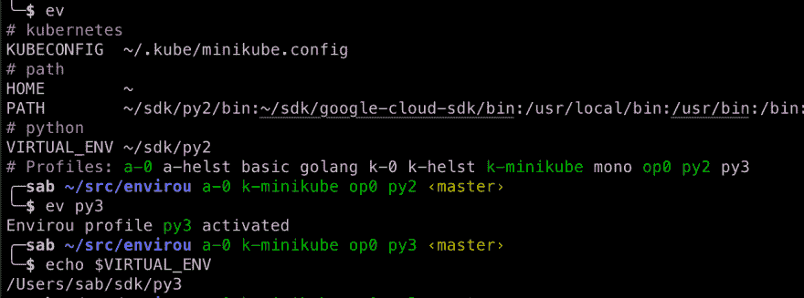

# 用 Envirou 掌握您的 bash/zsh 环境

> 原文：<https://dev.to/sverrirab/master-your-bash-zsh-environment-with-envirou-bjm>

几年前，我创建了一个简单的工具来帮助我管理我的环境变量——我想要一个快速的方法来查看我当前的配置。我正在使用什么 python 虚拟环境，或者什么 AWS 概要文件当前是活动的？
对我来说，这完全取代了`env | grep FOO`和`echo $PATH`，因为它告诉我哪个配置文件是活动的。

[https://github.com/sverrirab/envirou](https://github.com/sverrirab/envirou)

几年后，我增加了修改环境的可能性，所以现在我可以简单地通过`ev prod`和`ev dev`在配置之间快速切换。`ev`然后告诉我哪个概要文件是活动的，并显示所有重要的概要文件(过滤掉不感兴趣的变量，如`$TMP`或`$LC_CTYPE`)。

请尝试一下，看看是否可以简化您的工作流程！

##  [越冬](https://github.com/sverrirab) / [发](https://github.com/sverrirab/envirou)

### 使用 environ 管理您的 shell 环境

<article class="markdown-body entry-content container-lg" itemprop="text">

# 环境——查看和管理您的 shell 环境

[](https://camo.githubusercontent.com/1b882ef84e686e42c2a87f94ce70b7eea11017d7/68747470733a2f2f7472617669732d63692e6f72672f7376657272697261622f656e7669726f752e7376673f6272616e63683d6d6173746572)

Envirou ( `ev`)帮助您快速配置您的 shell 环境，不再编写`export`语句和维护自定义 shell 脚本。

最小配置后的例子 [](https://raw.githubusercontent.com/sverrirab/envirou/master/./screenshots/header.png)

# 演示会议

[](https://asciinema.org/a/hVaeBUd4zJ21LT3yRqQhvR0p8)

# 主要亮点

*   与任何其他工具一起工作-只是视图和可选地设置环境变量。
*   即时显示激活的配置文件(上面的`dev` AWS 配置文件)。
*   压缩输出(用`~`和*替换 HOME，并给*路径加下划线以提高可读性)。
*   隐藏所有不相关的变量，如`TMPDIR`、`LSCOLORS`等。
*   定制简单。
*   使用 bash 和 zsh 在 Mac / Linux 上工作。
*   完全独立，没有依赖性——使用您安装的任何 python 2.7 或 3.4 以上版本。
*   bash 和 zsh 的命令完成支持。
*   包括 [oh-my-zsh](https://ohmyz.sh/) 主题。
*   新增:Windows 支持。

## 快速启动

### 使用 Mac OS X 或 Linux

```
$ curl -o- https://raw.githubusercontent.com/sverrirab/envirou/master/curl_install.sh | bash
```

### 使用 Windows

1.  确保你已经安装了 python(`py`应该可以，3.7+推荐)。
2.  …

</article>

[View on GitHub](https://github.com/sverrirab/envirou)