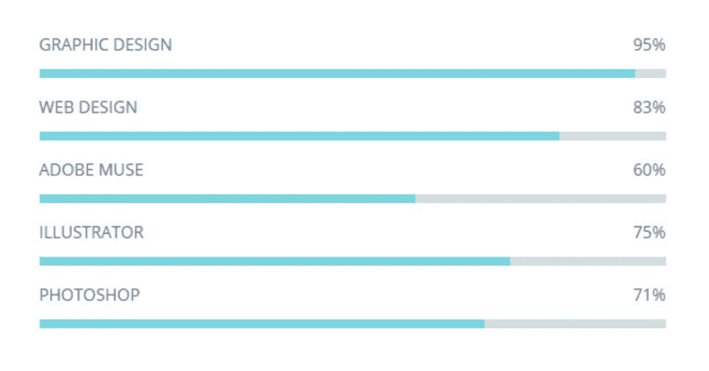

# 不要在简历中使用进度条

> 原文：<https://dev.to/iamzoka/don-t-use-progress-bars-in-your-cv-feb>

不久前，我得到了一个参与公司招聘过程的机会，我注意到的一件事是，大部分申请人喜欢在简历中使用进度条来显示他们的知识水平。

我唯一的问题是怎么做？首先，你如何计算某种技能的百分比？说你知道某事的 80%通常意味着你知道 100%是什么或在哪里。这进一步意味着你拥有超过 80%的知识，因为你知道你不知道的。现在，我不想开始一场关于知识圈的哲学辩论，所以我会尽量简短。

如果你给你的 HTML 知识打了 80%的分或者 4/5 颗星，你真的确定没有 HTML 参考的某个部分，某个技巧或者其他什么，你错过了，会给或者拿走一些宝贵的分数吗？

另一件事是，你不能轻易对不断变化和改进的事物进行评价。假设你对 CSS 知识的评分是 75%。CSS 工作组几个月前给了我们 CSS-Grid。你现在的 CSS 成绩是 50%还是 71%还是别的？

我的建议就是不要用，退一步说也没什么意义。