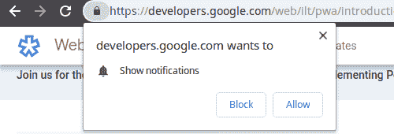

# 何时使用浏览器推送通知

> 原文：<https://dev.to/lyubomir/when-to-use-browser-push-notifications-32al>

推送通知是一个非常好的功能，你可以用任何你想要的标题、图片、正文来触发用户设备的通知，它甚至可以让移动设备在收到通知时振动(取决于浏览器)。

当你有促销活动、忘记装满产品的篮子或者你发布了新的东西时，这是一个非常酷的吸引用户注意力的方法。

为了使用**推送通知**，你必须首先征求用户的许可，这是 URL 栏旁边的小弹出窗口，带有“允许”和“阻止”按钮:

大多数网站是如何使用这一功能的？

当你访问他们的网站时，他们让这个弹出窗口立即出现，你不知道这是什么，你必须订阅什么，看在上帝的份上，我什么也没做，这个弹出窗口是干什么的？好了，挡住它！

大多数用户点击**阻止**，因为你没有在正确的时间请求许可，你只是放弃了转换这个用户的机会。

不要在初始加载时触发它，请在用户操作时触发它，例如在他阅读文章后放置一个按钮，询问用户是否想订阅更多新闻。或者在将一个项目保存到他的愿望列表时，您可以问他是否想要订阅通知，以便接收该项目何时可用的信息。

在这里你可以找到更多关于什么是可能的以及如何安装的信息