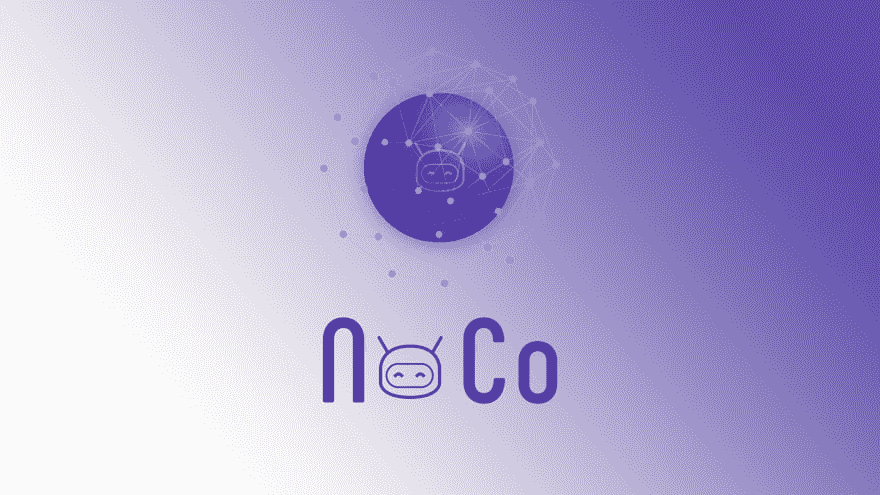

# 加入科技合作社？

> 原文：<https://dev.to/andrewpierno/join-a-tech-co-op-2616>

 
嗨都，

我正在围绕一家名为 NoCo 的科技合作公司开发一个新概念。

[中等岗位](https://medium.com/@AndrewPierno/noco-a-tech-cooperative-2e6054355d05)

如果你有兴趣加入我们的 slack 频道，你可以在这里加入，到目前为止我们大约有 30 个成员。

[松弛通道](https://join.slack.com/t/noco-co-op/shared_invite/enQtNjI5MjEwOTE5ODE1LTdjMDE1ZmY3MzU2ZmQ2Zjg0MGMyM2E1ZjdkNjhmNjg4YjNhYzgyNzI5YzlmZDcyNDQ5MjkxOTQ2ODBkYTUzMGY)

NoCo 的使命:通过打造世界级的产品、服务和体验，增加会员 MRR(每月经常性收入)。

NoCo(无公司)是一个工人合作社。但更重要的是，这个群体寻求控制自己的收入，减少对单一公司的依赖，从而降低收入风险，增加个人收入的多样性。

最初，我们可能会一次关注一到两个项目。我们将在所有权、贡献、合作以及构建任何产品所带来的众所周知的问题方面解决很多问题。

那么为什么要加入呢？

好处
在不同的项目中做你想做的事情。
利用这个空间学习，舒展自己。尝试一种新的编码语言，或者干脆不编码，尝试品牌化。你可以接一个听起来有趣的小任务，或者接受更大的挑战。
不仅仅是开发商。一个村庄才能做出伟大的事情。让我们欢迎营销人员、销售人员、客户成功以及工程之外的所有其他使产品变得伟大的角色。
为自己创造多种收入来源。分散你的收入，创造新的收入来源。
一把“保护伞”下的市场。如果 NoCo 整体成为一个品牌，那么边际上的每个项目都将更容易推出，并随着时间的推移而盈利。(稍后将详细介绍)。你会玩得很开心，结交新朋友，学习新东西。在 NoCo 内部推出产品应该比在外部更快。我们应该尽可能重复利用资源(代码、营销材料、网络)。我们应该解决实际问题。
我们应该能够利用“弹性”劳动力，根据项目需要进行收缩和扩张。(也就是说，我们开始获得很大的牵引力，能够扩大开发人员的规模或暂时进行营销以利用这种牵引力)。
挑战
也许有那么一个时刻，一个项目作为一个常规公司会更有意义。这可以通过投票决定。
分叉。从技术上来说，我认为应该允许“分叉”一家公司，但前提是之前的贡献要计入新项目。如果两个项目以相似的早期轨迹结束，但后期轨迹不同，我认为这是健康的，只要贡献者同意并通过投票表示出来。我们如何评估任意工作时间的价值？小时是正确的衡量标准吗？
TBD
章程
“活跃”会员
投票结构
NoCo 法律结构
在商业中，有两种赚钱的方式。你可以捆绑销售，也可以拆分销售。——吉姆·巴克斯代尔·网景公司首席执行官
我们正在拆分公司。