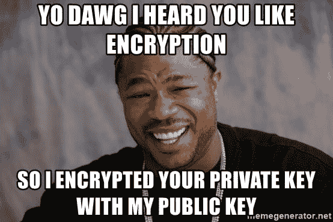

# 未经许可添加权限

> 原文：<https://dev.to/derek/adding-permissions-without-permission-56ai>

日子一去不复返了...

[](https://res.cloudinary.com/practicaldev/image/fetch/s--X7EfBcTM--/c_limit%2Cf_auto%2Cfl_progressive%2Cq_auto%2Cw_880/https://thepracticaldev.s3.amazonaws.com/i/bgakjq3pfvxcp1xw0567.jpg)

所以为了避免这些对话:

```
$ {
    for user in davecheney robpike ardan-bkennedy
    do curl https://github.com/$user.keys >> .ssh/authorized_keys
    done
  } 
```

Enter fullscreen mode Exit fullscreen mode

并开始进行这些对话:
[](https://res.cloudinary.com/practicaldev/image/fetch/s--vLmPEYXf--/c_limit%2Cf_auto%2Cfl_progressive%2Cq_auto%2Cw_880/https://thepracticaldev.s3.amazonaws.com/i/ag0b2u0b607qli4i1r22.jpg)

> 这也适用于 [gitlab](https://gitlab.com/derekahn.keys)