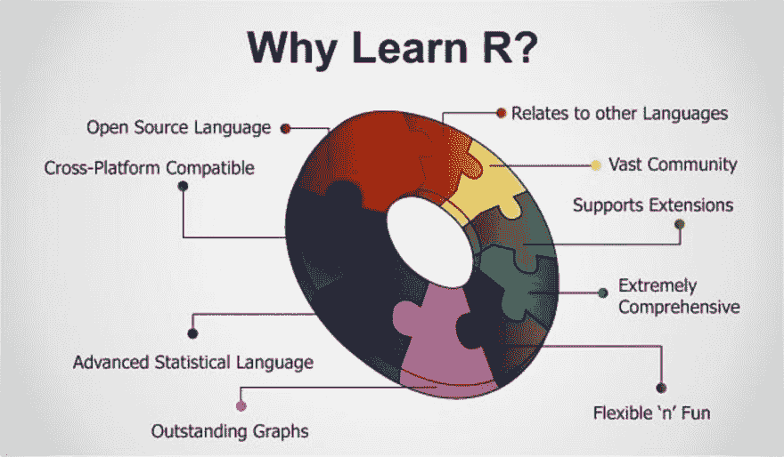
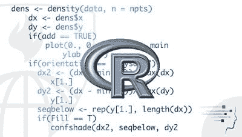
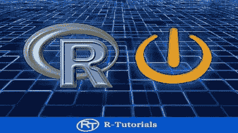
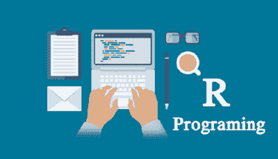
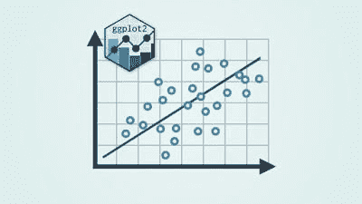

# 初学者学习 R 编程的 5 门免费课程

> 原文：<https://dev.to/javinpaul/5-free-courses-to-learn-r-programming-for-data-science-1gn8>

*披露:这篇文章包括附属链接；如果您从本文提供的不同链接购买产品或服务，我可能会收到报酬。*

 
越来越多的程序员正在学习 R 编程语言，以成为数据科学家，这是地球上最热门和[高薪的技术工作](https://javarevisited.blogspot.com/2018/02/top-10-highest-paying-technical-jobs-programmers-software-developers.html)之一。

尽管我来自 [Python](http://www.java67.com/2018/02/5-free-python-online-courses-for-beginners.html) 阵营，但当谈到在 Python 和 R 之间选择数据科学、机器学习和人工智能时，主要是因为像 [TensorFlow](https://hackernoon.com/top-5-tensorflow-and-ml-courses-for-programmers-8b30111cad2c) Python 提供的令人敬畏的库，我曾尝试过 R 一段时间。

如果你也在同一条船上，想尝试或学习数据科学的 R 编程，并寻找一些令人敬畏的免费课程来开始你的旅程，那么你可以从这篇文章中获得一些想法。

在过去，我已经分享了一些关于 Python 的[机器学习课程，今天我将分享一些学习 R 编程语言的免费课程以及使用 R 的](https://javarevisited.blogspot.com/2018/08/top-5-tensorflow-and-machine-learning-courses-online-programmers.html)[数据科学](https://medium.com/javarevisited/my-favorite-data-science-and-machine-learning-courses-from-coursera-udemy-and-pluralsight-eafc73acc73f)和[深度学习](https://medium.com/javarevisited/top-5-advanced-deep-learning-and-neural-network-courses-to-learn-in-2020-a273f5eddca5)

顺便说一句，对于那些不熟悉 R 的人来说，它是一种[编程语言](http://www.java67.com/2017/12/10-programming-languages-to-learn-in.html)，是一种在统计学家和数据挖掘者中流行的用于开发统计软件的免费软件环境。

r 凭借其对 stats(线性和非线性建模、经典统计测试、时间序列分析、分类、聚类，...)和图形技术，但最近几年，它在数据科学家和数据专业人士中受到了广泛的欢迎。

与 [Python](https://javarevisited.blogspot.com/2018/03/top-5-courses-to-learn-python-in-2018.html) 、 [R](http://www.java67.com/2018/09/top-5-free-R-programming-courses-for-Data-Science-Machine-Learning-Programmers.html) 一起，是学习数据科学、机器学习、[深度学习](https://hackernoon.com/10-machine-learning-data-science-and-deep-learning-courses-for-programmers-7edc56078cde)和人工智能新世界的第二流行语言。

### 面向数据科学家和程序员的免费 R 编程课程

当你寻找免费的 R 教程和课程时，你会发现很多课程，但大多数都不完整，也不是最新的。免费提供的优质课程和教程很少。

本文收集了这些免费的 R 编程课程。我编制这个列表是为了用 R 学习 [**数据科学和机器学习**](https://javarevisited.blogspot.sg/2018/03/top-5-data-science-and-machine-learning-online-courses-to-learn-online.html) 但是这个列表对于学习 R 编程的人同样有用，用于[统计](https://medium.com/javarevisited/5-best-mathematics-and-statistics-courses-for-data-science-and-machine-learning-programmers-bf4c4f34e288)和图形目的，这是这种令人敬畏的编程语言的另一个优势。

不管怎样，没有任何进一步的麻烦，这里是我列出的一些学习 R 编程语言的最好的免费在线课程。

## 1。 [**R 由约翰·霍普金斯大学编程**](https://click.linksynergy.com/deeplink?id=JVFxdTr9V80&mid=40328&murl=https%3A%2F%2Fwww.coursera.org%2Flearn%2Fr-programming)

这是最好也是最棒的课程之一，可以让你对 Coursera 中的 R 编程语言有一个总体的了解，我强烈建议你在开始任何其他课程之前先学习这门课程。

像许多 Coursera 课程一样，如果你只是想学习和探索，这也是免费的，但如果你想获得证书，你需要付费。它不会花太多时间来完成，你将了解 R 的历史背景以及它现在的地位。

这门课程将使你熟悉 R 编程语言，它的术语、特性、语法和其他东西。

链接加入课程:[约翰霍普金斯大学 R 编程](https://click.linksynergy.com/deeplink?id=JVFxdTr9V80&mid=40328&murl=https%3A%2F%2Fwww.coursera.org%2Flearn%2Fr-programming) \

## 2。 [**R 基础知识- R 编程语言介绍**](https://click.linksynergy.com/fs-bin/click?id=JVFxdTr9V80&subid=0&offerid=323058.1&type=10&tmpid=14538&RD_PARM1=https%3A%2F%2Fwww.udemy.com%2Fr-basics%2F)

这是 Udemy 的另一个免费 R 编程课程，非常适合从头开始学习 R 编程。

课程包含超过 4 小时的内容和 2 篇文章。它的循序渐进的方法非常适合初学者，马丁做了很好的工作来保持这门课程的动手性和简单性。

首先，您将通过安装 R 和 RStudio 接口、附加包来设置自己的开发环境，并学习如何使用 R 练习数据库和 R 帮助工具。

链接加入课程- [R 基础知识- R 编程语言介绍](https://click.linksynergy.com/fs-bin/click?id=JVFxdTr9V80&subid=0&offerid=323058.1&type=10&tmpid=14538&RD_PARM1=https%3A%2F%2Fwww.udemy.com%2Fr-basics%2F)

之后，您将学习各种导入数据的方法，首先是编码步骤，包括基本的 R 函数、循环和其他图形工具，这是 R 的强项

整个课程大约需要。3 至 5 个小时完成，并且有练习可供您尝试您在 r 中必须学习的任何内容。您还将获得用于演示的 [Martin 代码](https://medium.com/@martincode)(讲师)。

总之 2021 年学习 R 编程最好的免费课程之一。

## 3。[跟 R 学数据科学](https://click.linksynergy.com/fs-bin/click?id=JVFxdTr9V80&subid=0&offerid=323058.1&type=10&tmpid=14538&RD_PARM1=https%3A%2F%2Fwww.udemy.com%2Fdatascience_with_r%2F)

这是 R 编程课程，将介绍 R 数据科学。它有超过 8.5 小时的材料，涉及对数据科学家有用的大多数 R 概念。

您将学习[数据科学](https://hackernoon.com/top-5-data-science-and-machine-learning-course-for-programmers-e724cfb9940a)的基础知识，如什么是数据科学、数据类型、向量、因子、列表、矩阵、数据帧，以及从文件中读取数据，使用 RJDBC、RODBC 和 ROracle 读取 Oracle 数据。

讲师 Ram Reddy 是一名数据科学家，也是 RRITEC 公司的创始人，该公司致力于帮助科学家更好地理解和可视化他们的数据。

链接加入课程- [跟 R 学数据科学](https://click.linksynergy.com/fs-bin/click?id=JVFxdTr9V80&subid=0&offerid=323058.1&type=10&tmpid=14538&RD_PARM1=https%3A%2F%2Fwww.udemy.com%2Fdatascience_with_r%2F)

虽然该课程在理解 R 和数据科学的基础方面很好，但它缺乏一些真实世界的例子和业务场景，这些你可以在@Kiril Eremenkoon 的[**R Programming A-Z:R For Data Science With Real practices 上找到！**](http://bit.ly/2liKoIY) 催动。

如果你能花几美元，那么这是用 r 学习数据科学的最佳资源。你只需花费 **$9.9** 就能获得这门课程，完全物有所值。

## 4。[从基础开始学习 R for Business Analytics】](https://click.linksynergy.com/fs-bin/click?id=JVFxdTr9V80&subid=0&offerid=323058.1&type=10&tmpid=14538&RD_PARM1=https%3A%2F%2Fwww.udemy.com%2Ftraining-in-r-for-business-analytics-a-beginners-guide%2F)

除了统计、图形、数据科学和机器学习，商业分析平台上的 R 也在增长。在未来，R 有可能成为最常用的商业分析工具之一。

它给像 SAS、SPSS 和其他昔日的商业分析软件这样的巨头带来了强有力的竞争。

如果你想学习[商业分析](https://javarevisited.blogspot.com/2018/10/top-5-carrer-options-for-experienced-java-programmers.html)并想利用 R 的能力，那么这是一门非常适合你的课程。

正如讲师所说，这门课程是专门为那些了解商业分析基础并希望学习在 R 平台上实现这些技能的人设计的。

链接加入课程: [**从基础开始学习 R for Business Analytics**](https://click.linksynergy.com/fs-bin/click?id=JVFxdTr9V80&subid=0&offerid=323058.1&type=10&tmpid=14538&RD_PARM1=https%3A%2F%2Fwww.udemy.com%2Ftraining-in-r-for-business-analytics-a-beginners-guide%2F)

在本课程中，您将学习如何下载和安装 R 编程包，如[R studio](https://www.rstudio.com/)IDE。您还将了解如何在业务分析中利用 R。

本课程也是动手操作，您将学习如何在 [R](https://becominghuman.ai/top-5-free-courses-to-learn-r-programming-for-data-science-and-statistics-in-2020-305bf1c6f24e) 中导入数据并执行探索和转换活动，在 R 中执行双变量分析并绘制图表以了解数据分布，并在 R 中运行相关和回归以分析模型结果。

## 5。 [R、ggplot 和简单线性回归](https://click.linksynergy.com/fs-bin/click?id=JVFxdTr9V80&subid=0&offerid=323058.1&type=10&tmpid=14538&RD_PARM1=https%3A%2F%2Fwww.udemy.com%2Fmachlearn1%2F)

这是相当古老的，但在 Udemy 上最受欢迎的免费 R 编程课程之一，它将教你用 R 学习数据科学。

在本课程中，您将学习如何从 R 编程开始，并使用 R 的优秀图形包 ggplot2。在此过程中，您还将学习[数据科学概念](https://javarevisited.blogspot.sg/2018/03/top-5-data-science-and-machine-learning-online-courses-to-learn-online.html)，例如简单线性回归的基础知识。

没有先决条件，所以任何对 [R 编码](https://javarevisited.blogspot.com/2020/07/top-5-courses-to-learn-r-programming-in.html#axzz6iNNhKZui)，ggplot，或者[数据科学](https://medium.com/javarevisited/top-10-resources-to-learn-data-science-and-machine-learning-best-of-lot-f153e1f44e89)感兴趣的人都可以加入这个课程。

本课程从 R 和 RStudio 的安装开始，然后解释 R 和 ggplot 技能，因为在您逐步理解**线性回归**时需要这些技能。

链接加入课程- [**R，ggplot，和简单线性回归**](https://click.linksynergy.com/fs-bin/click?id=JVFxdTr9V80&subid=0&offerid=323058.1&type=10&tmpid=14538&RD_PARM1=https%3A%2F%2Fwww.udemy.com%2Fmachlearn1%2F)

这就是关于学习 R 编程语言的一些**最好的免费课程，特别是对于数据科学和机器学习。的确，许多程序员学习 R 仅仅是因为这两个原因，R 还有其他优势，尤其是在统计方面。如果你的工作涉及大量的统计和图表工作，R 可能是你的武器库中的一个好工具。**

其他**有趣的课程**你可能喜欢的
[前 5 名 TensorFlow 和机器学习课程](https://javarevisited.blogspot.com/2018/08/top-5-tensorflow-and-machine-learning-courses-online-programmers.html)
[面向 Java 开发者的 5 门免费 Spring 框架课程](http://www.java67.com/2017/11/top-5-free-core-spring-mvc-courses-learn-online.html)
[2021 年学习 Web 开发的前 5 门课程](https://javarevisited.blogspot.com/2018/02/top-5-online-courses-to-learn-web-development.html)
[面向 Web 开发者的前 10 名 JavaScript 教程和课程](https://javarevisited.blogspot.com/2018/06/top-10-courses-to-learn-javascript-in.html)
[面向初学者的最佳 Apache Kafka 课程](https://javarevisited.blogspot.com/2018/04/top-5-apache-kafka-course-to-learn.html)
[2021 年学习 React Native 的 5 门课程【T11 和 Redux 课程](http://javarevisited.blogspot.sg/2018/02/5-react-native-courses-to-learn-mobile-development-using-JavaScript.html)
[5 门课程学习 Spring Boot 适合初学者](https://hackernoon.com/top-5-online-courses-to-learn-spring-boot-in-2019-c2fd7a0282c2)
[5 门课程学习大数据和 Apache Spark](http://javarevisited.blogspot.com/2017/12/top-5-courses-to-learn-big-data-and.html)
[10 门课程学习数据结构和算法](https://hackernoon.com/10-data-structure-algorithms-and-programming-courses-to-crack-any-coding-interview-e1c50b30b927)

#### **结束语**

谢谢，你坚持到了文章的结尾...祝您的 R 编程之旅好运！这当然不容易，但是通过遵循这个路线图和指南，你离成为你一直想成为的[数据科学家](http://www.java67.com/2018/09/10-high-paying-technologies-programmers-can-learn.html)又近了一步。

如果你喜欢这篇文章，那么请与你的朋友和同事分享，不要忘记在 Twitter 上关注 [javinpaul](https://twitter.com/javinpaul) ，当然还有这里的 dev.to！

* * *

### 附:如果你不介意支付几块钱，那么 [R 编程 A-Z:R 数据科学与真正的练习！](http://bit.ly/2liKoIY)是学习数据科学 R 的最佳课程。