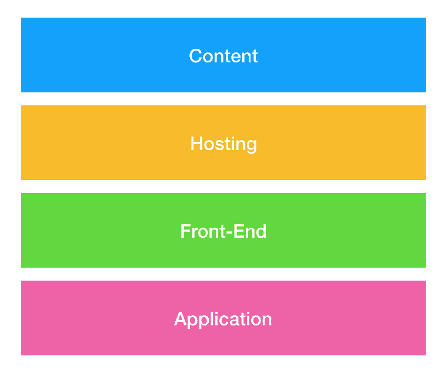
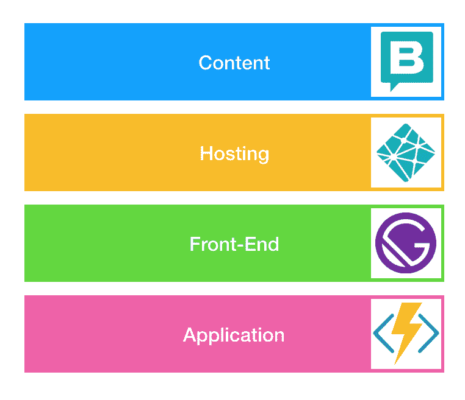
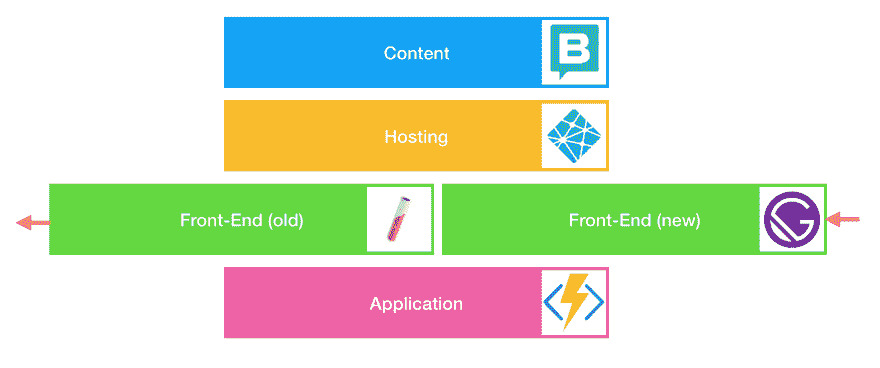
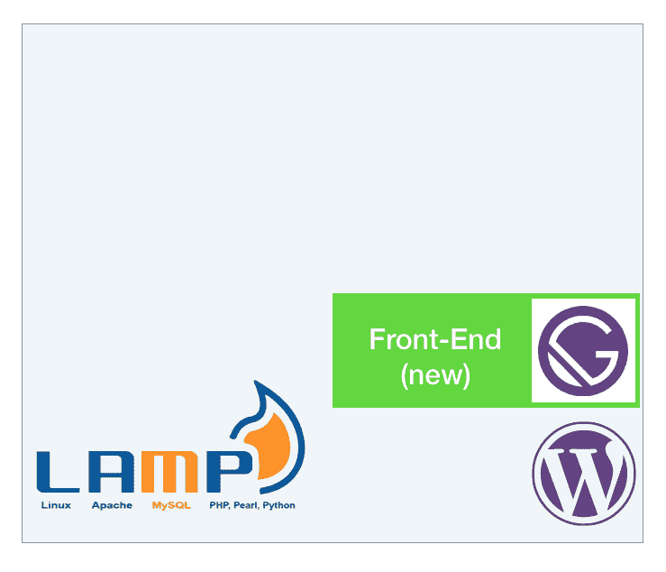

# JAMStack 网站的潜在优势

> 原文：<https://dev.to/ddprrt/the-unsung-benefits-of-jamstack-sites-3kd6>

传统网站通常建立在 CMS 之上。Drupal，Wordpress，Typo3，凡是你能想到的。CMS 处理从内容编辑、应用程序编程到前端生成的所有事情。因此，选择一个 CMS 对你如何开发你的网站，以及你需要什么样的技能和交易来完成工作有着巨大的影响。CMS 对主机也有影响！灯堆让你想起什么了吗？Linux，Apache，MySQL 和 PHP。这是很多流行的 CMS 至今的黄金标准。

JAMStack 站点则不同。你不再把 CMS 放在你所有决策的核心，而是把注意力放在前端。而且理由很充分。浏览器不在乎底下是什么技术。它只关心 HTML、CSS 和 JavaScript。那你为什么不应该呢？

把前端放在焦点上对你网站的其他层面有很大的影响。无论是 CMS、您的应用层还是您托管它的地方。而这种影响伴随着很多好处。

## 选择你的工具

JAMStack 网站将托管、内容管理和应用程序视为自己的实体。彼此之间几乎没有依赖。

应用层可以是任何东西，只要它产生前端可消费的 API。如果您采用全无服务器，您甚至不必关心是否有专用的应用服务器。伙计们，这就是少了一个服务器的地方。

内容管理系统也是如此。好消息:CMS 可以再次专注于实际管理内容！不需要充当渲染工具或者应用平台。如果你愿意，你甚至可以坚持使用 Wordpress 。或者像[童话镇](https://www.storyblok.com/)一样进行 JAMStack 优化。只要有一个获取内容的 API，就很好。

托管就像提供文件一样简单。把它放在云存储上，比如 S3 或者 Azure Storage。把它放在你的收存箱里。或者在旧网站旁边找一个舒适的地方。这是你的选择。

最好的事情:人们可以选择他们最喜欢的，他们觉得最有效率的。这一切都与 API 紧密相连。

## 没有技术锁定

由于每个部分都是独立的，你不仅有很多选择来完成你的网站。随着项目的发展，您还可以继续拥有这种选择。如果你不需要更换整个网站，用一种技术替换另一种技术会更容易。想从 Metalsmith 转到 Gatsby，没必要杀你的 API。没有必要扼杀你的托管策略。没有必要删除你的构建或者你在 CMS 中存储的大量内容。

CMS 不再为你服务了吗？将最新的输出存储在 JSON 文件中，以保持构建继续进行，并悄悄地转移到另一个。

笨重的 Java monolith 太慢，成本太高？一些轻量级的云功能很容易创建和集成。仅保持 API 合同有效。

远离技术并采用其他技术仍然不是一件容易的事，或者说不需要认真的努力。但是，如果你不必关心完整的图片，它会更容易掌握。

## 增量采用

每个部分都是独立的，用你喜欢的技术编写。这意味着您可以立即开始迁移到 JAMStack。你的旧应用还在，开始运行一些云功能，在你的旧应用旁边发布一些 HTML 页面。任何服务器都可以提供静态文件！

特别是在更大的项目中，我认为这是最有益的。您不希望在一次大爆炸中将 2000 页迁移到一个新的堆栈中。但是让最上面的页面保持新鲜、新颖和快速会产生巨大的影响。

## 底线

转向 JAMStack 是对现代云架构和 DevOps 工作流的承诺。这也意味着你可以采用你认为最合适的工具。不要害怕重做一切。开始吧。看看它会把你带向何方。