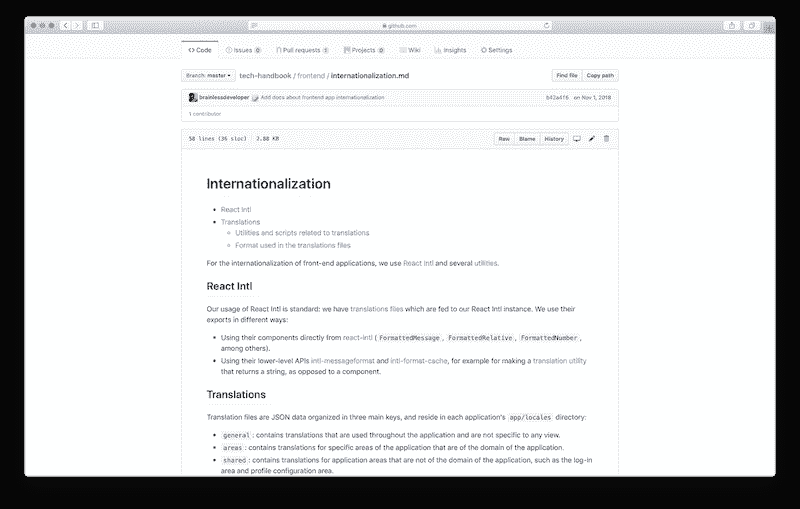

# store2be 的技术文档文化

> 原文：<https://dev.to/peterfication/tech-documentation-culture-at-store2be-11m9>

 
*我们的文档设置(照片由 Michael D Beckwith，flickr 提供)*

## [T1】简介](#intro)

> 墨迹胜过最好的记忆。🎓

这是我们技术文档的副标题！

* * *

如果你在小团队中没有考虑过文档，随着团队的成长，你最终会意识到文档是多么重要。即使是单独一个人，在没有写下来的情况下，要记住所有的知识，也需要很大的认知负荷。在团队中，文档甚至更重要，它作为一种交流工具，确保每个人对某些主题有相同的理解。文档对于执行不经常发生的非自动化常规任务也很有帮助。

在本文中，我们想要分享我们如何在 store2be 中处理文档。记录发生在不同的层面:

*   公司范围的文档
*   技术文档
*   [基础设施代码](https://en.wikipedia.org/wiki/Infrastructure_as_code)
*   特定于应用的文档
*   代码文档

所有对所有部门都重要的事情都需要记录在我们公司的文档中。例如，如果某个技术性的东西对产品团队也很重要，我们会把它放在公司范围的文档中。

技术文档是所有只与工程和 DevOps 团队相关的技术内容。在这部分文档中，还有前端和后端相关的文档，这些文档在我们的所有应用程序中共享，因此我们不必在这些存储库中重复。

我们的技术文档是一个带有 markdown 文件的 Git 库。这样做的好处是，我们可以轻松地离线编写它，并使用我们最喜欢的工具来编辑和搜索文档。此外，每个人都有一份完整文档的本地副本。

当您使用工具以声明的方式描述您的基础架构，并且您没有手动管理您的基础架构时，基础架构就像代码一样发生。我们在这种情况下使用的一些工具是 [Terraform](https://www.terraform.io/) 和 [Kubernetes](https://kubernetes.io/) 。

如果需要记录某个应用程序的特定内容，我们通常会将其放入相应 Git 存储库的 README.md 中。此处的示例包括特定于应用程序的脚本/命令以及它们的用途。

我们不会深入讨论代码文档的细节，因为这是一篇完整的博文可以单独讨论的内容。无论如何，为了完整起见，我们想在这里提到它。

## 技术文档

 
*科技手册*

这篇博文的主题是我们的技术文档。在这部分文档中，我们收集了工程团队的大部分知识，这有助于我们扩展工程团队。我们称之为:*技术手册*。

回顾 2017 年，我们几乎没有任何技术文档。我们仍然只是一个三人团队，在那一点上我们没有考虑太多文档。事后看来，这是非常糟糕的，也是我们将来要避免的事情，因为现在我们知道适当的文档是多么有价值。

到 2017 年底，我们有三个人在 2018 年初加入，我们知道，我们必须与他们分享很多知识。那时我们开始了技术手册的基础工作。

在开始的时候，我们从第一天开始就关注我们需要与新开发人员分享的领域，例如，过程和工具。基础设施部分紧随其后，因为基础设施工作大部分是一次性完成的，很久以后当你可能忘了很多的时候再看一遍。

从那以后，我们不断地添加新的东西，文档已经成为我们技术文化的一部分。

保持文档更新是一个完全不同的挑战。在 store2be，这是一个集体的努力。例如，一旦我们讨论流程变更，我们会指派某人通过我们的项目管理工具更新技术文档中的相关部分。这有助于我们将文档变更与正常的开发工作流程组织在一起。幸运的是，我们使用 Git 和 GitHub 作为我们的技术手册，团队中的其他每个人都可以查看文档变更并对其进行评论。所以最后，我们又达成一致了。

我们将技术手册分为以下几个部分:

*   一般
*   流程和工具
*   基础设施
*   后端
*   前端
*   验尸

这些部分应该是不言自明的。最后一个部分，post mortems，是我们在 2018 年秋季添加的最新部分。我们意识到，大多数时候，同一批人致力于发现和修复我们系统中的关键问题，而对团队的其他成员没有多少透明度。我们偶尔会有一个小演示，说明是什么导致了这个问题，但是如果类似的问题再次发生，处理这个问题的人必须记住它。这种方法没有很好的扩展性，即使同一个人再次处理类似的问题，这个人也可能忘记了之前解决方案的部分内容。

有了技术手册中的帖子，我们现在可以分享如何轻松调试问题的步骤，因为每个人都在审查它，每个人都可以感觉到可能的问题，并可以在编码时解决它。

## 结论

总之，我们很高兴选择建立我们的技术手册，并真的可以推荐给大家。这给了我们很多安全感，不会丢失知识，尤其是当有人去度假的时候。此外，新员工的入职变得更加容易和快捷。