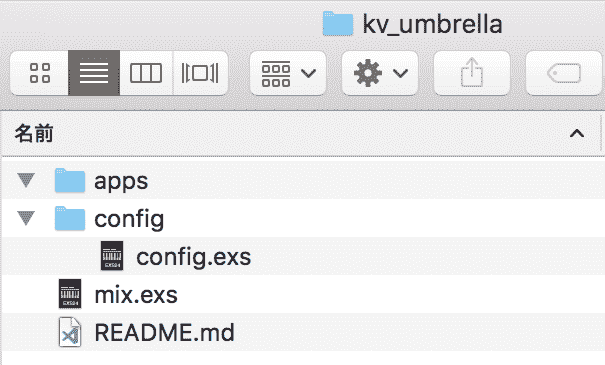
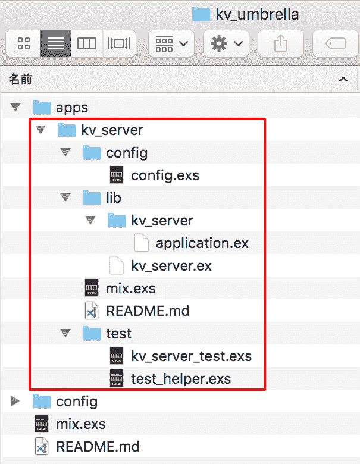
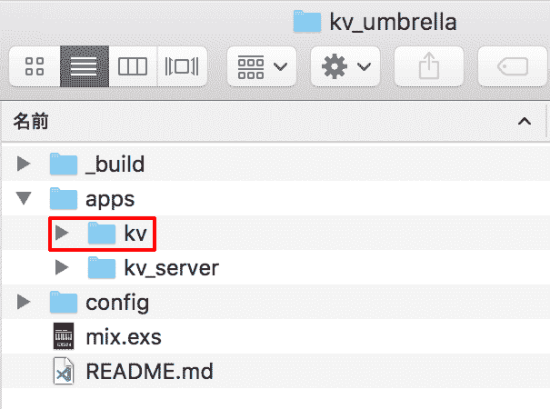

# Mix 和 OTP 07 :依赖关系和安布雷拉项目

> 原文：<https://dev.to/gumi/mix-otp-07-1p5k>

本文在 Elixir 官网的许可下，根据“[dependencies and umbrella projects](https://elixir-lang.org/getting-started/mix-otp/dependencies-and-umbrella-projects.html)”的解说，加以修改，就如何在 Mix 中管理依存关系进行说明。

接下来要实现的是处理`kv`APP 应用请求的服务器。 但是，不是在 APP 应用程序中添加代码。 `kv`将作为 APP 应用程序客户端的 TCP 服务器构建为其他 APP 应用程序。 运行时和 Elixir 生态系统总体上可以处理多个 APP 应用程序。 因此，您可以不将项目作为一个大的 APP 应用程序。 让分成小份的 APP 软件一起工作就可以了。

在开始创建新的 APP 应用程序之前，让我来说明 Mix 如何处理依赖关系。 平时实际处理的依存关系有两个。 内部依赖和外部依赖。 Mix 具有应对这两者的机制。

# External dependency system

外部依赖是一种与商业领域无关的关系。 例如，如果分布式 APP 应用需要 HTTP API，则可以使用[Plug](https://github.com/elixir-lang/plug) 项目作为外部依赖关系。

外部依赖关系的安装很简单。 最常见的是使用[Hex 软件包管理器](https://hex.pm/)。 依存关系在`mix.exs`文件的`deps`函数中列表添加。

以下依赖关系表示推送至 Hex 的 Plug 1.0 或更高版本的最新版本。 版本号 1.0 之前附加的`~>`是“以上”的意思。 关于版本要求的确定方法，请参阅“[Version](https://hexdocs.pm/elixir/Version.html) ”模块的文档。

```
def deps do
  [{:plug, "~> 1.0"}]
end 
```

Enter fullscreen mode Exit fullscreen mode

通常，推送到 Hex 的是稳定版。 如果希望依赖开发中的外部关系，Mix 还可以管理 Git 依赖关系。

```
def deps do
  [{:plug, git: "git://github.com/elixir-lang/plug.git"}]
end 
```

Enter fullscreen mode Exit fullscreen mode

在项目中添加依存关系后，Mix 将创建`mix.lock`文件，以便可以反复构建。 `lock`文件必须在版本控制系统的管理下添加。 这样，就可以保证使用这个项目的人都使用同一个依赖版本。

Mix 有很多处理依赖关系的任务。 在由`mix help`表示的列表中，以[`mix deps`](https://hexdocs.pm/mix/Mix.Tasks.Deps.html)开始的就是这些任务。

```
$  mix help
#  mix depsのみ抜粋
mix deps              #  Lists dependencies and their status
mix deps.clean        #  Deletes the given dependencies' files mix deps.compile      #  Compiles dependencies mix deps.get          #  Gets all out of date dependencies mix deps.tree         #  Prints the dependency tree mix deps.unlock       #  Unlocks the given dependencies mix deps.update       #  Updates the given dependencies 
```

Enter fullscreen mode Exit fullscreen mode

最常用的任务是`mix deps.get`和`mix deps.update`。 获取的依赖关系将自动编译。 关于`deps`，用`mix help deps`表示说明。 详情请在`Mix.Task`模块的文档中阅读“[mix deps](https://hexdocs.pm/mix/Mix.Tasks.Deps.html#content) ”。

# Internal dependency system

内部依赖是项目特定的关系。 在项目/公司/组织范围之外没有意义。 大多数情况下，由于技术、经济或经营的理由，被视为不公开。

如果存在内部依赖关系，Mix 有两种应对方法。 是 Git 存储库和安布雷拉项目。

例如，将`kv`项目推送到 Git 资源库时，必须将其添加到`deps`的代码列表中。

```
def deps do
  [{:kv, git: "https://github.com/YOUR_ACCOUNT/kv.git"}]
end 
```

Enter fullscreen mode Exit fullscreen mode

如果存储库是非公开的，请指定专用 URL 的`git@github.com:YOUR_ACCOUNT/kv.git`。 在任何情况下，只要具有适当的权限，Mix 就可以获得依赖关系。

Elixir 不建议在内部依赖关系中使用 Git 存储库。 运行时和 Elixir 生态系统已经表达了 APP 应用的想法。 即使是一个项目，代码也常常被细分为 APP 应用，并在逻辑上将其组合在一起。

但是，如果针对每个 APP 应用将 Git 存储库作为单独的项目进行推送，则很难维护，而且与编写代码相比，会占用更多的时间来管理 Git 存储库。

因此，Mix 支持“安布雷拉项目”。 安布雷拉项目用于在一个存储库中构建多个一起工作的 APP 应用程序。 关于安布雷拉项目的目标风格，在下一项中说明吧。

# 安布雷拉项目

制定新的 Mix 项目吧。 名字叫`kv_umbrella`。 这个项目拥有已经制作好的 APP 应用`kv`和新的`kv_server`两个。 完成的目录如下。

```
+ kv_umbrella
  + apps
    + kv
    + kv_server 
```

Enter fullscreen mode Exit fullscreen mode

`kv_umbrella`是与`kv`不同的项目。 `kv`请注意不要在项目中做。 制作安布雷拉项目时，在[`mix new`指令](https://hexdocs.pm/mix/Mix.Tasks.New.html#content)中加入`--umbrella`选项。

```
$ mix new kv_umbrella --umbrella
* creating README.md
* creating .formatter.exs
* creating .gitignore
* creating mix.exs
* creating apps
* creating config
* creating config/config.exs

Your umbrella project was created successfully.
Inside your project, you will find an apps/ directory
where you can create and host many apps:

    cd kv_umbrella
    cd apps
    mix new my_app

Commands like "mix compile" and "mix test" when executed
in the umbrella project root will automatically run
for each application in the apps/ directory. 
```

Enter fullscreen mode Exit fullscreen mode

与普通项目相比，生成的文件较少(图 001 )。 `mix.exs`文件的内容也有以下不同(注释除外)。

```
defmodule KvUmbrella.MixProject do
  use Mix.Project

  def project do
    [
      apps_path: "apps",
      start_permanent: Mix.env() == :prod,
      deps: deps()
    ]
  end

  defp deps do
    []
  end
end 
```

Enter fullscreen mode Exit fullscreen mode

#### t0001■由 Delever 项目制作的文件和文件夹

[](https://res.cloudinary.com/practicaldev/image/fetch/s--gtTtaHkg--/c_limit%2Cf_auto%2Cfl_progressive%2Cq_auto%2Cw_880/https://thepracticaldev.s3.amazonaws.com/i/6w93p0l7pct4zl9sutk6.png)

安布雷拉项目的特征是`project`中规定的`apps_path: "apps"`。 安普勒项目没有源文件，也没有测试。 但是，各自都有依存关系。 孩子的 APP 应用程序必须在目录 apps 内制作。

那么，转到 app 目录，构建 app 应用程序`kv_server`吧。 请勿手动创建子 APP，请在`mix new`命令后添加`--sup`选项进行生成。 然后，通过 Mix 自动完成监视树。

```
$ cd kv_umbrella/apps
$ mix new kv_server --module KVServer --sup
* creating README.md
* creating .formatter.exs
* creating .gitignore
* creating mix.exs
* creating config
* creating config/config.exs
* creating lib
* creating lib/kv_server.ex
* creating lib/kv_server/application.ex
* creating test
* creating test/test_helper.exs
* creating test/kv_server_test.exs

Your Mix project was created successfully.
You can use "mix" to compile it, test it, and more:

    cd kv_server
    mix test

Run "mix help" for more commands. 
```

Enter fullscreen mode Exit fullscreen mode

生成的子 APP 应用程序的文件与普通的 Mix 项目相似(图 002 )。

#### [t1-002■制作的子 APP 的文件](#%E5%9B%B3002%E2%96%A0%E3%81%A4%E3%81%8F%E3%82%89%E3%82%8C%E3%81%9F%E5%AD%90%E3%82%A2%E3%83%97%E3%83%AA%E3%82%B1%E3%83%BC%E3%82%B7%E3%83%A7%E3%83%B3%E3%81%AE%E3%83%95%E3%82%A1%E3%82%A4%E3%83%AB)

[](https://res.cloudinary.com/practicaldev/image/fetch/s--yC6TU7By--/c_limit%2Cf_auto%2Cfl_progressive%2Cq_auto%2Cw_880/https://thepracticaldev.s3.amazonaws.com/i/p6un6be7b43ny08mb3m0.png)

打开`mix.exs`，安布雷拉的子 APP 应用程序有两个追加。 一个是表示添加到`project`函数的父项目结构的 4 个路径。 这表示检出为`kv_umbrella/deps`，内部版本被汇总，`config.exs`和`mix.lock`被共享。 依赖关系的获取和编译是在整个 Abrah 结构上进行的，而不是在每个 APP 应用中进行的。

```
def project do
  [

    build_path: "../../_build",
    config_path: "../../config/config.exs",
    deps_path: "../../deps",
    lockfile: "../../mix.lock",

  ]
end 
```

Enter fullscreen mode Exit fullscreen mode

另一个追加是`application`函数的`mod: {KVServer.Application, []}`。 通过向`mix new`命令传递`--sup`选项，`KVServer.Application`被确定为 APP 应用程序的回调模块。 此模块将启动 APP 应用程序监视树。

```
def application do
  [

    mod: {KVServer.Application, []}
  ]
end 
```

Enter fullscreen mode Exit fullscreen mode

`apps/kv_server/lib/kv_server/application.ex`的`KVServer.Application`模块的记述如下。 APP 回调模块必须通过`use Application`实现[`Application`行为](https://hexdocs.pm/elixir/Application.html#content)。 需要回调函数`start/2`(请参见“[the application callback module](https://hexdocs.pm/elixir/Application.html#module-the-application-callback-module)”)。 该函数以`KVServer.Supervisor`为名规定了管理员。 另外，关于管理员的详细内容，请参考“[Supervisor behaviour](https://hexdocs.pm/elixir/Supervisor.html) ”。

```
defmodule KVServer.Application do
  # See https://hexdocs.pm/elixir/Application.html
  # for more information on OTP Applications
  @moduledoc false

  use Application

  def start(_type, _args) do
    # List all child processes to be supervised
    children = [
      # Starts a worker by calling: KVServer.Worker.start_link(arg)
      # {KVServer.Worker, arg},
    ]

    # See https://hexdocs.pm/elixir/Supervisor.html
    # for other strategies and supported options
    opts = [strategy: :one_for_one, name: KVServer.Supervisor]
    Supervisor.start_link(children, opts)
  end
end 
```

Enter fullscreen mode Exit fullscreen mode

可以从`apps/kv_server`目录测试此子 APP 应用程序。 在这里，为了测试整个 Abrah 项目，让我们转到根的`kv_umbrella`执行`mix test`。

```
$  mix test
==>  kv_server
Compiling 2 files (.ex)
Generated kv_server app ==>  kv_server
..  Finished in 0.04 seconds
1 doctest, 1 test, 0 failures

Randomized with seed 930276 
```

Enter fullscreen mode Exit fullscreen mode

# 安布雷拉项目中的依赖关系

在`kv_server`中，打算使用`kv`规定的功能。 因此，必须在 APP 应用程序的依赖关系中加入`kv`。 安布雷拉项目要求明确定义，以便 Mix 可以创建 APP 应用程序之间的依赖关系。 请在`apps/kv_server/mix.exs`的`deps/0`函数中加入以下内容。

这样，`:kv`就可以作为`:kv_server`内的依存关系使用了，在服务器启动之前`kv`APP 应用程序会自动启动。

```
defp deps do
  [
    {:kv, in_umbrella: true}
  ]
end 
```

Enter fullscreen mode Exit fullscreen mode

然后，请将 APP 应用程序`kv`复制到 DVD 项目的目录`apps`中(图 003 )。

#### t0-t1-003■将依赖 APP 复制到 apps

[](https://res.cloudinary.com/practicaldev/image/fetch/s--zc9AL8Rm--/c_limit%2Cf_auto%2Cfl_progressive%2Cq_auto%2Cw_880/https://thepracticaldev.s3.amazonaws.com/i/8wxcd8ro0cu8bdp177c2.png)

此外，`apps/kv/mix.exs`与`apps/kv_server/mix.exs`一样，需要 4 个 Abrea 项目的配置路径。 请在`apps/kv/mix.exs`的`project/0`函数中加入以下内容。

```
def project do
  [

    build_path: "../../_build",
    config_path: "../../config/config.exs",
    deps_path: "../../deps",
    lockfile: "../../mix.lock",

  ]
end 
```

Enter fullscreen mode Exit fullscreen mode

这样，两个项目的测试都将从安布雷拉项目的路线出发，在`mix test`上进行。

```
$  mix test
==>  kv
.....  Finished in 2.0 seconds
5 tests, 0 failures

Randomized with seed 857698 ==>  kv_server
..  Finished in 0.03 seconds
1 doctest, 1 test, 0 failures

Randomized with seed 857698 
```

Enter fullscreen mode Exit fullscreen mode

# 不服从也可以

安布雷拉项目对于组织和管理多个 APP 应用程序非常有用。 虽然 APP 之间存在一定程度的分离，但并不完全分离。 因为它们被视为共享相同的设置和依赖关系。

在同一存储库中包含多个 APP 应用程序的模式称为“单报告”( mono-repo )。 安布雷拉项目可以充分利用这种模式，一次编译、测试和执行多个 APP 应用程序。

如果您希望为同一依赖项的每个 APP 位置更改设置，或者希望使用不同依赖项的版本，则代码库的范围可能会超出 Abrase 项目的复盖范围。

这种时候，分开安布雷拉也不难。 因为只需将 APP 应用程序放在安布雷拉项目的`apps`目录之外即可。 在最坏的情况下，可能会舍弃 Delabra 项目及其相关的设定(`(build_path`或`config_path`、`deps_path`、`lockfile`)。 尽管如此，只要将所有 APP 应用程序保留在同一个存储库中，“报告”模式就可以继续使用。 APP 应用程序将具有各自的依赖关系和设置。 也可以使用`:path`选项明确列出 APP 应用程序之间的依赖关系(与`:git`相反)。

# 总结

`kv`在没有服务器的情况下也能工作，而`kv_server`直接依赖于`kv`。 通过将各自作为不同的 APP 应用分开，开发和测试会变得更容易进行。

使用安布雷拉 APP 应用时，分清主次很重要。 开发的`kv_server`只能访问`kv`规定的公开 API。 安布雷拉 APP 表示不存在其他依赖关系，包括 Elixir 本身在内。 只能访问已发布并有文档记录的内容。 应该避免接触依存关系中的非公开功能。 版本被修改时，会导致代码破产。

也可以将模糊 APP 作为最终从代码库中剪切的 APP 应用的起点。 例如，假设有一个 web APP 应用程序必须向用户发送“推送通知”。 整个“推送通知系统”可以基于独特的监控树和 API，在模糊器中作为单独的 APP 应用进行开发。 然后，如果其他项目需要推送通知系统，您可以将系统移动到专用资源库或 Hex 包中。

安布雷拉项目也可以被开发者用来划分广阔的业务领域。 必须确认的是，区域是不相互依存的(也称为循环依存)。 如果出现这种情况，则意味着 APP 应用程序没有相互分离。 我必须重新考虑结构和设计。

在安布雷拉项目的 APP 演示中，重要的是所有项目都共享相同的设置和依赖关系。 如果 Mabrella 中的 APP 应用程序之间的依赖关系设置差异很大，或者必须使用不同的版本，则它们的大小可能超过了 Mabrella 带来的优点。 这种时候，即使阻止了安布雷拉，也能得到基于《monorepore》的利益。

#### Mix 和 OTP 也抽签

*   [尝试使用 Mix 和 OTP 01:mix](https://dev.to/gumi/mixotp-01-mix-dg1)
*   MixとOTP 02:经纪人
*   MixとOTP 03:基因服务器
*   [Mix 和 OTP 04 :管理员和 APP 沟通](https://dev.to/gumi/mix-otp-04-bj0)
*   [Mix 和 OTP 05 :动态管理员](https://dev.to/gumi/mix-otp-05-l3p)
*   [MixとOTP 06: ETS](https://dev.to/gumi/mix-otp-06-ets-ol3)
*   Mix 和 OTP 07 :依赖关系和安布雷拉项目
*   MixとOTP 08: Taskとgen_tcp
*   [Mix 和 OTP 09: DocTest 和 with 的模式匹配](https://dev.to/gumi/mix-otp-09-doctest-with-533g)
*   [Mix 和 OTP 10 :分散处理的 Task 和设定](https://dev.to/gumi/mix-otp-10-3i31)