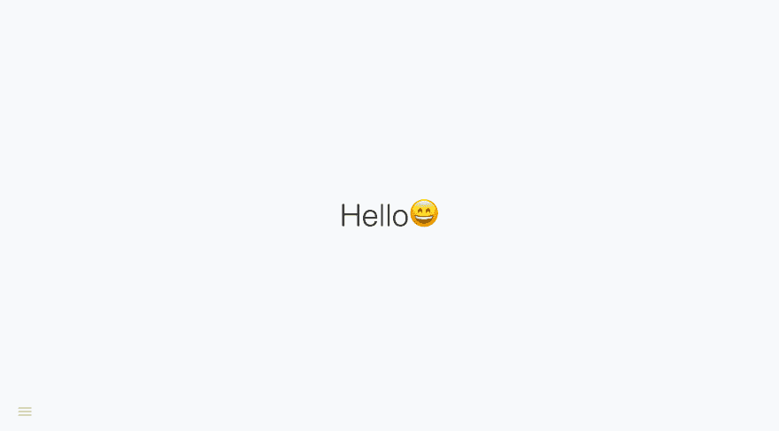
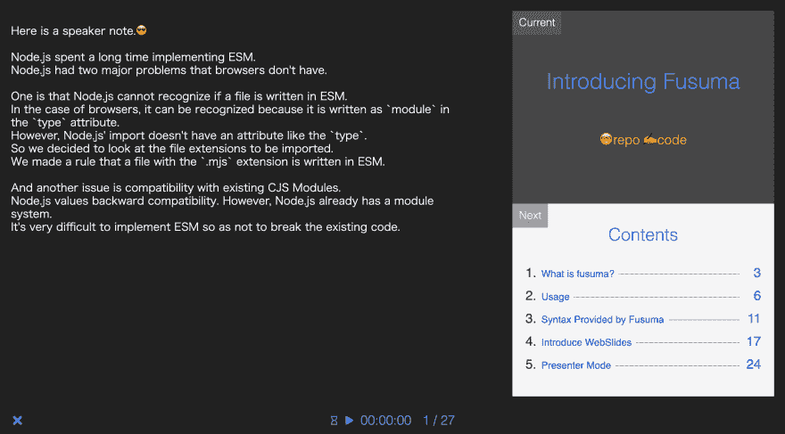

# Fusuma 已经发布，它可以轻松地创建带有 MarkDown 的幻灯片。🎉

> 原文：<https://dev.to/about_hiroppy/fusuma-which-can-create-slides-with-markdown-easily-has-been-released-3ii>

* * *

[广博/扶桑](https://github.com/hiroppy/fusuma)

## 扶桑是什么？

Fusuma 是一个 CLI，提供开发环境、产品构建、部署、导出为 PDF 等。fusuma 是一个将 MarkDown 转换成 HTML 的桥梁，它也像 create-react-app 一样封装了 configure(例如 babel，webpack)。

## 特性

*   开发环境(webpack-dev-server)
*   生产环境(包括优化)
*   部署到 GitHub 页面
*   导出为 PDF
*   支持社交网络和 OGP
*   演示者模式

只要做以下事情，你就可以得到很酷的幻灯片。

```
$ npm i fusuma -D
$ npx fusuma init
$ mkdir slides && echo '# Hello😄' > slides/title.md
$ npx fusuma build 
```

[](https://res.cloudinary.com/practicaldev/image/fetch/s--QKLPuh_D--/c_limit%2Cf_auto%2Cfl_progressive%2Cq_auto%2Cw_880/https://thepracticaldev.s3.amazonaws.com/i/ubjrrbrqlmz8bgqi38bm.png)

只需写入 MarkDown 并使用 CLI 执行😍

## 幻灯片库

Fusuma 使用 WebSlides，它有许多组件和 css 类，非常漂亮。

[网络幻灯片——让 HTML 演示变得简单](https://webslides.tv/#slide=1)

请查看样本幻灯片。😍另外，你可以覆盖网页幻灯片的 CSS。

## 在减价中写作

如果你写在下面，你会得到 2 页的幻灯片。

```
## First Slide
Hi!
- -
## Second Slide
Hi! 
```

## 膨胀

您可以扩展 JavaScript 和 CSS 来覆盖 web 幻灯片。

## 演示者模式

扶桑有主持人的模式。下图供演示者使用。

[](https://res.cloudinary.com/practicaldev/image/fetch/s--GbGffwNt--/c_limit%2Cf_auto%2Cfl_progressive%2Cq_auto%2Cw_880/https://thepracticaldev.s3.amazonaws.com/i/uf4oa81lhfotar0q7536.png)

Fusuma 与[演示 API](https://developer.mozilla.org/en-US/docs/Web/API/Presentation_API) 兼容，但是如果您使用没有演示 API 的浏览器，您也可以使用这种模式，因为 Fusuma 可以退回到使用 localstrage。

### 主讲人备注

如果您在幻灯片上写下如下内容，您可以将此视为注释。

```
<!-- note
Hi!
-->

## Hello😁 
```

## 样本载玻片和储存库

幻灯片:[https://hiroppy.github.io/fusuma/intro](https://hiroppy.github.io/fusuma/intro)T2【回购:[https://github.com/hiroppy/fusuma/tree/master/samples/intro](https://github.com/hiroppy/fusuma/tree/master/samples/intro)

* * *

我认为当你想快速创建幻灯片时，Fusuma 是有用的。✨

享受😍