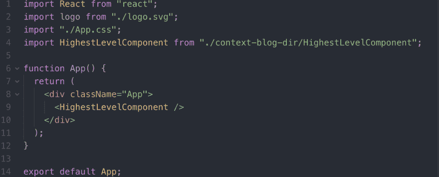
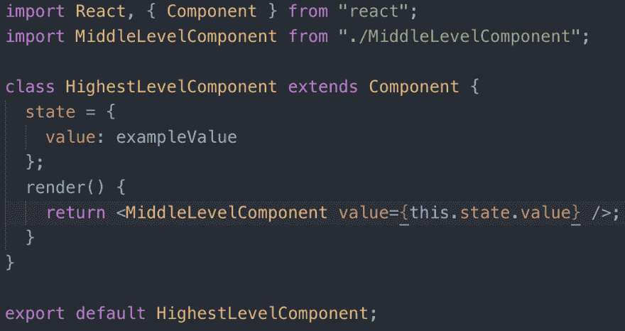
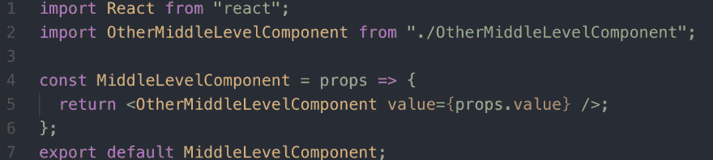
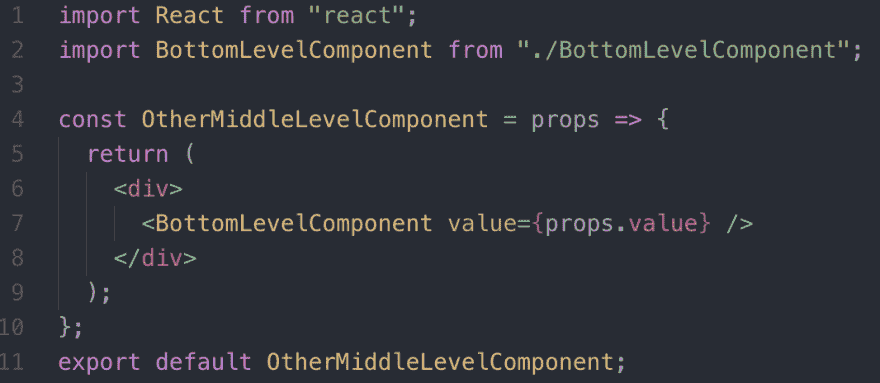
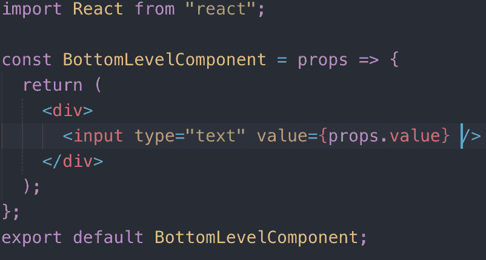
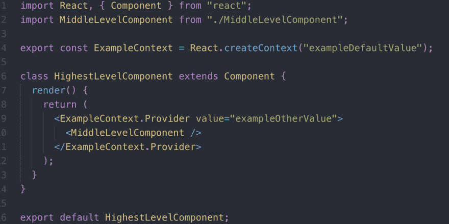
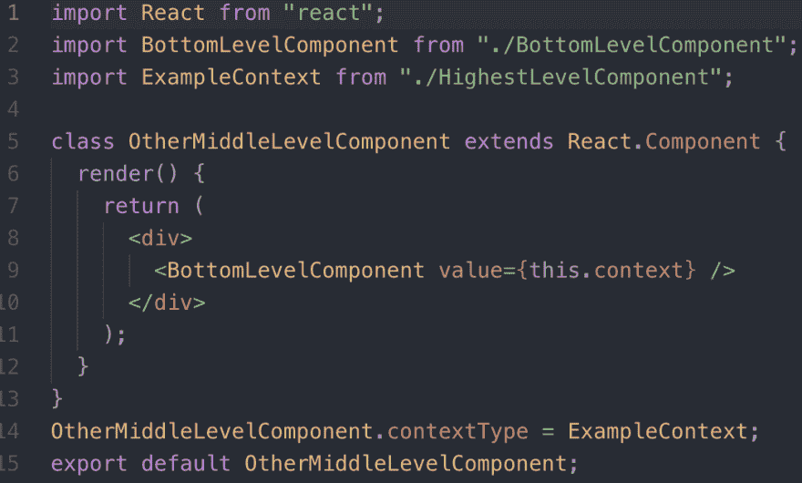
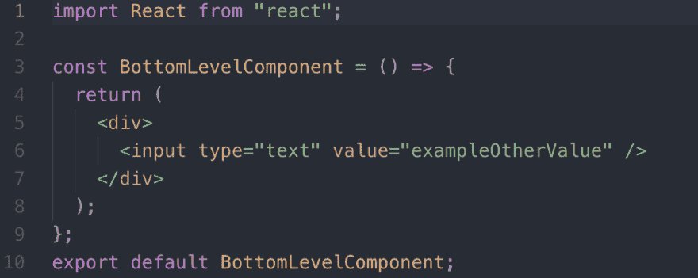
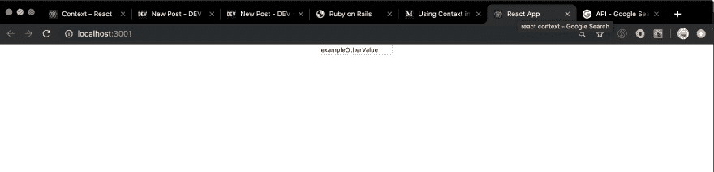

# 上下文超级采摘鞋面！

> 原文：<https://dev.to/andershornor/context-the-super-picker-upper-3fke>

##### 如果一个复杂的应用程序有几层以上的组件，那么用 React 编码可能是一项乏味的打字工作。为了避免不必要的输入，增加一个新的 API 允许的上下文反应会有所帮助。

再解释一下，上下文允许人们通过深度嵌套的组件树传递信息，而不必通过树的每一层传递属性。通过在项目开始时花费少量的额外时间，可以避免不必要的混乱和在整个项目中打字。Context 的工作方式与 props 类似，在父组件中定义了他们希望在子组件中访问的变量。但是在上下文中，变量被定义在最高级别的组件中，然后可以通过任何子组件来访问，而不是必须确定要在父组件和子组件之间传递哪些变量。有几种方法可以建立和访问组件树的上下文，但是我在这篇博客中只介绍一种，Component.contextType 实现方法。

## 实现

为了展示上下文 API 的强大功能，想象一个深度嵌套的组件树，如下所示。
一个呈现顶级组件
 
的 app 一个呈现组件
 
的顶级组件，后者呈现另一个组件
 
，后者呈现另一个组件
 
，后者呈现一个输入

## 实现

现在，使用 context，您可以通过使用 react.createContext 在顶级组件中定义上下文，并避免必须传入 props。

所有加在一起看起来是这样的:

然后将上下文传递给孙子女，您希望用 ExampleContext 访问上下文的值。供应商三明治。

当您呈现底层组件时，您现在可以访问顶层组件中设置的上下文值

谢谢你，妈妈！看这个网络应用程序！这么简单！

## #上下文

为了说明这一点，我们举了一个简单的例子，展示了 react 上下文 API 的一个非常基本的实现。除了这个基本演示之外，还有其他方法可以实现上下文的相同功能以及上下文的其他功能。我鼓励你也看看 [react 文档](https://reactjs.org/docs/context.html#contextprovider)中上下文的其他功能。感谢阅读:)