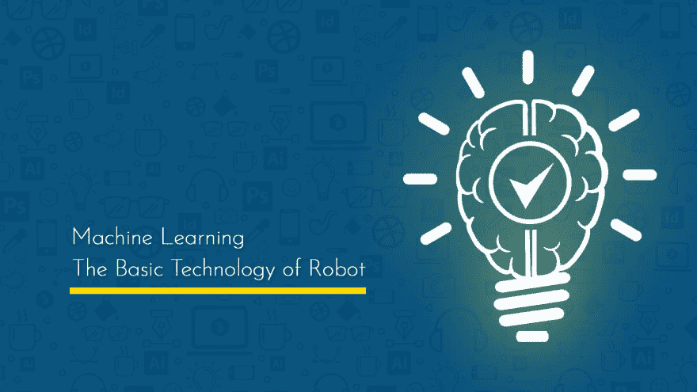

# 机器学习——机器人的基础技术

> 原文：<https://dev.to/erpankajsood/machine-learning-the-basic-technology-of-robot-2lmb>

我们不能把机器人和一个完整的人相比较。机器人是人类通过机器学习技术和人工智能的伟大创造。此外，自动化和其他支持编程语言有助于成功完成项目。任务的方法我们按照有价值的动作的顺序，用必需的参数、关键字、[…]来分割任务

帖子[机器学习——机器人的基础技术](https://codebriefly.com/machine-learning-the-basic-technology-of-robot/)最早出现在[代码上简要介绍](https://codebriefly.com)。