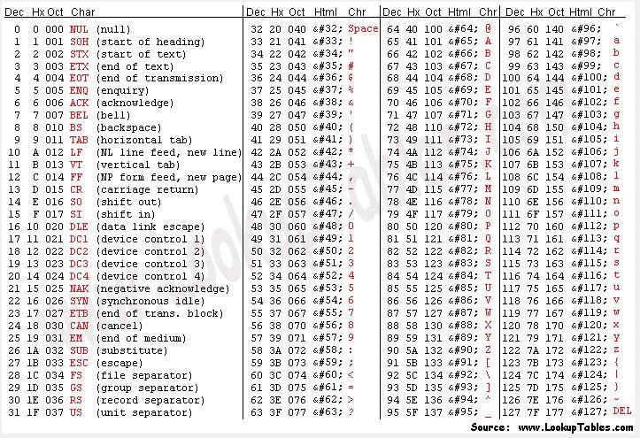
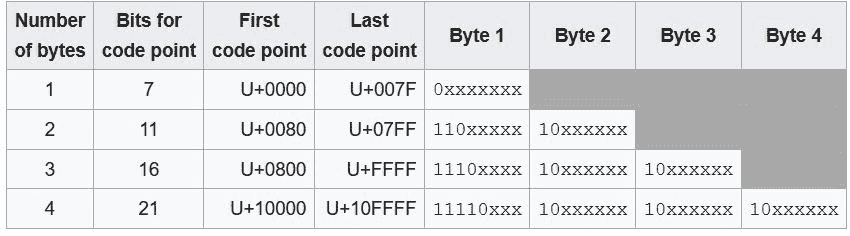

# 解码混乱的编码世界(第 1 部分)

> 原文：<https://dev.to/neumaneuma/decoding-the-confusing-world-of-encodings-part-1-3oke>

# 什么是编码？

你曾经遇到过这些陈述吗？

> 这个文件是十六进制编码的
> 
> 该文件使用 ASCII 编码
> 
> 该字符串是 Unicode 编码的
> 
> 让我们将输出写入 UTF-8 编码的文件
> 
> 我们的信息是安全的，因为它是用 Base64 编码的
> 
> Python 使用 Unicode 字符串进行编码

这些代表了术语“编码”在整个行业中的许多使用方式。坦白地说，我发现这一切真的很令人困惑，直到我开始写这篇文章！我将逐一阐述这些陈述，并尝试定义和明确编码的确切含义。

* * *

> ## This file is
> 
> in hexadecimal code.

与十六进制编码类似的短语是二进制编码。就我个人而言，我不喜欢在这里使用“编码”这个术语。从技术上讲，可以认为语义是正确的。然而，我更喜欢用“表现”这个词它使得编码不再是一个重载的定义。此外，“表现”在描述实际发生的事情方面做得更好(至少在我看来是这样)。

十六进制(缩写为 hex)和二进制都是数字系统。这是一种奇特的说法，“这是表示一个数的方法。”如果你退一步想想，数字是有趣的东西。一个数字看起来很简单，但它实际上是一个抽象的概念。你有多少根手指？你可以说是`00001010`、`10`或`a`，这三个都是准确的！我们学会说`10`是因为对人类来说最简单和最常见的数字系统是十进制，也称为以 10 为基数。我们有 10 个手指和 10 个脚趾，所以当我们还是婴儿的时候，学习如何数数就变得更加直观了。

如果我们将易用性标准应用于计算机，我们将得到二进制(或以 2 为基数)。为什么？因为计算机从根本上认为事物是[“开”或“关”](https://www.howtogeek.com/367621/what-is-binary-and-why-do-computers-use-it/)计算机依靠带正电荷或负电荷的电子来表示`1`和`0`，正是通过这些`1`和`0`来完成计算的基础，例如存储数据或进行数学计算。

太好了，所以我们可以用多种方式表示同一个数字。那有什么用？让我们回头看看数字十。我们可以用二进制(`00001010`)或十六进制(`a`)来表示它。它需要八个二进制字符(或者四个没有填充`0` s 的字符)，但是十六进制只有一个！这是由于每个人使用的符号数量。二进制使用两个:`0`和`1`。十六进制用 16: `0` - `9`和`a` - `f`。对于数字 10 来说，表征大小的差异已经足够明显了，但是当使用更大的数字时，这种差异会变得更加不平等。因此，优势在于十六进制比二进制更有效地表示大数(就此而言，也比十进制更有效)。

让我们来探讨一下如何将这一理论转化为实践知识。为了给这篇文章提供一些例子，我通过命令行创建了两个文件:`file1.txt`和`file2.txt`。以下是它们输出的内容:

```
$ cat file1.txt
abc 
```

```
$ cat file2.txt
abcŔŖ 
```

不用担心`file2.txt`结尾不熟悉的`R`字。我将在 UTF-8 和 Unicode 部分深入讨论这些细节。现在我将只显示每个文件的二进制和十六进制表示:

```
$ xxd -b file1.txt # binary
00000000: 01100001 01100010 01100011 00001010                    abc. 
```

```
$ xxd file1.txt # hex
00000000: 6162 630a                                abc. 
```

```
$ xxd -b file2.txt # binary
00000000: 01100001 01100010 01100011 11000101 10010100 11000101  abc...
00000006: 10010110 00001010                                      .. 
```

```
$ xxd file2.txt # hex
00000000: 6162 63c5 94c5 960a                      abc..... 
```

我们再次看到十六进制的紧凑性。`file1.txt`需要 32 个字符用二进制表示，而十六进制只需要 8 个。`file2.txt`需要 64 个字符以二进制表示，而十六进制只需要 16 个。如果我们使用一个[十六进制到二进制的转换器](https://www.mathsisfun.com/binary-decimal-hexadecimal-converter.html)，我们可以看到这些表示是如何相互匹配的。

让我们来解剖一下`file1.txt`:

| 二进制的 | 十六进制的 | 小数 |
| --- | --- | --- |
| `01100001` | `61` | `97` |
| `01100010` | `62` | `98` |
| `01100011` | `63` | `99` |
| `00001010` | `0a` | `10` |

如上所述，二进制是计算机“理解”的数字系统这两个文件的二进制表示就是这些文件在计算机中的存储方式(在计算机中被称为位、`1` s 和`0` s)。十六进制和十进制表示只是表示相同位的不同方式。我们可以看到，二进制中的每个字节(1 字节等于 8 位)用 2 个十六进制字符排列。我们可以看到，如果用十进制表示，这些相同的值会是什么。供参考，最大的 1 字节二进制值为`11111111`，十六进制为`ff`，十进制为`255`。最小的 1 字节二进制值为`00000000`，十六进制为`00`，十进制为`0`。但是，即使有了对十六进制和二进制的理解，还有很多工作要做。这一切和`file1.txt`的内容有什么关系？

> ## This file uses ASCII coding

请记住，这些二进制、十六进制和十进制表示都是同一个数字。但是我们没有存储数字！我们正在存储`abc`。问题是计算机没有字母的概念。他们只懂数字。所以我们需要一种方法对计算机说，“我想让这个字符翻译成数字 X，下一个字符翻译成数字 Y，等等……”输入 ASCII。

过去，ASCII 或多或少是用英语字母表编写的文本编码的事实标准。它为所有 26 个小写字母、所有 26 个大写字母、标点符号、符号，甚至数字 0-9 分配一个数值。这是一张 ASCII 表的图片:

[](https://res.cloudinary.com/practicaldev/image/fetch/s--BccVu2R8--/c_limit%2Cf_auto%2Cfl_progressive%2Cq_auto%2Cw_880/https://thepracticaldev.s3.amazonaws.com/i/8kob9cyunwqthf8uxs3w.jpg)

下面是使用 ASCII 表将`file1.txt`的十六进制值映射到它们的 ASCII 字符:

| 十六进制的 | 美国信息交换标准代码 |
| --- | --- |
| `61` | `a` |
| `62` | `b` |
| `63` | `c` |
| `0a` | `LF` |

正如我们所料，我们可以在那里看到`a`、`b`和`c`。但是最后那个`LF`在做什么呢？`LF`是 Unix 中的换行符(代表“换行符”)。我在编辑`file1.txt`的时候按了`Return`键，这样就多了一个换行符。

ASCII 字符集中的任何字符都只需要 1 个字节来存储。ASCII 支持 128 个字符，正如我们在 ASCII 表中看到的。然而，1 字节允许表示 256(或 2 个 <sup>8</sup> )个值。在十进制中就是`0`(二进制中的`00000000`)到`255`(二进制中的`11111111`)。这意味着 ASCII 可以多支持 128 个字符。为什么不是这样呢？ASCII 只需要 128 个字符来支持英文文本及其伴随的符号，所以这大概是 ASCII 标准正式形成时所考虑的全部内容。因此，ASCII 仅使用一个字节中 8 位中的 7 位。然而，这导致了大量的浪费——一半的值没有被使用！可以支持 128 个附加字符。

乔尔·斯波尔斯基就这个问题写了一篇精彩的博文。基本上，问题是分裂。每个人都同意前 128 个值应该映射到什么，但是每个人都决定自己对剩余的 128 个值的用法。因此，不同地区之间没有一致性。

让我们复习一下到目前为止所学的内容。我们看到计算机将字符串`abc`编码成数字(以位的形式存储)。然后，我们可以查看计算机以二进制存储的这些位，或者我们可以使用不同的表示法，如十六进制。`a`变成`97`，`b`变成`98`，`c`变成`99`，Unix 中的换行符是`10`。ASCII 只是一种将比特(计算机理解的)映射到字符(人类理解的)的方式。

然而，ASCII 留下了一个大问题。使用的字符远不止 128 个！我们该如何处理来自其他语言的字符？其他随机符号？表情符号？？？

> ## This string is Unicode encoded

尽管 2019 年的编程以英语为中心，但英语并不是唯一需要在网络上得到支持的语言。ASCII 可以很好地编码英语，但是它不能支持其他任何东西。这就是 Unicode 介入争论的地方。Unicode 不是一种编码。那一点值得重复。Unicode 是*而不是*一种编码。

[维基百科](https://en.wikipedia.org/wiki/Unicode)称之为可以通过不同字符编码实现的标准。我觉得这个定义虽然简洁，但太抽象了。相反，我更愿意这样想:

> 想象你有一个巨大的字母表。它可以支持超过 100 万个字符。它是人类已知的每一种语言的超集。它可以支持虚构的语言。它包含了你能想到的所有奇怪的符号。它有表情符号。所有这些只占其字符集的 15%。还有更多空间可以添加。然而，拥有一个拥有超过一百万个不同字符的按钮组合的键盘是不切实际的。我现在使用的键盘有 47 个按钮，专门用来输入字符。按下`Shift`键，数字会翻倍。不过，这离 100 万还远着呢。需要有某种方法来使用这个字母表中的字符！
> 
> 为了使这个字母表有用，我们要把它放进一本大字典里。一本普通的字典会把单词和它们各自的定义对应起来。在这本特殊的字典中，我们将数字映射到所有这些字符。所以要产生你想要的字符，你就要为它键入相应的数字。然后，将这些数字替换为它们在字典中映射到的字符将是其他人的工作。就像单词按字母顺序排列一样，数字也会按升序排列。对于尚未填充的字符，我们将在未使用的数字旁边有一个空白条目。

简而言之，这就是 Unicode。这是一本支持超过 110 万个字符的字母表的字典。这是通过一个叫做代码点的抽象来实现的。每个字符都有一个[唯一码位](https://unicode-table.com/en/)。例如，`a`有一个代码点`U+0061`。`b`的代码点为`U+0062`。而`c`有一个代码点`U+0063`。注意到模式了吗？`61`是 ASCII 中字符`a`的十六进制值，而`U+0061`是 Unicode 中`a`的码位。我将在 UTF-8 部分回到这一点。

码位的结构如下:`U+`后跟一个十六进制字符串。最小的十六进制字符串是`0000`，最大的是`10FFFF`。所以`U+0000`是最小的代码点(代表`Null`字符)，而`U+10FFFF`是最大的代码点(目前未分配)。截至 Unicode 12.0.0 有将近 138，000 个代码点在使用，这意味着还剩下不到 100 万个。我想可以肯定地说，我们不会很快用完。

ASCII 可以将计算机上的位映射到英语字母表，但它不知道如何处理 Unicode。因此，我们需要一种字符编码，可以将计算机上的位映射到 Unicode 码位(进而映射到一个巨大的字母表)。这就是 UTF-8 发挥作用的地方。

> ## Let's write the output to a UTF-8 encoded file

UTF 8 是支持 Unicode 的几种编码之一。事实上，UTF 8 中的 UTF 代表 Unicode 转换格式。你可能听说过其他的一些:UTF-16 LE、UTF-16 BE、UTF-32、UCS-2、UTF-7 等等...不过，我会忽略所有其他的。为什么？因为 UTF-8 是这个组织中最主要的编码。它向后兼容 ASCII，根据[维基百科](https://en.wikipedia.org/wiki/UTF-8)，它占所有网页编码的 90%以上。

UTF-8 使用不同的字节大小，这取决于所引用的代码点。这是允许它保持与 ASCII 向后兼容的特性。

[](https://res.cloudinary.com/practicaldev/image/fetch/s--iVY7kCU3--/c_limit%2Cf_auto%2Cfl_progressive%2Cq_auto%2Cw_880/https://thepracticaldev.s3.amazonaws.com/i/p8ilscah998gw5uxvjg4.JPG)

<sup>来源:维基百科</sup>

如果 UTF-8 遇到一个以`0`开头的字节，它知道它找到了一个起始字节，并且这个字符只有一个字节长。如果 UTF-8 遇到一个以`110`开头的字节，那么它知道它找到了一个起始字节，并寻找总共两个字节。三个字节是`1110`，四个字节是`11110`。所有连续字节(即，非起始字节；字节 2、3 或 4)将以一个`10`开始。这些延续字节的[原因是它允许你能够很容易地找到一个字符的开始字节。](https://www.quora.com/Why-do-subsequent-bytes-in-UTF-8-need-to-start-with-10-when-the-first-byte-already-contains-the-information-on-how-many-bytes-in-total-are-used)

回顾一下，`file2.txt`在命令行上看起来是这样的:

```
$ cat file2.txt
abcŔŖ 
```

```
$ xxd -b file2.txt # binary
00000000: 01100001 01100010 01100011 11000101 10010100 11000101  abc...
00000006: 10010110 00001010                                      .. 
```

```
$ xxd file2.txt # hex
00000000: 6162 63c5 94c5 960a                      abc..... 
```

让我们解剖`file2.txt`来理解 UTF-8 是如何工作的:

| 十六进制的 | UTF-8 | Unicode 码位 |
| --- | --- | --- |
| `61` | `a` | `U+0061` |
| `62` | `b` | `U+0062` |
| `63` | `c` | `U+0063` |
| `c594` | `Ŕ` | `U+0154` |
| `c596` | `Ŗ` | `U+0156` |
| `0a` | `LF` | `U+000A` |

我们可以看到，`a`、`b`、`c`和`LF`的十六进制表示与`file1.txt`相同，并且它们与各自的代码点完全一致。尽管`Ŕ`和`Ŗ`的十六进制表示是其他十六进制表示的两倍长。这意味着它们需要 2 个字节来存储，而不是 1 个字节。

下表并列显示了不同的表示形式和字节类型:

| 字节类型 | 二进制的 | 十六进制的 | 小数 | UTF-8 |
| --- | --- | --- | --- | --- |
| 起始字节 | `01100001` | `61` | `97` | `a` |
| 起始字节 | `01100010` | `62` | `98` | `b` |
| 起始字节 | `01100011` | `63` | `99` | `c` |
| 起始字节 | `11000101` | `c5` | `197` | `Ŕ` |
| 延续字节 | `10010100` | `94` | `148` | `Ŕ`(续。) |
| 起始字节 | `11000101` | `c5` | `197` | `Ŗ` |
| 延续字节 | `10010110` | `96` | `150` | `Ŗ`(续。) |
| 起始字节 | `00001010` | `0a` | `10` | `LF` |

UTF-8 使用 1 个字节来编码 ASCII 字符，使用多个字节来编码非 ASCII 字符。准确地说，它使用 7 位来编码 ASCII 字符，就像 ASCII 一样。磁盘上映射到 ASCII 字符的每个字节都将映射到 UTF-8 中完全相同的字符。该范围之外的任何其他代码点将只使用额外的字节进行编码。

正如我前面提到的，`a`、`b`和`c`的代码点与 ASCII 中这些字母的十六进制表示完全匹配。我认为 Unicode 的设计者这样做是希望它能更容易地向后兼容 ASCII。UTF 八号充分利用了这一点。它的前 128 个字符需要一个字节来编码。尽管第一个字节有 128 个字符的空间，但 UTF-8 要求第 129 个字符使用 2 个字节。 [`DEL`](https://unicode-table.com/en/007F/) 是第 128 个字符(页面上的第 127 个字符，因为表格从 0 开始)，用十六进制表示`7F`，总共 1 个字节。 [`XXX`](https://unicode-table.com/en/0080/) (不，不是色情的字符)是第 129 个字符，用十六进制表示`C280`，总共 2 个字节。

如果你想知道，这里有一些需要超过 2 个字节的字符的例子:

*   3 字节: [`㚈`](https://unicode-table.com/en/3688/)
*   4 字节: [`🜁`](https://unicode-table.com/en/1F701/)

只是为了再次强调这里发生的事情:UTF-8 将磁盘上的字节映射到一个代码点。该代码点映射到 Unicode 中的一个字符。不同的编码，例如 UTF-32，会将这些相同的字节映射到完全不同的代码点。或者它甚至没有从这些字节到有效代码点的映射。关键是一系列字节可以根据编码以完全不同的方式解释。

* * *

第 1 部分到此为止。我们讨论了十六进制和二进制等数字系统(我喜欢称之为表示，而不是编码)，不同的字符编码，如 ASCII 和 UTF-8，以及 Unicode 是什么(以及为什么它是*而不是*编码)。在[第 2 部分](https://dev.to/neumaneuma/decoding-the-confusing-world-of-encodings-part-2-4lo)中，我们将解决剩下的问题，并有望澄清围绕术语“编码”的混乱