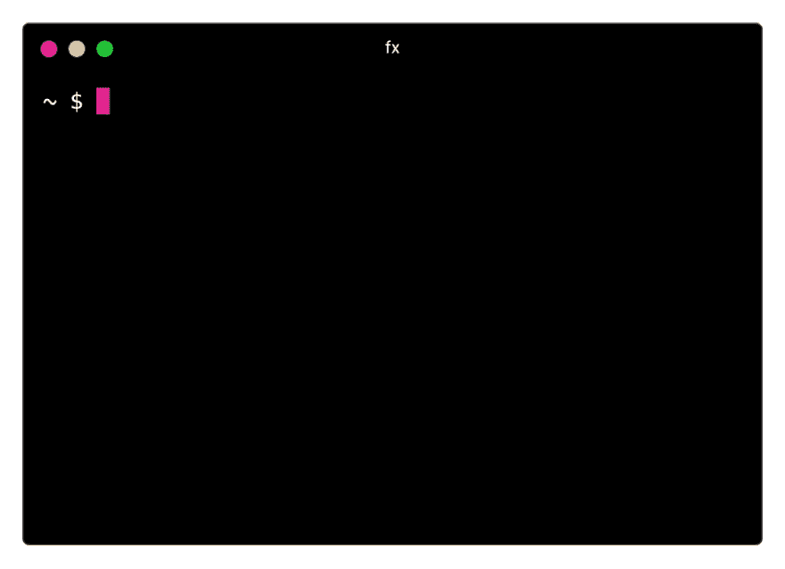
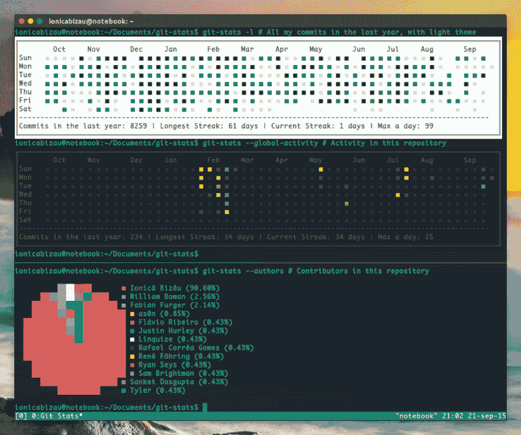
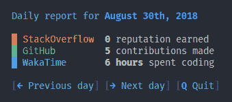
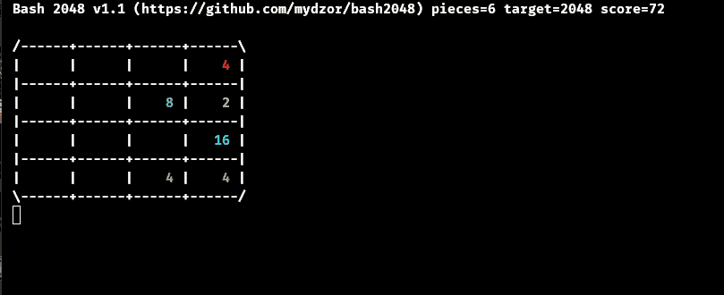
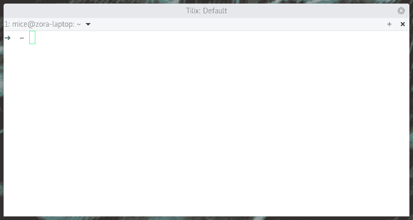

# 使用这些棒极了的 CLI 工具改善您的工作流程⚡

> 原文：<https://dev.to/dylantientcheu/improve-your-workflow-with-these-awesome-cli-tools-31gf>

开心地(？)，今天我们处在一个生产力大多是通过聪明的工作而不是努力工作来实现的时代。我们必须不断寻找更快、更简单、更智能的方法来实现目标。

下面的工具不仅能帮助你更快地工作，还能让你在终端中享受乐趣**。**

<figure> 

<figcaption>OMG 是这个-…是的这是真的在 Windows 上(按照这些步骤)</figcaption>

</figure>

***Windows 用户注意*** *:您可能注意到了，大多数工具都是基于 Unix 的，并且实现了一些可能无法在 CMD 或 Powershell 上正常运行的功能。我推荐你用*[***WSL***](https://docs.microsoft.com/en-us/windows/wsl/install-win10)***(Windows 子系统 for Linux)。*T15】**

*不用担心，* [***本帖***](https://dev.to/dylantientcheu/transforming-your-ugly-windows-terminal-to-a-unicorn-577k) *可以向你展示如何把 WSL 打造成最美的终端*😉

让我们尽情摇摆吧。

### 任务管理&计划

是的，我知道，我们在网络和桌面上都有太多惊人的任务管理工具。但是，您应该尝试基于您的终端模拟器的那些。

#### [任务战士](https://taskwarrior.org/)

Taskwarrior 是一款免费的开源软件，可以从命令行管理你的待办事项。它灵活、快速且不引人注目。它完成它的工作，然后离开你的方式。

<figure> 

<figcaption>这连 Taskwarrior 的[1/10](https://taskwarrior.org/docs/)都做不到。</figcaption>

</figure>

#### [百里](https://github.com/hughbien/thyme) —控制台番茄计时器

番茄工作法是由弗朗西斯科·西里洛发明的。这项技术确实有助于效率和时间管理。现在，**百里香**是一个工具，有助于将这种技术与大的可定制选项一起带到您的终端。

#### [莫罗](https://github.com/albacoretuna/moro) —工作时间跟踪器

一个跟踪工作时间的命令行工具，非常简单。

<figure>

<figcaption></figcaption>

</figure>

### 发展

#### [Wuzz](https://github.com/asciimoo/wuzz) — HTTP 检查员

想起一个 [**终端化的邮递员**](https://www.getpostman.com/) **。** Wuzz 是一个用于 HTTP 检测的交互式 cli 工具。

<figure>

<figcaption></figcaption>

</figure>

#### [FX](https://github.com/antonmedv/fx) — JSON 查看器

FX 是 JSON 处理和查看的首选工具。它的执行命令让人印象深刻。我仍在寻找基于网络/桌面的同类产品。

<figure>

<figcaption></figcaption>

</figure>

#### [服务器](https://github.com/zeit/serve) —最快的 CLI 文件服务工具

也许你认为我太夸张了。嗯，我不是。还记得你以前每次需要在 localhost 中建立一个静态站点时，都要下载 [*python 的 simpleHTTPServer*](https://docs.python.org/2/library/simplehttpserver.html) 或*chrome 应用程序的 web 服务器*吗？那都是过去式了。只需从静态站点的文件夹中直接使用 npx serve 这样简单的命令，您就可以得到服务了！

#### [您好](https://github.com/gleitz/howdoi)—您的 StackOverFlow quickie

它最好这样描述自己“通过命令行即时编码回答”。

下一次你在寻找编码答案的时候，在打开浏览器阅读博客之前，请三思。用 howdoi，答案可能比你想象的要近。

#### [git stats](https://github.com/IonicaBizau/git-stats)—print(githubCharts)；

#### [t1](#devstats%E2%80%8A%E2%80%8Aprintalldevstats)[状态](https://github.com/shroudedcode/devstats)-打印(所有状态)；

DevStats 是一个 CLI 应用程序，它从 StackOverflow、WakaTime 和 GitHub 等“开发人员站点”获取统计数据，并很好地显示它们。如果你是一个统计狂，你甚至可以显示你的每日报告，并在日期之间切换

#### [终端记录器](https://github.com/faressoft/terminalizer)&[asci NEMA](https://asciinema.org/)—终端记录器

*   [Terminalizer](https://github.com/faressoft/terminalizer) 帮助您记录您的终端会话并生成 gif 图像。这确实有助于展示如何使用命令。

<figure> 

<figcaption>终止器</figcaption>

</figure>

*   asci NEMA 是一个伟大的开源解决方案，用于记录终端会话并在 web 上共享它们。它旨在成为每个希望与其他人分享技能的命令行用户的“必去”之地。或者换一种说法，这是一个展示你的极客气质的地方。

### 好玩

> 谁真正在等待 npm 安装完成？

#### [Bash2048](https://github.com/mydzor/bash2048) —在你的终端上玩 2048

从你的终端上玩著名的 2048 游戏。(复制下面一行并粘贴到您的终端中)。

$ bashhttps://raw . githubusercontent . com/myd zor/bash 2048/master/bash 2048 . sh

<figure>

<figcaption>bash<(curl-s[https://raw . githubusercontent . com/mydzor/bash 2048/master/bash 2048 . sh](https://raw.githubusercontent.com/mydzor/bash2048/master/bash2048.sh))</figcaption>

</figure>

#### [文字名称](https://github.com/beatfreaker/text-meme-cli)

直接从你的终端上生成如下好看的文字迷因

<figure>

<figcaption></figcaption>

</figure>

#### [CLI Typer](https://github.com/balzss/cli-typer)—像 2003 年一样练习指纹

在命令行中练习触摸输入，并测试您的技能。

### 杂项

#### [速度测试](https://github.com/sindresorhus/speed-test) —网速测试

Git 表现的很奇怪？也许你需要一个快速连接测试。让速度测试从您的终端 ping。

#### [加班-cli](https://github.com/diit/overtime-cli)

远程团队的简易时间重叠表。

<figure>

<figcaption></figcaption>

</figure>

### 感觉名单太短？

这些都是**棒极了的工具**，是**棒极了的开发者**为了帮助社区而建造的。

你知道更棒的是什么吗？一个**牛逼列表**的**牛逼列表**包含**牛逼 CLI** 工具🦄

*   [https://github.com/agarrharr/awesome-cli-apps](https://github.com/agarrharr/awesome-cli-apps)
*   [https://github.com/alebcay/awesome-shell](https://github.com/alebcay/awesome-shell)
*   [http://reddit.com/r/commandline](http://reddit.com/r/commandline)

一定要看看这些，并在回复上留下一些星星。

> 你可以留下 c_lap_👏🏾如果你喜欢这本书。

[迪伦·蒂恩彻(@DylanTientcheu) |推特](https://twitter.com/dylantientcheu)

* * *