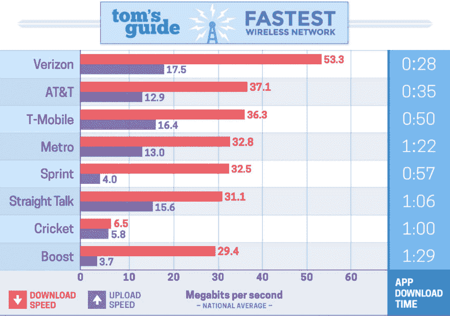
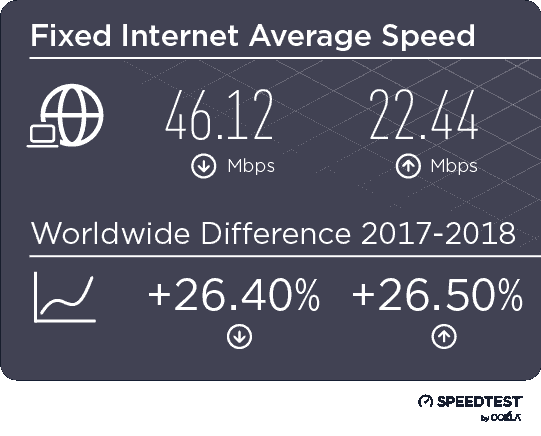

# 服务人员

> 原文：<https://dev.to/tbrixey/service-workers-3c3g>

### 总结

在这篇文章中，我将对服务人员进行高水平的检查。稍后，我将讨论如何在 React 应用程序中实现服务工作者。在底部会有我所有的资源和文档的链接，这样你可以了解更多！

### 什么是服务人员？

*   “服务人员是您的浏览器在后台运行的脚本，独立于网页，为不需要网页或用户交互的功能打开了大门。”–[马特·冈特](https://developers.google.com/web/fundamentals/primers/service-workers/)
*   在页面加载时执行的 JavaScript 代码。
*   让开发人员更好地控制浏览器。

#### 服务人员生命周期

[](https://res.cloudinary.com/practicaldev/image/fetch/s--0UjhcJOQ--/c_limit%2Cf_auto%2Cfl_progressive%2Cq_auto%2Cw_880/https://developers.google.com/web/fundamentals/primers/service-workeimg/sw-lifecycle.png)

### 为什么要用？

*   渐进式 Web 应用程序所必需的
*   提供离线网站支持
*   可以让您的网站有心跳，通过观看网站更新，甚至自动更新！
    *   这包括强迫用户在推出新版本时使用它，或者只是通知他们有更新。
*   如果不需要离线支持，它会通过缓存站点代码来加速站点的重新访问。
*   显著降低部署停机时间。
*   您的用户在他们的本地副本上运行站点，不依赖于服务器，即使在点击链接和浏览站点时也是如此。

#### 网站截图参考，我们直接从我们的服务器提供一些高尺寸图片。

[](https://res.cloudinary.com/practicaldev/image/fetch/s--uQouHH56--/c_limit%2Cf_auto%2Cfl_progressive%2Cq_auto%2Cw_880/https://imgur.com/qdcTptT.png)

没有服务人员的情况下下载大小和加载时间

 **[](https://res.cloudinary.com/practicaldev/image/fetch/s--mJ8wuuPs--/c_limit%2Cf_auto%2Cfl_progressive%2Cq_auto%2Cw_880/https://imgur.com/pj2vkYt.png)

由服务人员下载大小和加载时间

 **[](https://res.cloudinary.com/practicaldev/image/fetch/s--BR6ZTJ85--/c_limit%2Cf_auto%2Cfl_progressive%2Cq_auto%2Cw_880/https://imgur.com/qG4GEE1.png)

正如您所看到的，加载时间和带宽利用率有很大的不同！当服务人员被利用时，我们只需下载一次图像，而当它不存在时，则需要每次加载页面。当然，你可以把这些图片放在一个单独的图片托管平台上，就像我正在为上面的图片使用的平台一样，但这可能会违反你的应用程序的安全标准。图像也不是一个很好的例子，但是想象一下你的应用程序非常大，你有很多代码需要处理。你的浏览器不能自动缓存，你也不能离线访问。

### 想想移动吧！

下图来自一篇关于移动网络速度的文章。

[](https://res.cloudinary.com/practicaldev/image/fetch/s--tCxioSn4--/c_limit%2Cf_auto%2Cfl_progressive%2Cq_auto%2Cw_880/https://img.purch.com/fastestcarriers-2018-main-chart-v2-4-jpg/o/aHR0cDovL21lZGlhLmJlc3RvZm1pY3JvLmNvbS9BL08vODA1MjAwL29yaWdpbmFsL0Zhc3Rlc3RDYXJyaWVyc18yMDE4LW1haW4tY2hhcnRfdjIuNC5qcGc%3D)

当然，这些看起来很快，但这些是最好的情况。文章接着谈到这一点，因为他们只测试了“...去年美国八个城市多个地点的无线网络速度...”。有了服务人员，即使使用较慢的网速，你的用户也能更快地重新访问你的应用。

#### 除了移动...

你有没有在咖啡店里旋转你最喜欢的网站，却花了很长时间？您最喜欢的站点可能没有实现任何类型的缓存。因此，当你喝着你最喜欢的饮料时，你不能浏览你想浏览的网站！不幸的是，您可能无法联系到他们的开发团队并向他们展示这篇文章。

在咖啡店里，你可能在用你的笔记本电脑，它应该比你的手机快，对吗？良好的...不一定。大多数咖啡店都有较低层的数据计划，它与大楼中的每个人(甚至是员工和商店设备)共享。

这是 speedtest.net 的一张图表，显示了全球互联网速度。这确实表明，你必须考虑网络速度和用户回到你的应用程序。你不希望每个人每次花 3 秒钟加载你的页面(可能更长，可能更短)。

[](https://res.cloudinary.com/practicaldev/image/fetch/s--NkjxiEfe--/c_limit%2Cf_auto%2Cfl_progressive%2Cq_auto%2Cw_880/https://www.speedtest.net/insights/blog/conteimg/2018/12/Graphic-Tables-Final-v2_fixed-average.png)

### 我在！我如何开始？

如果你使用 React，那么这将是小菜一碟！如果你没有使用 React，我推荐你点击[这里](https://developers.google.com/web/fundamentals/primers/service-workers/registration)来了解更多关于如何注册你自己的服务人员的信息。

我的建议是利用软件包[离线插件](https://github.com/NekR/offline-plugin),因为它提供了多种功能和选项。如果你想的话，你完全可以使用 [Create-React-App](https://github.com/facebook/create-react-app) (CRA)自带的那个，但是你会错过很多功能。CRA 内置的东西肯定是一个好的开始，尤其是如果你对离线插件提供的任何选项都不感兴趣的话。

#### 通过 CRA 实现基本服务工作者。

默认情况下，这个代码片段位于您的`src/index.js`文件中！

```
import * as serviceWorker from "./serviceWorker";

// ...

serviceWorker.register(); 
```

Enter fullscreen mode Exit fullscreen mode

#### 离线-插件实现

你已经走到这一步了，所以我要让你轻松愉快。如果您想要一个具有自动更新功能的服务人员，请遵循以下步骤。

1.  `npm i offline-plugin react-app-rewired --save-dev`在您的项目目录中。
2.  转到项目根目录(package.json 所在的位置)并创建一个名为`config-overrides.js`的新文件。
3.  在该文件中粘贴以下内容

```
// This is a good baseline for setting up auto install
const OfflinePlugin = require("offline-plugin");

module.exports = function override(config, env) {
  if (!config.plugins) {
    config.plugins = [];
  }
  config.plugins.push(
    new OfflinePlugin({
      autoUpdate: true, // true = check every hour for an update while user is connected to your application.
      ServiceWorker: {
        events: true
      }
    })
  );
  return config;
}; 
```

Enter fullscreen mode Exit fullscreen mode

1.  从这里开始，你必须决定当你推一个新版本时，你是否想要提醒或强制用户更新。如果是...继续！如果没有，那么你就完了！🎉

2.  让我们给用户一个更新的选项！在站点访问中安装的新组件中，让我们添加一些代码！

```
import React, { Component } from "react";
import runtime from "offline-plugin/runtime";

class Updater extends Component {
  state = {
    updateSite: false,
    updating: false
  };

  componentDidMount() {
    // You can test on local development my remove or changing this if
    if (process.env.NODE_ENV === "production") { 
      runtime.install({
        onUpdateReady: () => {
          this.setState({ updateSite: true });
        }
      });
    }
  }

  applySomeUpdate = () => {
    runtime.applyUpdate();
    setTimeout(() => {
      window.location.reload(true);
    }, 1000); // Give some time for the new service worker to start after the update
  };

  render() {
    return (
      <div>
        {this.state.updateSite ? (
          <button onClick={this.applySomeUpdate}>Update now!</button>
        ) : null}
      </div>
    );
  }
}

export default Updater; 
```

Enter fullscreen mode Exit fullscreen mode

1.  嘣！💥差不多吧...你应该明确这种风格，让它成为你自己的！

现在，您已经有了一个非常粗略的组件示例，它将在新的服务人员准备好安装时显示一个按钮。每当有人访问您的站点时，它都会运行。最棒的是，给一个新的服务人员的支票是免费的！0 字节 0 滞后！

### 结论

你已经坚持到了最后，希望你能更好地理解服务人员以及他们为什么如此伟大。我(现在还有你)几乎没有接触过服务人员。凭借我们双方有限的理解，我们都可以推动一个更好的网络。让我们的应用程序更快、更易访问。

现在出去雇佣一些服务人员！

谢谢大家！🙏

### 参考文献

[服务人员文档](https://developers.google.com/web/fundamentals/primers/service-workers/)

[手机网速](https://www.tomsguide.com/us/best-mobile-network,review-2942.html)

[速度测试](https://www.speedtest.net/insights/blog/2018-internet-speeds-global/)

* * *

[服务人员登记](https://developers.google.com/web/fundamentals/primers/service-workers/registration)

[创建-反应-应用](https://github.com/facebook/create-react-app)

[离线插件](https://github.com/NekR/offline-plugin)

[react-app-rewired](https://github.com/timarney/react-app-rewired)

* * *

最初发布于此[https://www . crema . us/blog/a-complete-guide-to-service-workers](https://www.crema.us/blog/a-complete-guide-to-service-workers)****